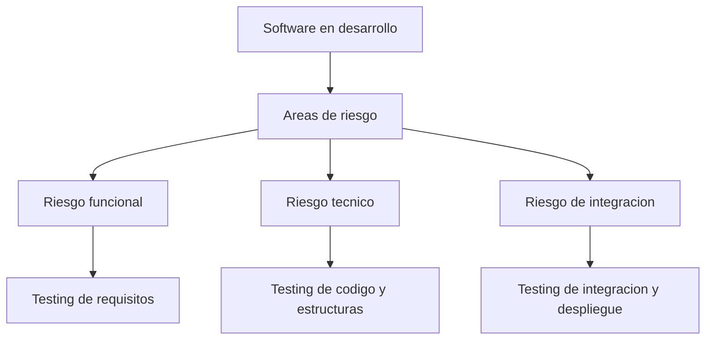
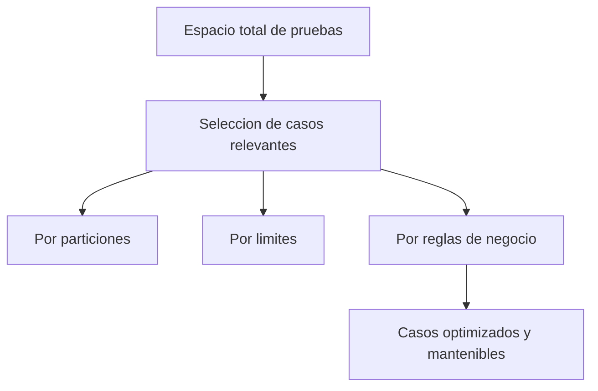
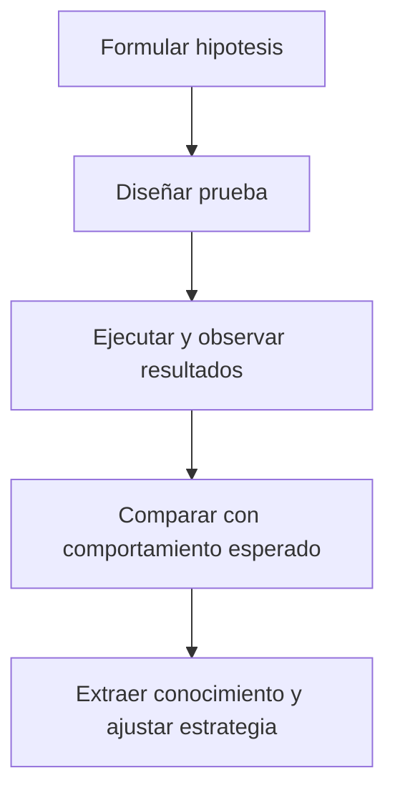
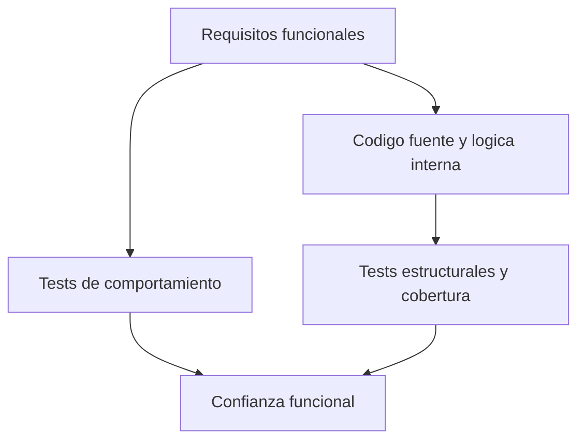
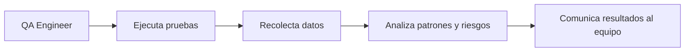
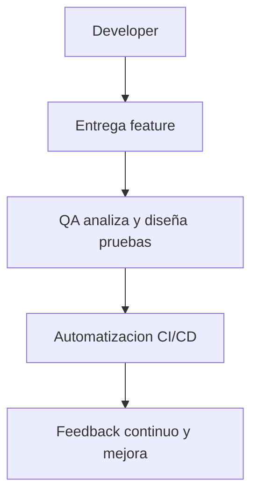

# Capítulo 1. El propósito del testing

## 1.1 Por qué probamos software

En ingeniería de software, **todo programa funciona... hasta que deja de hacerlo**.  
El testing no existe para demostrar que algo "anda bien", sino para **demostrar bajo qué condiciones deja de hacerlo**.

Desde mi experiencia como software engineer, aprendí que los errores más costosos no son los que rompen la aplicación, sino los que pasan inadvertidos durante semanas en producción.  
El testing es el proceso mediante el cual **hacemos visibles las fallas ocultas** antes de que impacten a los usuarios o al negocio.

Cada prueba, cada caso, y cada automatización tiene un propósito común: **reducir el riesgo**.  
No probamos por costumbre ni por auditoría, probamos porque el software vive en entornos impredecibles.

---



---

## 1.2 Testing como gestión de riesgos

El testing es **una forma estructurada de reducir incertidumbre**.  
El QA moderno no se mide por la cantidad de bugs encontrados, sino por su capacidad de identificar **los riesgos más relevantes** y proponer estrategias para mitigarlos.

Un tester maduro no ejecuta pruebas al azar. Prioriza. Clasifica. Comunica.

### Tipos de riesgo más frecuentes

| Tipo de riesgo | Descripción                                      | Ejemplo                                               |
| -------------- | ------------------------------------------------ | ----------------------------------------------------- |
| Funcional      | El sistema no cumple lo esperado.                | El botón “Guardar” no guarda todos los campos.        |
| Técnico        | La lógica interna es incorrecta o inconsistente. | Cálculo de impuestos con redondeo erróneo.            |
| Integración    | Los módulos no colaboran correctamente.          | API devuelve JSON incorrecto a frontend.              |
| Performance    | El sistema falla bajo carga.                     | Checkout colapsa con más de 500 usuarios simultáneos. |
| Seguridad      | El sistema es vulnerable.                        | Fuga de datos por endpoint sin autenticación.         |

El QA Engineer no elimina riesgos, los **mapea, prioriza y traduce a información útil para el equipo**.

---

## 1.3 El mito del testing completo

Una de las primeras lecciones que enseño a mis alumnos es que **probar todo es imposible**.  
Un formulario de 10 campos con 5 posibles valores cada uno tendría más de 9 millones de combinaciones posibles.

Intentar cubrir todo es una trampa. Lo importante no es probar mucho, sino **probar bien**.

Para eso existen técnicas de diseño de pruebas:

- **Particiones de equivalencia**: agrupar entradas con comportamiento similar.
- **Análisis de valores límite**: centrarse en los bordes del rango donde suelen ocurrir los errores.
- **Tablas de decisión**: cubrir combinaciones relevantes de entradas y reglas.
- **Testing basado en riesgo**: priorizar lo que más puede fallar o impactar.

---



---

## 1.4 Testing como experimento

Probar software es **experimentar con hipótesis**. Cada test es una afirmación sobre el sistema que puede ser falsa.

Ejemplo en TypeScript:

```typescript
function divide(a: number, b: number): number {
  return a / b;
}

// Hipótesis: dividir por cero lanza error
try {
  divide(5, 0);
} catch {
  console.log("OK: el sistema maneja la división por cero");
}
```

El test no “verifica” que funcione: **explora** cómo se comporta el sistema ante lo inesperado.

Este cambio de mentalidad —de comprobar a experimentar— es lo que convierte a un tester en **ingeniero de calidad**.

---



---

## 1.5 De la validación a la exploración

La validación confirma que el software cumple lo esperado.  
El testing busca **lo que nadie esperaba**.

| Enfoque    | Validación   | Testing             |
| ---------- | ------------ | ------------------- |
| Objetivo   | Confirmar    | Descubrir           |
| Pregunta   | ¿Funciona?   | ¿Qué podría fallar? |
| Tipo de QA | Repetitivo   | Exploratorio        |
| Resultado  | Confirmación | Aprendizaje         |

Un tester que valida solo cumple con la tarea.  
Un QA Engineer que explora **cuestiona las suposiciones** del producto y del equipo.

---

## 1.6 Testing como disciplina de ingeniería

En mi práctica profesional, integro el testing como parte del diseño del sistema.  
Siguiendo los enfoques de _Effective Software Testing_, existen dos grandes familias de pruebas:

- **Testing basado en especificaciones** (caja negra): el tester diseña casos a partir de los requisitos.
- **Testing estructural** (caja blanca): el tester diseña casos con conocimiento del código.

Ambos se necesitan. El primero garantiza cumplimiento funcional; el segundo, consistencia técnica.

---



---

## 1.7 Ejemplo: Testing de reglas de negocio en TypeScript

Supongamos que tenemos un módulo de impuestos:

```typescript
export function calcularImpuesto(valor: number): number {
  if (valor < 0) throw new Error("El valor no puede ser negativo");
  const impuesto = valor * 0.21;
  if (impuesto < 0) throw new Error("El impuesto no puede ser negativo");
  return impuesto;
}
```

Y un test basado en especificaciones:

```typescript
describe("calcularImpuesto", () => {
  it("debería lanzar error para valores negativos", () => {
    expect(() => calcularImpuesto(-5)).toThrow(
      "El valor no puede ser negativo"
    );
  });

  it("debería devolver 21 cuando el valor es 100", () => {
    expect(calcularImpuesto(100)).toBe(21);
  });
});
```

Este caso cubre tanto una **precondición** (no aceptar valores negativos) como una **postcondición** (el resultado debe ser positivo).  
Así se empieza a construir **contratos de software**, una técnica que veremos más adelante.

---

## 1.8 El tester como analista de información

Un QA Engineer no entrega “tests pasados”, sino **información de valor**.  
Su objetivo no es probar todo, sino **explicar la calidad actual del producto** con evidencia técnica.



---

## 1.9 Caso práctico: El bug invisible

Imagina una función para verificar si una palabra es palíndroma:

```typescript
function esPalindromo(palabra: string): boolean {
  return palabra === palabra.split("").reverse().join("");
}
```

Prueba: `esPalindromo("Ana")` devuelve `false`.  
El error no está en la lógica, sino en la suposición: **no se normalizan las mayúsculas**.

```typescript
function esPalindromo(palabra: string): boolean {
  const normalizada = palabra.toLowerCase();
  return normalizada === normalizada.split("").reverse().join("");
}
```

Testing es justamente eso: **romper suposiciones**.  
El mejor tester no busca errores, busca **mentiras del sistema**.

---

## 1.10 Testing como colaboración

El testing efectivo ocurre cuando QA y desarrollo trabajan en sincronía.  
No se trata de “verificar lo que los devs hicieron mal”, sino de **prevenir juntos lo que podría fallar**.



El testing moderno es **una conversación continua** dentro del equipo de desarrollo.

---

## 1.11 Síntesis del capítulo

- El testing no es un fin, es un **método de gestión del riesgo**.
- No hay cobertura completa, hay cobertura **inteligente**.
- Cada test es una **hipótesis sobre el sistema**.
- El QA moderno es **ingeniero, comunicador y estratega**.
- La calidad es una **responsabilidad compartida**, no un rol aislado.

---

## 1.12 Lo que viene

En el siguiente capítulo, **Diseño de tests – de la intuición al método**, aprenderás cómo pasar de una idea vaga a un conjunto estructurado de pruebas.  
Aplicaremos principios de _Specification-based Testing_ y _Designing Tests_ para construir casos sólidos, escalables y automatizables.
