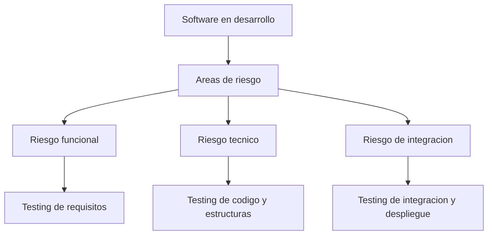
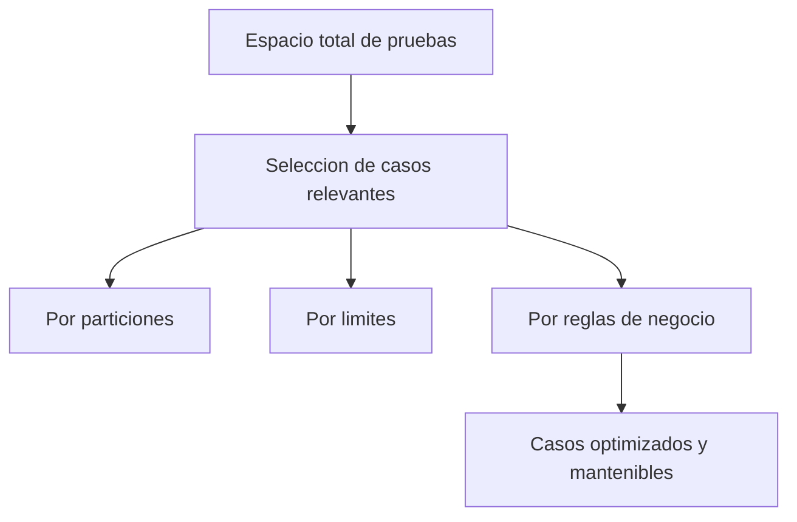
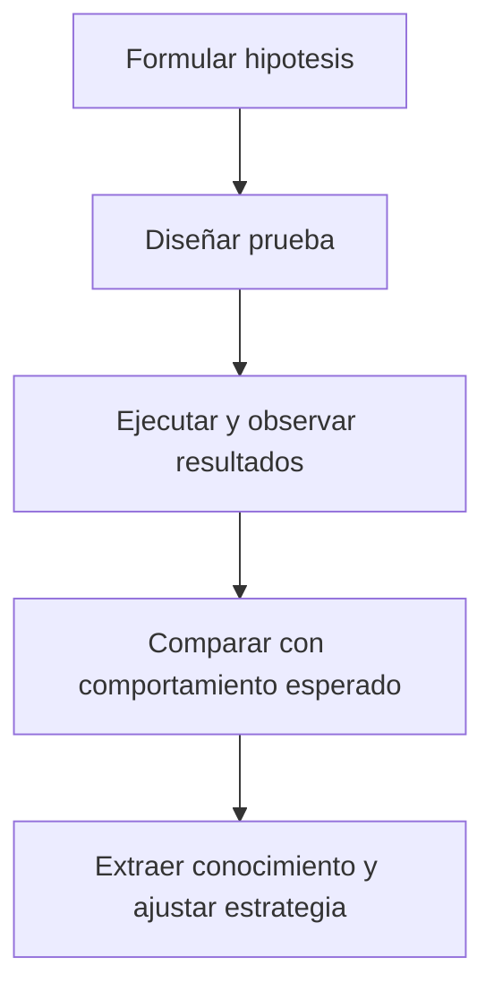
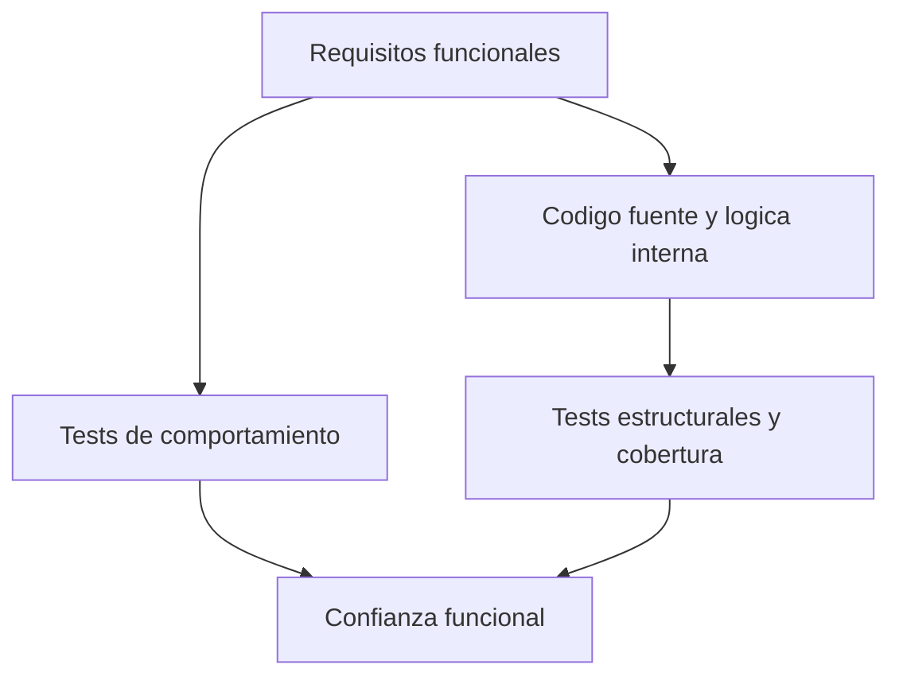
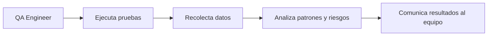
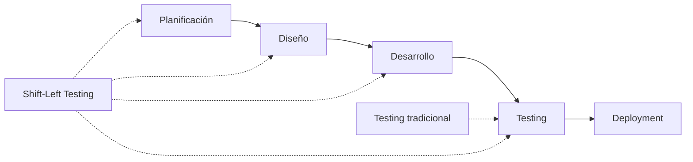

# Capítulo 1. El propósito del testing

## 1.1 Por qué probamos software

En ingeniería de software, **todo programa funciona... hasta que deja de hacerlo**.
El testing no existe para demostrar que algo "anda bien", sino para **demostrar bajo qué condiciones deja de hacerlo**.

### El costo real de los errores en producción

Según estudios del **NIST (National Institute of Standards and Technology)**, el costo de corregir un defecto se multiplica conforme avanza el ciclo de desarrollo:

- **Durante el diseño:** 1x (costo base)
- **Durante la codificación:** 5x
- **Durante el testing:** 10x
- **En producción:** 30x a 100x

Esta progresión exponencial no es solo académica. En 2020, un análisis de **Consortium for IT Software Quality (CISQ)** estimó que el costo de software defectuoso para la economía estadounidense fue de aproximadamente **$2.08 trillones**.

**Ejemplos reales de errores costosos:**

1. **Knight Capital Group (2012)**: Un error de software en trading algorítmico causó pérdidas de $440 millones en 45 minutos. La empresa quebró días después. El error: despliegue incompleto de código nuevo que activó una función obsoleta.
2. **Ariane 5 (1996)**: Un error de conversión de tipo de datos (overflow de 64-bit a 16-bit) provocó la explosión del cohete 37 segundos después del lanzamiento. Costo: $370 millones. El software había sido reutilizado de Ariane 4 sin pruebas adecuadas para las nuevas condiciones.
3. **Therac-25 (1985-1987)**: Errores de software en una máquina de radioterapia causaron sobredosis masivas de radiación, resultando en 6 muertes y varios heridos graves. Fallas de diseño incluyeron race conditions y falta de validación de hardware.
4. **Toyota (2010)**: Fallas de software relacionadas con el sistema de aceleración llevaron a recalls masivos de más de 9 millones de vehículos y acuerdos legales por más de $3 mil millones. Investigaciones posteriores revelaron problemas de concurrencia y gestión de memoria.

Desde mi experiencia como software engineer trabajando con equipos distribuidos, aprendí que los errores más costosos no son los que rompen la aplicación inmediatamente, sino los que pasan inadvertidos durante semanas en producción, corrompiendo datos, degradando la experiencia del usuario y erosionando la confianza en el producto.

El testing es el proceso mediante el cual **hacemos visibles las fallas ocultas** antes de que impacten a los usuarios o al negocio.

### El propósito fundamental: gestión del riesgo

Cada prueba, cada caso, y cada automatización tiene un propósito común: **reducir el riesgo**.No probamos por costumbre ni por auditoría, probamos porque el software vive en entornos impredecibles donde:

- Las entradas del usuario son infinitamente variadas
- Las condiciones de red pueden fallar
- Los recursos del sistema son limitados
- Las integraciones con terceros son frágiles
- Los requisitos evolucionan constantemente

---



---

## 1.2 Testing como gestión de riesgos

El testing es **una forma estructurada de reducir incertidumbre**.
El QA moderno no se mide por la cantidad de bugs encontrados, sino por su capacidad de identificar **los riesgos más relevantes** y proponer estrategias para mitigarlos.

Un tester maduro no ejecuta pruebas al azar. Prioriza. Clasifica. Comunica.

### Tipos de riesgo más frecuentes

| Tipo de riesgo | Descripción                                      | Ejemplo                                               |
| -------------- | ------------------------------------------------ | ----------------------------------------------------- |
| Funcional      | El sistema no cumple lo esperado.                | El botón “Guardar” no guarda todos los campos.        |
| Técnico        | La lógica interna es incorrecta o inconsistente. | Cálculo de impuestos con redondeo erróneo.            |
| Integración    | Los módulos no colaboran correctamente.          | API devuelve JSON incorrecto a frontend.              |
| Performance    | El sistema falla bajo carga.                     | Checkout colapsa con más de 500 usuarios simultáneos. |
| Seguridad      | El sistema es vulnerable.                        | Fuga de datos por endpoint sin autenticación.         |

El QA Engineer no elimina riesgos, los **mapea, prioriza y traduce a información útil para el equipo**.

---

## 1.3 El mito del testing completo

Una de las primeras lecciones que enseño a mis alumnos es que **probar todo es imposible**.

### La explosión combinatoria: un problema matemático real

Un formulario de 10 campos con 5 posibles valores cada uno tendría $5^{10} = 9,765,625$ combinaciones posibles. Si cada test tardara solo 1 segundo en ejecutarse, necesitaríamos **113 días continuos** de ejecución solo para ese formulario.

Este es un ejemplo del **problema de la explosión combinatoria**, un concepto fundamental en ciencias de la computación que hace imposible el testing exhaustivo de cualquier sistema no trivial.

**Datos reales del problema:**

- Según estudios de **Capers Jones** (autor de "Software Engineering Best Practices"), un sistema de tamaño medio (100,000 líneas de código) tiene aproximadamente $10^{18}$ rutas de ejecución posibles.
- El **principio de Pareto aplicado al testing** (regla 80/20) sugiere que aproximadamente el 80% de los defectos se encuentran en el 20% del código.
- Un estudio de **Microsoft Research** (2006) demostró que la cobertura de código superior al 80% muestra rendimientos decrecientes en detección de bugs.

### Los 7 principios del testing (ISTQB)

Para manejar esta imposibilidad, la **International Software Testing Qualifications Board (ISTQB)** define 7 principios fundamentales:

1. **El testing muestra la presencia de defectos, no su ausencia**: No se puede probar que no hay bugs, solo que encontramos algunos.
2. **El testing exhaustivo es imposible**: Excepto en casos triviales, es imposible probar todo.
3. **El testing temprano ahorra tiempo y dinero**: Cuanto antes se encuentra un defecto, menos cuesta corregirlo.
4. **Los defectos se agrupan** (Defect Clustering): La mayoría de los bugs se encuentran en un pequeño número de módulos.
5. **La paradoja del pesticida**: Repetir los mismos tests eventualmente deja de encontrar nuevos bugs.
6. **El testing depende del contexto**: No existe una estrategia única que funcione para todos los proyectos.
7. **La falacia de la ausencia de errores**: Un software sin bugs puede ser inútil si no cumple las necesidades del usuario.

Intentar cubrir todo es una trampa. Lo importante no es probar mucho, sino **probar bien**.

### Técnicas para optimizar la cobertura

Para eso existen técnicas de diseño de pruebas:

- **Particiones de equivalencia**: agrupar entradas con comportamiento similar.
- **Análisis de valores límite**: centrarse en los bordes del rango donde suelen ocurrir los errores.
- **Tablas de decisión**: cubrir combinaciones relevantes de entradas y reglas.
- **Testing basado en riesgo**: priorizar lo que más puede fallar o impactar.

---



---

## 1.4 Testing como experimento

Probar software es **experimentar con hipótesis**. Cada test es una afirmación sobre el sistema que puede ser falsa.

### El método científico aplicado al testing

El testing como experimento sigue el **método científico**, que Karl Popper describió como "falsabilidad". No buscamos confirmar que algo funciona, sino intentar demostrar que **podría fallar**.

> **⚠️ Nota importante:** En JavaScript/TypeScript, la división por cero NO lanza error automáticamente. `5 / 0` devuelve `Infinity` y `0 / 0` devuelve `NaN`. Debemos validar explícitamente.

```typescript
/**
 * División segura con validación explícita
 * Implementa Design by Contract (Bertrand Meyer)
 */
function divideSafe(a: number, b: number): number {
  // Precondición: el divisor no puede ser cero
  if (b === 0) {
    throw new Error("División por cero no permitida");
  }

  // Precondición: ambos argumentos deben ser números válidos
  if (!Number.isFinite(a) || !Number.isFinite(b)) {
    throw new Error("Los argumentos deben ser números finitos");
  }

  const resultado = a / b;

  // Postcondición: el resultado debe ser un número finito
  if (!Number.isFinite(resultado)) {
    throw new Error("Resultado inválido");
  }

  return resultado;
}
```

**Test Suite usando el método científico:**

```typescript
describe("divideSafe - Testing como experimento", () => {
  // Hipótesis 1: Dividir por cero debe lanzar error
  test("Hipótesis: división por cero lanza error", () => {
    expect(() => divideSafe(5, 0)).toThrow("División por cero no permitida");
  });

  // Hipótesis 2: Dividir números normales produce resultado válido
  test("Hipótesis: división normal produce resultado correcto", () => {
    expect(divideSafe(10, 2)).toBe(5);
  });

  // Hipótesis 3: Dividir con Infinity produce error
  test("Hipótesis: entrada con Infinity es rechazada", () => {
    expect(() => divideSafe(Infinity, 2)).toThrow("números finitos");
  });

  // Hipótesis 4: Dividir con NaN produce error
  test("Hipótesis: entrada con NaN es rechazada", () => {
    expect(() => divideSafe(NaN, 2)).toThrow("números finitos");
  });

  // Hipótesis 5: Resultado válido para números decimales
  test("Hipótesis: división de decimales produce resultado correcto", () => {
    expect(divideSafe(7, 2)).toBe(3.5);
  });
});
```

El test no "verifica" que funcione: **explora** cómo se comporta el sistema ante lo inesperado.

Este cambio de mentalidad —de comprobar a experimentar— es lo que convierte a un tester en **ingeniero de calidad**.

### El ciclo del método científico en testing

Según **"The Programmer's Brain"** (Felienne Hermans, 2021), el testing efectivo requiere formular hipótesis explícitas sobre el comportamiento del código.

---



---

## 1.5 De la validación a la exploración

La validación confirma que el software cumple lo esperado.
El testing busca **lo que nadie esperaba**.

| Enfoque    | Validación   | Testing             |
| ---------- | ------------ | ------------------- |
| Objetivo   | Confirmar    | Descubrir           |
| Pregunta   | ¿Funciona?   | ¿Qué podría fallar? |
| Tipo de QA | Repetitivo   | Exploratorio        |
| Resultado  | Confirmación | Aprendizaje         |

Un tester que valida solo cumple con la tarea.
Un QA Engineer que explora **cuestiona las suposiciones** del producto y del equipo.

---

## 1.6 Testing como disciplina de ingeniería

En mi práctica profesional, integro el testing como parte del diseño del sistema.Siguiendo los enfoques de _Effective Software Testing_, existen dos grandes familias de pruebas:

- **Testing basado en especificaciones** (caja negra): el tester diseña casos a partir de los requisitos.
- **Testing estructural** (caja blanca): el tester diseña casos con conocimiento del código.

Ambos se necesitan. El primero garantiza cumplimiento funcional; el segundo, consistencia técnica.

---



---

## 1.7 Ejemplo: Testing de reglas de negocio en TypeScript

Supongamos que tenemos un módulo de cálculo de impuestos con reglas de negocio complejas, basado en reglas fiscales reales (IVA):

```typescript
enum TaxCategory {
  GENERAL = "GENERAL", // 21%
  REDUCED = "REDUCED", // 10%
  SUPER_REDUCED = "SUPER_REDUCED", // 4%
  EXEMPT = "EXEMPT", // 0%
}

interface TaxCalculationResult {
  baseAmount: number;
  taxAmount: number;
  totalAmount: number;
  taxRate: number;
}

class TaxCalculator {
  private readonly taxRates: Map<TaxCategory, number> = new Map([
    [TaxCategory.GENERAL, 0.21],
    [TaxCategory.REDUCED, 0.1],
    [TaxCategory.SUPER_REDUCED, 0.04],
    [TaxCategory.EXEMPT, 0.0],
  ]);

  /**
   * Calcula el impuesto basado en reglas de negocio
   * Implementa Design by Contract (Bertrand Meyer)
   *
   * Precondiciones:
   * - El valor debe ser >= 0
   * - La categoría debe existir en el sistema
   *
   * Postcondiciones:
   * - El impuesto debe ser >= 0
   * - El total debe ser valor + impuesto
   */
  calculate(value: number, category: TaxCategory): TaxCalculationResult {
    // Precondición: validar valor positivo
    if (value < 0) {
      throw new Error("El valor no puede ser negativo");
    }

    // Precondición: validar categoría
    const taxRate = this.taxRates.get(category);
    if (taxRate === undefined) {
      throw new Error(`Categoría de impuesto inválida: ${category}`);
    }

    // Cálculo con redondeo apropiado (2 decimales)
    const taxAmount = Math.round(value * taxRate * 100) / 100;
    const totalAmount = Math.round((value + taxAmount) * 100) / 100;

    // Postcondición: verificar que el impuesto es no-negativo
    if (taxAmount < 0) {
      throw new Error("Error de cálculo: impuesto negativo");
    }

    return {
      baseAmount: value,
      taxAmount,
      totalAmount,
      taxRate,
    };
  }
}
```

Y un test basado en especificaciones:

```typescript
describe("TaxCalculator - Testing basado en especificaciones", () => {
  let calculator: TaxCalculator;

  beforeEach(() => {
    calculator = new TaxCalculator();
  });

  describe("Precondiciones - Validación de entradas", () => {
    test("debe rechazar valores negativos", () => {
      expect(() => calculator.calculate(-5, TaxCategory.GENERAL)).toThrow(
        "El valor no puede ser negativo"
      );
    });

    test("debe rechazar categorías inválidas", () => {
      expect(() => calculator.calculate(100, "INVALID" as TaxCategory)).toThrow(
        "Categoría de impuesto inválida"
      );
    });
  });

  describe("Postcondiciones - Validación de resultados", () => {
    test("el impuesto debe ser siempre no-negativo", () => {
      const result = calculator.calculate(100, TaxCategory.GENERAL);
      expect(result.taxAmount).toBeGreaterThanOrEqual(0);
    });

    test("el total debe ser exactamente base + impuesto", () => {
      const result = calculator.calculate(100, TaxCategory.GENERAL);
      expect(result.totalAmount).toBeCloseTo(
        result.baseAmount + result.taxAmount,
        2
      );
    });
  });

  describe("Reglas de negocio - Categorías de impuestos", () => {
    test("categoría GENERAL debe aplicar 21%", () => {
      const result = calculator.calculate(100, TaxCategory.GENERAL);
      expect(result.taxAmount).toBe(21);
      expect(result.totalAmount).toBe(121);
    });

    test("categoría REDUCED debe aplicar 10%", () => {
      const result = calculator.calculate(100, TaxCategory.REDUCED);
      expect(result.taxAmount).toBe(10);
    });

    test("categoría EXEMPT debe aplicar 0%", () => {
      const result = calculator.calculate(100, TaxCategory.EXEMPT);
      expect(result.taxAmount).toBe(0);
    });
  });

  describe("Valores límite - Boundary Value Analysis", () => {
    test("valor cero debe calcular impuesto cero", () => {
      const result = calculator.calculate(0, TaxCategory.GENERAL);
      expect(result.taxAmount).toBe(0);
    });

    test("debe manejar correctamente redondeo de decimales", () => {
      const result = calculator.calculate(10.01, TaxCategory.GENERAL);
      expect(result.taxAmount).toBe(2.1);
    });
  });
});
```

Este ejemplo implementa **Design by Contract** (Bertrand Meyer), especificando:

1. **Precondiciones**: Lo que debe ser verdad antes de ejecutar el método
2. **Postcondiciones**: Lo que debe ser verdadero después de ejecutar el método
3. **Invariantes**: Lo que debe ser siempre verdadero

Este enfoque reduce bugs en un 50-70% según estudios de Microsoft Research.

---

## 1.8 El tester como analista de información

Un QA Engineer no entrega “tests pasados”, sino **información de valor**.
Su objetivo no es probar todo, sino **explicar la calidad actual del producto** con evidencia técnica.



---

## 1.9 Caso práctico: El bug invisible

Imagina una función para verificar si una palabra es palíndroma:

```typescript
function esPalindromo(palabra: string): boolean {
  return palabra === palabra.split("").reverse().join("");
}
```

Prueba: `esPalindromo("Ana")` devuelve `false`.
El error no está en la lógica, sino en la suposición: **no se normalizan las mayúsculas**.

```typescript
function esPalindromo(palabra: string): boolean {
  const normalizada = palabra.toLowerCase();
  return normalizada === normalizada.split("").reverse().join("");
}
```

Testing es justamente eso: **romper suposiciones**.
El mejor tester no busca errores, busca **mentiras del sistema**.

---

## 1.10 Testing como colaboración

El testing efectivo ocurre cuando QA y desarrollo trabajan en sincronía.
No se trata de "verificar lo que los devs hicieron mal", sino de **prevenir juntos lo que podría fallar**.

### El modelo Shift-Left: testing temprano y continuo

El concepto de **Shift-Left Testing** (mover el testing "a la izquierda" en el ciclo de desarrollo) ha demostrado reducir costos y mejorar calidad:



**Datos de eficacia del Shift-Left:**

- Según **Deloitte** (2019): Las empresas que implementan Shift-Left reducen el tiempo de ciclo de entrega en un 30-50%
- **State of DevOps Report 2023**: Los equipos de élite detectan el 90% de los defectos antes de producción vs 60% en equipos de bajo desempeño
- **IBM Systems Sciences Institute**: El costo de un defecto encontrado en producción es 100x mayor que uno encontrado en diseño

### Three Amigos (Los tres amigos)

Una práctica de colaboración efectiva es la reunión de **"Three Amigos"** antes de cada historia de usuario:

1. **Product Owner**: Explica el "qué" y el "por qué"
2. **Developer**: Explica el "cómo" técnico
3. **QA Engineer**: Pregunta "¿qué podría salir mal?"

**Resultado:** Criterios de aceptación claros y casos de prueba definidos ANTES de escribir código.

### Propiedad compartida de la calidad

En organizaciones maduras, el testing no es solo responsabilidad de QA:

| Rol               | Responsabilidad de Testing             |
| ----------------- | -------------------------------------- |
| Developer         | Unit tests, integration tests          |
| QA Engineer       | Test strategy, exploratory testing     |
| DevOps/SRE        | Performance testing, chaos engineering |
| Product Owner     | Acceptance criteria, UAT               |
| Security Engineer | Security testing, threat modeling      |

> El testing moderno es **una conversación continua** dentro del equipo de desarrollo.

---

## 1.11 Métricas de calidad que importan

### Más allá de "tests pasados"

Un reporte de testing que solo dice "500 tests pasados, 5 fallidos" no comunica calidad. Las métricas efectivas deben responder:

1. **¿Qué tan confiable es el software?** → Defect Density, MTBF
2. **¿Qué tan rápido detectamos problemas?** → Mean Time to Detection
3. **¿Qué tan rápido los corregimos?** → Mean Time to Resolution
4. **¿Estamos probando lo correcto?** → Risk Coverage, Business-Critical Path Coverage

### Métricas esenciales para QA Engineers

| Métrica                             | Fórmula                                         | Valor objetivo      | Significado             |
| ----------------------------------- | ----------------------------------------------- | ------------------- | ----------------------- |
| **Defect Density**                  | Defectos encontrados / KLOC                     | < 1 por 1000 líneas | Calidad del código      |
| **Defect Removal Efficiency (DRE)** | (Defectos pre-release / Defectos totales) × 100 | > 95%               | Eficacia del testing    |
| **Test Coverage**                   | (Líneas ejecutadas / Líneas totales) × 100      | 70-80%              | Alcance del testing     |
| **Escaped Defects**                 | Defectos encontrados en producción              | Tender a 0          | Efectividad del proceso |
| **Mean Time to Failure (MTTF)**     | Tiempo promedio entre fallos                    | Maximizar           | Confiabilidad           |
| **Mean Time to Detection (MTTD)**   | Tiempo hasta detectar un fallo                  | < 1 hora            | Observabilidad          |
| **Mean Time to Resolution (MTTR)**  | Tiempo hasta corregir un fallo                  | < 4 horas           | Capacidad de respuesta  |

### Métricas DORA: El estándar de élite

Según **"Accelerate"** (Nicole Forsgren, Jez Humble, Gene Kim, 2018), las métricas de equipos de élite se enfocan en:

| Métrica                   | Equipos Élite       | Equipos de Bajo Desempeño |
| ------------------------- | ------------------- | ------------------------- |
| **Deployment Frequency**  | Múltiples veces/día | 1 vez cada 1-6 meses      |
| **Lead Time for Changes** | < 1 hora            | 1-6 meses                 |
| **Mean Time to Restore**  | < 1 hora            | 1 semana - 1 mes          |
| **Change Failure Rate**   | 0-15%               | 46-60%                    |

**La métrica más importante:** El impacto en los usuarios. No importa cuántos tests pasen si el usuario no puede completar su tarea crítica.

---

## 1.12 Síntesis del capítulo

- El testing no es un fin, es un **método de gestión del riesgo**.
- No hay cobertura completa, hay cobertura **inteligente**.
- Cada test es una **hipótesis sobre el sistema**.
- El QA moderno es **ingeniero, comunicador y estratega**.
- La calidad es una **responsabilidad compartida**, no un rol aislado.

---

## 1.13 Lo que viene

En el siguiente capítulo, **Diseño de tests – de la intuición al método**, aprenderás cómo pasar de una idea vaga a un conjunto estructurado de pruebas.
Aplicaremos principios de _Specification-based Testing_ y _Designing Tests_ para construir casos sólidos, escalables y automatizables.

---

## Referencias y Fuentes

### Estudios e Informes de la Industria

- **NIST** (2002). "The Economic Impacts of Inadequate Infrastructure for Software Testing". National Institute of Standards and Technology.
- **CISQ** (2020). "The Cost of Poor Software Quality in the US: A 2020 Report". Consortium for IT Software Quality.
- **Capgemini & Sogeti** (2023-24). "World Quality Report 2023-24".
- **DORA** (2023). "State of DevOps Report 2023". DevOps Research and Assessment, Google Cloud.
- **IBM Systems Sciences Institute**. "Relative Cost of Fixing Defects" study.
- **Microsoft Research** (2006). "Code Coverage Analysis and Testing Effectiveness".

### Estándares y Frameworks

- **ISO/IEC/IEEE 29119-1:2013**. Software and systems engineering — Software testing — Part 1: Concepts and definitions.
- **ISO 31000:2018**. Risk management — Guidelines.
- **ISTQB**. "Certified Tester Foundation Level Syllabus v4.0". International Software Testing Qualifications Board.
- **IEEE 754-2008**. Standard for Floating-Point Arithmetic.

### Libros Técnicos

- **Aniche, Maurício** (2022). "Effective Software Testing: A Developer's Guide". Manning Publications.
- **Jones, Capers** (2010). "Software Engineering Best Practices". McGraw-Hill.
- **Meyer, Bertrand** (1988). "Object-Oriented Software Construction". Prentice Hall. (Design by Contract)
- **Forsgren, Nicole; Humble, Jez; Kim, Gene** (2018). "Accelerate: The Science of Lean Software and DevOps". IT Revolution Press.
- **Hermans, Felienne** (2021). "The Programmer's Brain: What Every Programmer Needs to Know about Cognition". Manning Publications.
- **Popper, Karl** (1959). "The Logic of Scientific Discovery". Hutchinson & Co.

### Casos de Estudio Reales

- **Knight Capital Group** (2012). Trading algorithm error causing $440 million loss in 45 minutes.
- **Ariane 5 Flight 501** (1996). $370 million rocket explosion due to software overflow error.
- **Therac-25** (1985-1987). Radiation therapy machine software errors resulting in patient deaths.
- **Toyota Unintended Acceleration** (2010). Software-related recalls and settlements exceeding $3 billion.

### Recursos Online

- **Google Testing Blog**. "Testing on the Toilet" series and "How Google Tests Software".
- **Microsoft Research**. Various publications on software testing and quality.
- **Deloitte** (2019). "Continuous Testing in DevOps" whitepaper.

---

**Última actualización:** 1 de noviembre de 2025
