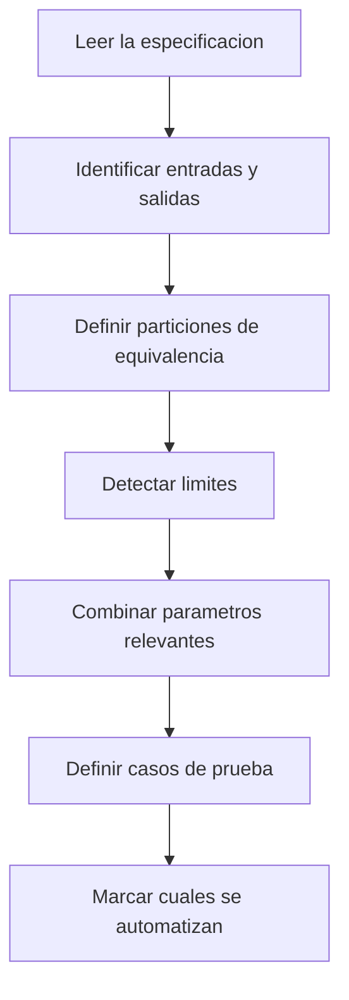
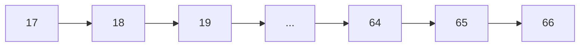
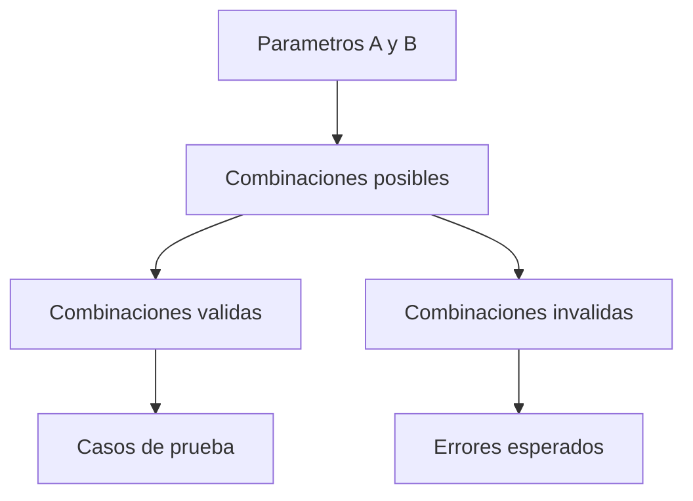

# Capítulo 2. Diseño de tests: de la intuición al método

> Nota  
> En este capítulo te voy a hablar como le hablo a mis alumnas que ya trabajaron en QA pero nunca vieron fundamentos. No voy a asumir que “ya sabés lo que es una partición de equivalencia”, pero tampoco te voy a tratar como si fuera tu primer día en tecnología. La idea es ordenar lo que ya hacés para que deje de ser intuitivo y pase a ser **repetible**.

## 2.1 El problema de probar “como venga”

Algo que vi en todos los equipos donde trabajé (Estados Unidos, España, Argentina, UK, Alemania, Francia) es lo mismo: la mayoría de los testers **no tienen un método de diseño de pruebas**.  
Lo que tienen es **una mezcla de experiencia + costumbre + lo que hacía el equipo anterior**.

Eso funciona… hasta que:

- el sistema crece,
- aparecen cambios de reglas de negocio,
- hay que automatizar,
- o hay que justificar por qué algo no se probó.

Ahí es donde se nota si el testing fue hecho “con buena voluntad” o “con diseño”.

> Observación  
> El autor de _Effective Software Testing_ dice exactamente esto: el problema no es que la gente no pruebe, es que **no prueba de forma sistemática**, y por eso dos personas distintas diseñan dos suites distintas para el mismo código. Lo que buscamos es que **cualquier persona razonable llegue a un conjunto de tests parecido** para el mismo problema.

---

## 2.2 Qué significa “diseñar” un test

Diseñar un test no es “escribir un caso en TestRail”.  
Diseñar un test es **construir un escenario mínimo que demuestre un comportamiento relevante del sistema**.

Ese escenario debe tener siempre:

1. **Contexto** (precondiciones): qué tenía que cumplirse antes.
2. **Acción**: qué hace el usuario o el sistema.
3. **Oráculo** (lo esperado): cómo sé si pasó o no.
4. **Propósito**: qué riesgo cubre.

Si falta el propósito, el caso existe “porque sí”. Ese es el que nadie quiere automatizar después.

> Nota  
> Cuando diseñes pensando en automatizar con Playwright, Postman/Newman o Jest, esto es clave: **la automatización no arregla un test mal diseñado**. Primero se diseña, después se ejecuta, y recién después se automatiza. Esto también lo marca el libro: primero derivamos los casos, después los pasamos a JUnit (o al framework que tengamos).

---

## 2.3 El pipeline mental para diseñar pruebas



Esto es casi exactamente lo que hace el capítulo de **Specification-based testing**: primero mira parámetros, después piensa en valores válidos e inválidos, después mira relaciones entre parámetros y después arma los casos. El autor mismo dice que en la práctica es **iterativo**, no lineal: podés volver atrás cuando descubrís una partición que te faltó.

---

## 2.4 Paso 1: leer la especificación… de verdad

Acá es donde la mayoría falla: leen el ticket como si fuera un requisito perfecto.  
En la vida real el requisito:

- está incompleto,
- o está pensado solo para el caso “feliz”,
- o no dice qué pasa con datos raros.

Entonces, cuando hago QA con equipos de Estados Unidos o Alemania, lo primero que hago es **desarmar el requisito en variables**.

Ejemplo sencillo: “El sistema debe calcular el costo de estacionamiento por día”.

Variables que yo veo:

- tipo de vehículo,
- fecha/hora de entrada,
- fecha/hora de salida,
- reglas por día (fines de semana, feriados),
- descuentos,
- límites de días.

Si no identificás variables, **no podés diseñar tests buenos**.

> Aclaración  
> Si el requisito no está completo, el test no es menos importante. Al revés: tu test se vuelve **una forma de descubrir requisitos faltantes**. Por eso los buenos QAs hacen preguntas.

---

## 2.5 Paso 2: particiones de equivalencia

La idea es simple: **si dos entradas son tratadas igual por el sistema, no necesito probar las dos**. Probar una representa a la otra.

Ejemplo con TypeScript:

```typescript
function calcularEdad(fechaNacimiento: string): number {
  const hoy = new Date("2025-11-01");
  const cumple = new Date(fechaNacimiento);
  let edad = hoy.getFullYear() - cumple.getFullYear();
  const m = hoy.getMonth() - cumple.getMonth();
  if (m < 0 || (m === 0 && hoy.getDate() < cumple.getDate())) {
    edad--;
  }
  return edad;
}
```

Particiones obvias:

1. Fechas válidas en formato correcto.
2. Fechas válidas pero futuras.
3. Fechas en formato incorrecto.
4. Valores vacíos o null.
5. Valores límite (29-02 en año bisiesto).

```mermaid
graph TD
    A[Input fechaNacimiento] --> B[Valida]
    A --> C[Invalida]
    B --> D[Formato correcto]
    B --> E[Fecha futura]
    C --> F[Formato incorrecto]
    C --> G[Null o vacio]
    B --> H[Casos limite (bisiesto)]
```

> Nota  
> En el PDF de _Specification-based testing_ el autor hace esto exactamente igual: primero analiza cada parámetro por separado (null, vacío, un elemento, varios elementos, ceros a la izquierda) y recién después analiza la relación entre parámetros. Nosotros vamos a hacer lo mismo.

---

## 2.6 Paso 3: análisis de valores límite

Los límites son donde el software más se rompe.  
Qué es un límite:

- el mínimo permitido,
- el máximo permitido,
- el paso entre valores,
- la transición entre dos reglas.

Ejemplo: si un sistema acepta edades de 18 a 65:

- 17 (debajo del mínimo)
- 18 (mínimo)
- 19 (justo encima del mínimo)
- 64 (justo debajo del máximo)
- 65 (máximo)
- 66 (arriba del máximo)



> Observación  
> Esto parece básico, pero es lo que más falta cuando reviso test suites reales de equipos que automatizaron “a lo bestia”: tienen el caso feliz, pero no tienen el 17 ni el 66. Y después dicen “Playwright no encontró nada”. Claro, si no le diste escenarios que rompan reglas, no va a encontrar nada.

---

## 2.7 Paso 4: analizar relaciones entre parámetros

Hasta acá probaste cada parámetro por separado.  
Ahora hay que ver **cómo se combinan**.

En sistemas de negocio esto pasa todo el tiempo. Ejemplos que vi trabajando para equipos de UK y Alemania:

- país + moneda
- tipo de documento + país
- tipo de envío + peso
- rol del usuario + estado del pedido



Ejemplo en tabla:

| Rol      | Estado del pedido | Debe poder aprobar |
| -------- | ----------------- | ------------------ |
| admin    | pendiente         | si                 |
| admin    | aprobado          | no                 |
| operador | pendiente         | si                 |
| operador | aprobado          | no                 |
| invitado | pendiente         | no                 |

> Nota  
> Acá es donde una QA que solo ejecuta se queda sin herramientas. La que diseña, en cambio, puede discutir la regla con producto y decir “tu lógica tiene huecos”.

---

## 2.8 Paso 5: derivar los casos de prueba

Una vez que tengo:

- particiones,
- límites,
- combinaciones relevantes,

recién ahí escribo los casos.

Estructura que recomiendo:

```text
ID: CT-REGISTRO-001
Titulo: Registrar usuario con datos validos
Proposito: Validar que el sistema acepta datos minimos y crea el usuario
Precondiciones:
  - No existe un usuario con ese correo
Pasos:
  1. Abrir pantalla de registro
  2. Completar nombre, correo y password valido
  3. Enviar formulario
Resultado esperado:
  - El sistema crea el usuario
  - Se muestra mensaje de exito
Riesgo cubierto: flujo feliz
Automatizable: si
```

> Aclaracion  
> El libro de _Effective Software Testing_ insiste en separar **diseño** de **ejecución** y de **automatización**. El test nace aquí, en el diseño. La automatización es solo la forma de ejecutarlo muchas veces. Si saltás directo a Playwright sin este paso, tu suite va a crecer desordenada.

---

## 2.9 Ejemplo completo con TypeScript

Supongamos que tenemos un servicio que calcula el precio de un envío:

```typescript
type ShippingType = "standard" | "express" | "international";

interface ShippingRequest {
  weightKg: number;
  country: string;
  type: ShippingType;
  discountCode?: string;
}

export function calculateShipping(req: ShippingRequest): number {
  if (req.weightKg <= 0) {
    throw new Error("Invalid weight");
  }

  let base = 10;

  if (req.type === "express") {
    base += 15;
  } else if (req.type === "international") {
    base += 25;
  }

  if (req.weightKg > 20) {
    base += 20;
  }

  if (req.country !== "AR") {
    base += 5;
  }

  if (req.discountCode === "AIKO10") {
    base = base * 0.9;
  }

  return base;
}
```

Casos resultantes (resumen):

1. Peso <= 0 -> debe lanzar error.
2. Peso 10, standard, AR, sin descuento -> base 10.
3. Peso 10, express, AR, sin descuento -> 25.
4. Peso 10, international, AR, sin descuento -> 35.
5. Peso 25, standard, AR, sin descuento -> 30.
6. Peso 25, international, no AR, sin descuento -> 60.
7. Peso 10, express, no AR, con AIKO10 -> 27.

> Nota  
> Fijate que todos los casos tienen una razón. No hay “probar con 5 kg porque sí”. Esto es lo que diferencia una suite hecha a mano de una suite **diseñada**.

---

## 2.10 Cómo documentar las “notas del tester”

Podés usar citas de Markdown así:

> Observacion del tester  
> En mobile con red lenta, la pantalla de pago tarda demasiado y no hay loader. Esto no es un bug funcional pero es una condicion de prueba que deberiamos repetir.

> Nota tecnica  
> Este endpoint devuelve 200 aun cuando el dato no existe. Hablar con backend para ver si se puede devolver 404 o 204.

> Riesgo detectado  
> Si agregamos un nuevo tipo de envio, todos los tests que dependen del enum "ShippingType" van a romper. Conviene centralizar fixtures.

---

## 2.11 Relación con automatización (avanzado)

> Nota  
> La automatización solo tiene valor a partir de la segunda corrida. La primera vez el valor lo puso el humano que diseñó el test. Si tu diseño es pobre, tu automatización va a ser pobre. Esto parece obvio, pero lo he visto repetirse en empresas de Estados Unidos y también en pymes de Argentina: el problema no era Selenium, era el diseño.

---

## 2.12 Cerrar el capítulo

En este capítulo vimos que:

- Diseñar tests es **reducir un espacio infinito de pruebas** a un conjunto manejable y con sentido.
- Las técnicas de especificación (particiones, límites, relaciones) no son académicas: son las que te permiten automatizar después sin que la suite explote.
- La buena documentación de pruebas incluye **notas y observaciones** además de los casos formales.
- El diseño va primero, la herramienta después.
