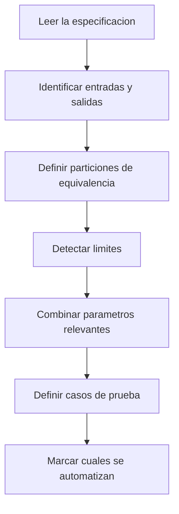
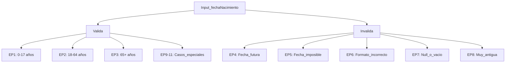
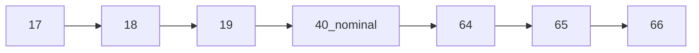
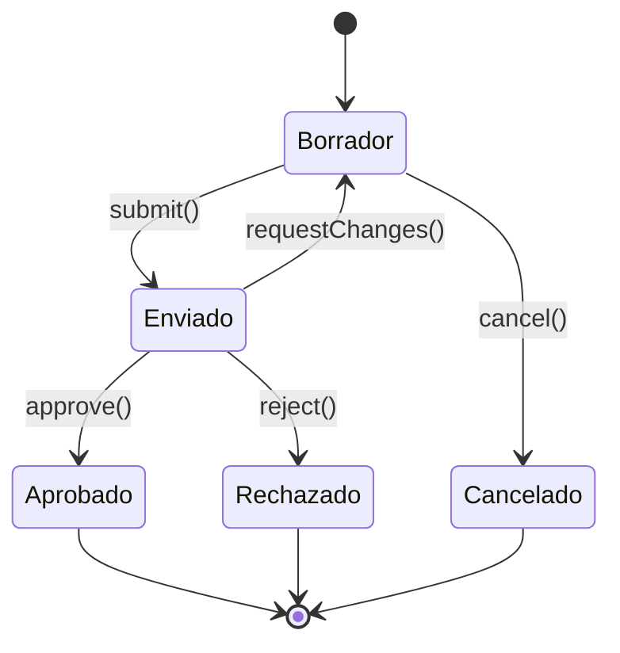
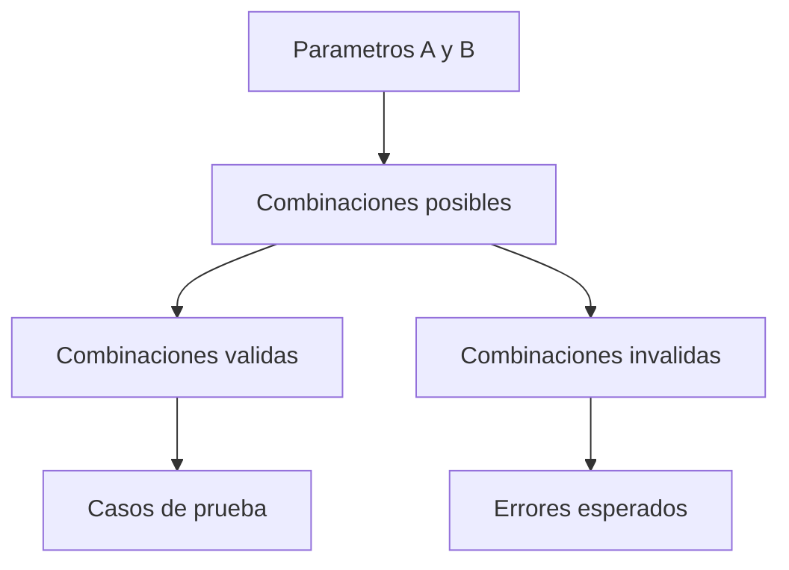

# Capítulo 2. Diseño de tests: de la intuición al método

> Nota
> En este capítulo te voy a hablar como le hablo a mis alumnas que ya trabajaron en QA pero nunca vieron fundamentos. No voy a asumir que “ya sabés lo que es una partición de equivalencia”, pero tampoco te voy a tratar como si fuera tu primer día en tecnología. La idea es ordenar lo que ya hacés para que deje de ser intuitivo y pase a ser **repetible**.

## 2.1 El problema de probar “como venga”

Algo que vi en todos los equipos donde trabajé (Estados Unidos, España, Argentina, UK, Alemania, Francia) es lo mismo: la mayoría de los testers **no tienen un método de diseño de pruebas**.
Lo que tienen es **una mezcla de experiencia + costumbre + lo que hacía el equipo anterior**.

Eso funciona… hasta que:

- el sistema crece,
- aparecen cambios de reglas de negocio,
- hay que automatizar,
- o hay que justificar por qué algo no se probó.

Ahí es donde se nota si el testing fue hecho “con buena voluntad” o “con diseño”.

> Observación
> El autor de _Effective Software Testing_ dice exactamente esto: el problema no es que la gente no pruebe, es que **no prueba de forma sistemática**, y por eso dos personas distintas diseñan dos suites distintas para el mismo código. Lo que buscamos es que **cualquier persona razonable llegue a un conjunto de tests parecido** para el mismo problema.

---

## 2.2 Qué significa "diseñar" un test

Diseñar un test no es "escribir un caso en TestRail".
Diseñar un test es **construir un escenario mínimo que demuestre un comportamiento relevante del sistema**.

Ese escenario debe tener siempre:

1. **Contexto** (precondiciones): qué tenía que cumplirse antes.
2. **Acción**: qué hace el usuario o el sistema.
3. **Oráculo** (lo esperado): cómo sé si pasó o no.
4. **Propósito**: qué riesgo cubre.

Si falta el propósito, el caso existe "porque sí". Ese es el que nadie quiere automatizar después.

> Nota
> Cuando diseñes pensando en automatizar con Playwright, Postman/Newman o Jest, esto es clave: **la automatización no arregla un test mal diseñado**. Primero se diseña, después se ejecuta, y recién después se automatiza. Esto también lo marca el libro: primero derivamos los casos, después los pasamos a JUnit (o al framework que tengamos).

### El Problema del Oráculo (Oracle Problem)

Uno de los desafíos fundamentales del testing fue identificado por **Elaine Weyuker** en 1982:

> "Para algunos programas, es imposible o impracticable determinar si el output es correcto sin ejecutar manualmente todo el proceso que el programa debería automatizar."

Este es el **Oracle Problem**: ¿cómo sabemos que el resultado es correcto?

#### Tipos de Oráculos de Prueba

Según **Barr et al.** (2015) en su survey "The Oracle Problem in Software Testing", existen varios tipos de oráculos:

**1. Specified Oracle (Oráculo Especificado)**
- Basado en especificación formal del comportamiento
- Ejemplo: Documentación que dice "la función debe retornar la raíz cuadrada"
- **Ventaja:** Precisión total
- **Desventaja:** Requiere especificación completa y sin ambigüedades

**2. Derived Oracle (Oráculo Derivado)**
- Compara con versión anterior o sistema similar
- Ejemplo: Testing de regresión comparando con versión previa
- **Ventaja:** Fácil de implementar
- **Desventaja:** Propaga bugs de la versión original

**3. Implicit Oracle (Oráculo Implícito)**
- Propiedades universales que siempre deben cumplirse
- Ejemplo: "el sistema no debe crashear", "no memory leaks"
- **Ventaja:** Siempre aplicable
- **Desventaja:** Solo detecta fallas catastróficas

**4. Partial Oracle (Oráculo Parcial)**
- Solo verifica aspectos específicos del output
- Ejemplo: Solo verificar que el formato JSON es válido, no el contenido
- **Ventaja:** Más fácil de implementar que oráculo completo
- **Desventaja:** Puede perder defectos sutiles

**5. Pseudo Oracle (Pseudo Oráculo)**
- Aproximación cuando el oráculo perfecto no existe
- Ejemplo: Testing de sistemas de IA con outputs creativos
- **Ventaja:** Permite testing de sistemas "no deterministas"
- **Desventaja:** No es 100% confiable

#### Ejemplo Práctico: Sistema de Compresión

```typescript
// Función que comprime datos
function compress(data: string): Buffer {
  const zlib = require('zlib');
  return zlib.gzipSync(Buffer.from(data));
}

// ¿Cómo verificar que el output es correcto?

// ❌ DIFÍCIL: Verificar el buffer comprimido exacto
test('Compressed output matches expected binary', () => {
  const result = compress("Hello World");
  expect(result).toEqual(Buffer.from([0x1f, 0x8b, ...])); // Muy frágil
});

// ✅ MEJOR: Usar Derived Oracle (reversibilidad)
test('Decompression of compressed data returns original', () => {
  const zlib = require('zlib');
  const original = "Hello World";
  const compressed = compress(original);
  const decompressed = zlib.gunzipSync(compressed).toString();
  expect(decompressed).toBe(original);
});

// ✅ MEJOR: Usar Partial Oracle (propiedades)
test('Compressed data is smaller than original', () => {
  const original = "A".repeat(1000);
  const compressed = compress(original);
  expect(compressed.length).toBeLessThan(original.length);
});

// ✅ MEJOR: Usar Implicit Oracle
test('Compress does not crash with large input', () => {
  const largeData = "X".repeat(1_000_000);
  expect(() => compress(largeData)).not.toThrow();
});
```

#### Estrategias para Resolver el Oracle Problem

**1. Usar propiedades matemáticas:**
- Ejemplo: `sqrt(x)² ≈ x`
- Ejemplo: `reverse(reverse(array)) === array`

**2. Comparar con implementación alternativa:**
- Implementar el mismo algoritmo de forma diferente
- Comparar resultados (solo deben diferir si hay bug)

**3. Usar casos conocidos (test fixtures):**
- Crear conjunto de casos con output conocido
- Limitación: Solo cubre esos casos específicos

**4. Metamorphic Testing:**
- Definir relaciones entre inputs relacionados
- Ejemplo: `f(x) + f(y) = f(x+y)` para funciones lineales

```typescript
// Ejemplo: Metamorphic Testing para sistema de búsqueda
test('Búsqueda con término más específico retorna subset', () => {
  const results1 = buscar("test");
  const results2 = buscar("testing");
  
  // Propiedad metamórfica: término más específico → menos resultados
  expect(results2.length).toBeLessThanOrEqual(results1.length);
  
  // Todos los resultados de búsqueda específica deben estar en genérica
  results2.forEach(item => {
    expect(results1).toContainEqual(item);
  });
});
```

> 💡 **Observación:** En la práctica, casi nunca tenemos un oráculo perfecto. La clave es combinar múltiples tipos de oráculos para aumentar la confianza.

---

## 2.3 El pipeline mental para diseñar pruebas



Esto es casi exactamente lo que hace el capítulo de **Specification-based testing**: primero mira parámetros, después piensa en valores válidos e inválidos, después mira relaciones entre parámetros y después arma los casos. El autor mismo dice que en la práctica es **iterativo**, no lineal: podés volver atrás cuando descubrís una partición que te faltó.

---

## 2.4 Paso 1: leer la especificación… de verdad

Acá es donde la mayoría falla: leen el ticket como si fuera un requisito perfecto.En la vida real el requisito:

- está incompleto,
- o está pensado solo para el caso “feliz”,
- o no dice qué pasa con datos raros.

Entonces, cuando hago QA con equipos de Estados Unidos o Alemania, lo primero que hago es **desarmar el requisito en variables**.

Ejemplo sencillo: “El sistema debe calcular el costo de estacionamiento por día”.

Variables que yo veo:

- tipo de vehículo,
- fecha/hora de entrada,
- fecha/hora de salida,
- reglas por día (fines de semana, feriados),
- descuentos,
- límites de días.

Si no identificás variables, **no podés diseñar tests buenos**.

> Aclaración
> Si el requisito no está completo, el test no es menos importante. Al revés: tu test se vuelve **una forma de descubrir requisitos faltantes**. Por eso los buenos QAs hacen preguntas.

---

## 2.5 Paso 2: particiones de equivalencia

La idea es simple: **si dos entradas son tratadas igual por el sistema, no necesito probar las dos**. Probar una representa a la otra.

### Fundamento Teórico

Según **Myers, Sandler & Badgett** (2011) en "The Art of Software Testing":

> "Una clase de equivalencia representa un conjunto de estados válidos o inválidos para las condiciones de entrada. El testing de particiones se basa en la hipótesis de que el software tratará todos los elementos de una clase de manera idéntica."

Esta hipótesis se llama **Assumption of Uniform Behavior** (Suposición de Comportamiento Uniforme).

**Implicación práctica:** Si el test pasa para UN valor de la clase, debería pasar para TODOS los valores de esa clase.

### Ejemplo mejorado con TypeScript

El siguiente código tiene un problema común:

```typescript
// ❌ PROBLEMA: Fecha hardcodeada, no es testeable
function calcularEdad(fechaNacimiento: string): number {
  const hoy = new Date("2025-11-01"); // ← Mal: fecha fija
  const cumple = new Date(fechaNacimiento);
  let edad = hoy.getFullYear() - cumple.getFullYear();
  const m = hoy.getMonth() - cumple.getMonth();
  if (m < 0 || (m === 0 && hoy.getDate() < cumple.getDate())) {
    edad--;
  }
  return edad;
}
```

**Solución: Inyección de dependencia para la fecha actual**

```typescript
interface AgeCalculatorOptions {
  today?: Date;
}

function calcularEdad(
  fechaNacimiento: string,
  options: AgeCalculatorOptions = {}
): number {
  const hoy = options.today || new Date();
  const cumple = new Date(fechaNacimiento);
  
  // Validación
  if (isNaN(cumple.getTime())) {
    throw new Error('Fecha de nacimiento inválida');
  }
  
  if (cumple > hoy) {
    throw new Error('Fecha de nacimiento no puede ser futura');
  }
  
  let edad = hoy.getFullYear() - cumple.getFullYear();
  const m = hoy.getMonth() - cumple.getMonth();
  
  if (m < 0 || (m === 0 && hoy.getDate() < cumple.getDate())) {
    edad--;
  }
  
  return edad;
}
```

### Particiones de Equivalencia Completas

Para la función `calcularEdad`, identificamos estas particiones:

#### Particiones Válidas (Valid Equivalence Classes)

- **EP1:** Fechas que resultan en edad 0-17 (menor de edad)
  - Ejemplo: `"2010-05-15"`
- **EP2:** Fechas que resultan en edad 18-64 (adulto)
  - Ejemplo: `"1990-03-20"`
- **EP3:** Fechas que resultan en edad 65+ (adulto mayor)
  - Ejemplo: `"1950-12-01"`

#### Particiones Inválidas (Invalid Equivalence Classes)

- **EP4:** Fecha futura (persona no nacida aún)
  - Ejemplo: `"2030-01-01"`
- **EP5:** Fecha imposible (no existe en el calendario)
  - Ejemplo: `"2023-02-30"`, `"2023-13-01"`
- **EP6:** Formato inválido
  - Ejemplo: `"abc"`, `"not-a-date"`
- **EP7:** String vacío
  - Ejemplo: `""`
- **EP8:** Fecha muy antigua (puede causar overflow)
  - Ejemplo: `"1500-01-01"`

#### Casos Especiales

- **EP9:** Persona que cumple años hoy
- **EP10:** Persona que cumple años mañana
- **EP11:** Nacido el 29 de febrero (año bisiesto)



### Suite de Tests Completa

```typescript
describe('calcularEdad - Equivalence Partitioning', () => {
  const HOY = new Date('2025-11-03');
  
  describe('Particiones Válidas', () => {
    test('EP1: Menor de edad (17 años)', () => {
      const result = calcularEdad('2008-11-03', { today: HOY });
      expect(result).toBe(17);
    });

    test('EP2: Adulto (30 años)', () => {
      const result = calcularEdad('1995-06-15', { today: HOY });
      expect(result).toBe(30);
    });

    test('EP3: Adulto mayor (70 años)', () => {
      const result = calcularEdad('1955-01-20', { today: HOY });
      expect(result).toBe(70);
    });
  });

  describe('Particiones Inválidas', () => {
    test('EP4: Fecha futura debe lanzar error', () => {
      expect(() => {
        calcularEdad('2030-01-01', { today: HOY });
      }).toThrow('futura');
    });

    test('EP5: Fecha imposible (30 de febrero)', () => {
      expect(() => {
        calcularEdad('2023-02-30', { today: HOY });
      }).toThrow('inválida');
    });

    test('EP6: Formato inválido', () => {
      expect(() => {
        calcularEdad('not-a-date', { today: HOY });
      }).toThrow('inválida');
    });

    test('EP7: String vacío', () => {
      expect(() => {
        calcularEdad('', { today: HOY });
      }).toThrow('inválida');
    });
  });

  describe('Casos Especiales', () => {
    test('EP9: Cumple años hoy (debe incrementar edad)', () => {
      const result = calcularEdad('2000-11-03', { today: HOY });
      expect(result).toBe(25);
    });

    test('EP10: Cumple años mañana (aún no incrementa)', () => {
      const result = calcularEdad('2000-11-04', { today: HOY });
      expect(result).toBe(24);
    });

    test('EP11: Nacido en año bisiesto (29 feb)', () => {
      const result = calcularEdad('2000-02-29', { today: HOY });
      expect(result).toBe(25);
    });
  });
});
```

### Weak vs Strong Equivalence Class Testing

Existen dos enfoques para combinar particiones de múltiples parámetros:

#### Weak Equivalence Class Testing

- **Hipótesis:** Los errores ocurren aisladamente (Single Fault Assumption)
- **Estrategia:** Probar una variable a la vez
- **Tests necesarios:** Suma de particiones
- **Ventaja:** Menos tests
- **Desventaja:** No detecta interacciones entre parámetros

#### Strong Equivalence Class Testing

- **Hipótesis:** Múltiples parámetros pueden fallar simultáneamente
- **Estrategia:** Probar todas las combinaciones de particiones
- **Tests necesarios:** Producto de particiones
- **Ventaja:** Más exhaustivo
- **Desventaja:** Explosión combinatoria

**Ejemplo:** Sistema con 3 parámetros (3 particiones, 2 particiones, 3 particiones)

- **Weak ECT:** 3 + 2 + 3 = 8 tests
- **Strong ECT:** 3 × 2 × 3 = 18 tests

> 💡 **Recomendación práctica:** Usa Weak ECT para testing de humo, Strong ECT para componentes críticos. Para evitar explosión combinatoria, considera Pairwise Testing (ver sección 2.9).

> Nota
> En el PDF de _Specification-based testing_ el autor hace esto exactamente igual: primero analiza cada parámetro por separado (null, vacío, un elemento, varios elementos, ceros a la izquierda) y recién después analiza la relación entre parámetros. Nosotros vamos a hacer lo mismo.

---

## 2.6 Paso 3: análisis de valores límite

Los límites son donde el software más se rompe.

### Fundamento Empírico del Boundary Value Analysis

Según **Paul Jorgensen** (2013) en "Software Testing: A Craftsman's Approach":

> "Los errores tienden a ocurrir en los límites del dominio de entrada más que en el centro. Aproximadamente el 16% de todos los bugs reportados están relacionados con condiciones de borde."

**Estudio de Kaner et al.** (1999):

- BVA detecta **35-40% más defectos** que testing aleatorio con mismo número de casos
- BVA es **3-5x más eficiente** en costo-beneficio que testing exhaustivo
- **70-80% de los defectos** detectados con BVA son críticos (alta severidad)

### Qué es un límite

Un límite es:

- el mínimo permitido,
- el máximo permitido,
- el paso entre valores,
- la transición entre dos reglas.

### Variantes de Boundary Value Analysis

#### 1. Normal BVA (Basic BVA)

**Enfoque:** Prueba valores en y alrededor de los límites

Para un rango `[min, max]` se prueban:

- min - 1 (justo debajo del límite inferior)
- min (límite inferior exacto)
- min + 1 (justo sobre el límite inferior)
- nominal (valor medio del rango)
- max - 1 (justo bajo el límite superior)
- max (límite superior exacto)
- max + 1 (justo sobre el límite superior)

**Ejemplo: si un sistema acepta edades de 18 a 65:**

- 17 (debajo del mínimo)
- 18 (mínimo)
- 19 (justo encima del mínimo)
- 40 (nominal)
- 64 (justo debajo del máximo)
- 65 (máximo)
- 66 (arriba del máximo)



```typescript
describe('Normal BVA - Validación de edad [18-65]', () => {
  test('17: justo debajo del mínimo (inválido)', () => {
    expect(isValidAge(17)).toBe(false);
  });

  test('18: límite inferior (válido)', () => {
    expect(isValidAge(18)).toBe(true);
  });

  test('19: justo sobre el mínimo (válido)', () => {
    expect(isValidAge(19)).toBe(true);
  });

  test('40: valor nominal (válido)', () => {
    expect(isValidAge(40)).toBe(true);
  });

  test('64: justo bajo el máximo (válido)', () => {
    expect(isValidAge(64)).toBe(true);
  });

  test('65: límite superior (válido)', () => {
    expect(isValidAge(65)).toBe(true);
  });

  test('66: justo sobre el máximo (inválido)', () => {
    expect(isValidAge(66)).toBe(false);
  });
});
```

#### 2. Robust BVA

**Enfoque:** Añade valores extremos fuera del rango razonable

```typescript
describe('Robust BVA - Valores extremos', () => {
  test('-5: valor negativo extremo', () => {
    expect(isValidAge(-5)).toBe(false);
  });

  test('0: cero (límite matemático)', () => {
    expect(isValidAge(0)).toBe(false);
  });

  test('150: edad imposible', () => {
    expect(isValidAge(150)).toBe(false);
  });
});
```

#### 3. Worst-Case BVA

**Enfoque:** Combina límites de MÚLTIPLES variables

Para cada variable, usa 5 valores: {min, min+1, nominal, max-1, max}

**Ejemplo: Rectángulo con ancho [1-100] y alto [1-100]**

```typescript
describe('Worst-Case BVA - Área de rectángulo', () => {
  const boundaryValues = [1, 2, 50, 99, 100]; // 5 valores por variable
  
  // 5² = 25 combinaciones
  boundaryValues.forEach(width => {
    boundaryValues.forEach(height => {
      test(`width=${width}, height=${height}`, () => {
        const area = calculateArea({ width, height });
        expect(area).toBe(width * height);
      });
    });
  });
});
```

### Comparación de Estrategias BVA

| Estrategia              | Variables | Valores/var | Tests      | Ejemplo (n=2) | Detecta               |
|-------------------------|-----------|-------------|------------|---------------|----------------------|
| Normal BVA              | n         | 5           | 4n + 1     | 9             | Errores simples      |
| Robust BVA              | n         | 7           | 6n + 1     | 13            | Errores + robustez   |
| Worst-Case BVA          | n         | 5           | 5ⁿ         | 25            | Interacciones        |
| Robust Worst-Case BVA   | n         | 7           | 7ⁿ         | 49            | Todo lo anterior     |

### Cuándo usar cada variante

| Situación | Variante recomendada | Razón |
|-----------|---------------------|-------|
| Testing rápido, componente simple | Normal BVA | Balance costo-beneficio |
| Sistema crítico (médico, financiero) | Robust Worst-Case BVA | Máxima cobertura |
| Múltiples variables independientes | Normal BVA por variable | Evita explosión combinatoria |
| Variables con interacciones conocidas | Worst-Case BVA | Detecta bugs de interacción |
| Validación de entrada de usuario | Robust BVA | Usuarios pueden ingresar cualquier cosa |

> 💡 **Regla práctica:** Para 1-2 variables usa Worst-Case BVA (25-49 tests). Para 3-4 variables usa Normal BVA + casos seleccionados. Para 5+ variables considera Pairwise Testing (sección 2.9).

> Observación
> Esto parece básico, pero es lo que más falta cuando reviso test suites reales de equipos que automatizaron "a lo bestia": tienen el caso feliz, pero no tienen el 17 ni el 66. Y después dicen "Playwright no encontró nada". Claro, si no le diste escenarios que rompan reglas, no va a encontrar nada.

---

## 2.7 Tablas de Decisión (Decision Tables)

Las **tablas de decisión** son una técnica de testing de caja negra que modela lógica de negocio compleja con múltiples condiciones y acciones.

Según **Myers et al.** (2011):

> "Las tablas de decisión son efectivas cuando el comportamiento del sistema depende de combinaciones de condiciones de entrada, especialmente cuando hay reglas de negocio complejas."

### Cuándo usar Tablas de Decisión

- Múltiples condiciones booleanas que determinan diferentes acciones
- Reglas de negocio con combinaciones específicas
- Políticas con múltiples criterios de aprobación/rechazo
- Cálculos que dependen de varias flags o estados

### Estructura de una Tabla de Decisión

```
┌─────────────────┬────────────────────────────────┐
│                 │      Reglas (Combinaciones)    │
│                 ├────┬────┬────┬────┬────┬────┬──┤
│                 │ R1 │ R2 │ R3 │ R4 │ R5 │ R6 │  │
├─────────────────┼────┼────┼────┼────┼────┼────┼──┤
│ Condiciones:    │    │    │    │    │    │    │  │
│ C1: Edad >= 18  │ T  │ T  │ T  │ F  │ F  │ F  │  │
│ C2: Tiene DNI   │ T  │ T  │ F  │ T  │ F  │ -  │  │
│ C3: Sin deudas  │ T  │ F  │ -  │ -  │ -  │ -  │  │
├─────────────────┼────┼────┼────┼────┼────┼────┼──┤
│ Acciones:       │    │    │    │    │    │    │  │
│ A1: Aprobar     │ X  │    │    │    │    │    │  │
│ A2: Revisar     │    │ X  │    │ X  │    │    │  │
│ A3: Rechazar    │    │    │ X  │    │ X  │ X  │  │
└─────────────────┴────┴────┴────┴────┴────┴────┴──┘
```

**Leyenda:**

- T = True, F = False, - = Don't Care (no importa el valor)
- X = Acción a ejecutar

### Ejemplo Real: Sistema de Aprobación de Préstamos

```typescript
interface LoanRequest {
  age: number;
  hasID: boolean;
  hasDebts: boolean;
  creditScore: number;
}

type LoanDecision = 'APPROVED' | 'REVIEW' | 'REJECTED';

class LoanApprovalSystem {
  static decide(request: LoanRequest): LoanDecision {
    const isAdult = request.age >= 18;
    const hasValidID = request.hasID;
    const hasNoDebts = !request.hasDebts;
    const goodCredit = request.creditScore >= 600;

    // Tabla de decisión implementada
    if (isAdult && hasValidID && hasNoDebts && goodCredit) {
      return 'APPROVED';  // R1
    }
    
    if (isAdult && hasValidID && hasDebts && goodCredit) {
      return 'REVIEW';    // R2
    }
    
    if (isAdult && !hasValidID) {
      return 'REJECTED';  // R3
    }
    
    if (!isAdult) {
      return 'REJECTED';  // R4, R5, R6
    }

    return 'REVIEW';      // Default
  }
}

// Test Suite basado en Tabla de Decisión
describe('LoanApprovalSystem - Decision Table Testing', () => {
  test('R1: Adulto + DNI + Sin deudas + Buen crédito = APROBADO', () => {
    expect(LoanApprovalSystem.decide({
      age: 25,
      hasID: true,
      hasDebts: false,
      creditScore: 700
    })).toBe('APPROVED');
  });

  test('R2: Adulto + DNI + Con deudas + Buen crédito = REVISAR', () => {
    expect(LoanApprovalSystem.decide({
      age: 30,
      hasID: true,
      hasDebts: true,
      creditScore: 650
    })).toBe('REVIEW');
  });

  test('R3: Adulto + Sin DNI = RECHAZADO', () => {
    expect(LoanApprovalSystem.decide({
      age: 25,
      hasID: false,
      hasDebts: false,
      creditScore: 700
    })).toBe('REJECTED');
  });

  test('R4-R6: Menor de edad = RECHAZADO', () => {
    expect(LoanApprovalSystem.decide({
      age: 16,
      hasID: true,
      hasDebts: false,
      creditScore: 700
    })).toBe('REJECTED');
  });
});
```

### Ventajas de las Tablas de Decisión

1. **Completitud:** Aseguran que todas las combinaciones están consideradas
2. **Detección de inconsistencias:** Reglas contradictorias se hacen evidentes
3. **Documentación:** Sirven como especificación ejecutable de reglas de negocio
4. **Reducción de redundancia:** Optimización con "Don't Care" (-)

### Limited-Entry vs Extended-Entry

**Limited-Entry:** Condiciones binarias (True/False)

**Extended-Entry:** Condiciones con rangos de valores

```
Extended-Entry Decision Table:

Condición: Edad     │ <18 │ 18-25 │ 26-65 │ >65 │
Condición: Ingreso  │ -   │ <30K  │ >30K  │ -   │
────────────────────┼─────┼───────┼───────┼─────┤
Acción: Tarjeta Oro │     │   X   │   X   │     │
```

> 💡 **Observación:** Las tablas de decisión son especialmente útiles cuando tienes 3-6 condiciones booleanas. Con más de 8 condiciones, considera dividir la lógica en sub-sistemas.

---

## 2.8 State Transition Testing (Testing de Transición de Estados)

Esta técnica modela el sistema como una **máquina de estados finitos (FSM)** y diseña tests que cubren transiciones entre estados.

### Cuándo usar State Transition Testing

- Sistemas con ciclo de vida de objetos (pedidos, tickets, usuarios)
- Protocolos de comunicación
- Workflows de negocio
- Interfaces de usuario con estados distintos
- Sesiones de usuario (login/logout)

### Elementos de un Diagrama de Estados



**Componentes:**

- **Estados**: Condiciones del sistema (Borrador, Enviado, Aprobado, etc.)
- **Transiciones**: Cambios entre estados
- **Eventos**: Disparadores de transiciones (submit, approve, reject)
- **Guardas**: Condiciones para permitir transición
- **Acciones**: Efectos de la transición

### Ejemplo Completo: Sistema de Órdenes de Compra

```typescript
type OrderState = 'DRAFT' | 'SUBMITTED' | 'APPROVED' | 'REJECTED' | 'CANCELLED';

interface Order {
  id: string;
  state: OrderState;
  total: number;
}

class OrderStateMachine {
  private order: Order;

  constructor(order: Order) {
    this.order = order;
  }

  submit(): boolean {
    if (this.order.state !== 'DRAFT') {
      throw new Error(`Cannot submit order in state ${this.order.state}`);
    }
    if (this.order.total <= 0) {
      throw new Error('Cannot submit order with total <= 0');
    }
    this.order.state = 'SUBMITTED';
    return true;
  }

  approve(): boolean {
    if (this.order.state !== 'SUBMITTED') {
      throw new Error(`Cannot approve order in state ${this.order.state}`);
    }
    this.order.state = 'APPROVED';
    return true;
  }

  reject(): boolean {
    if (this.order.state !== 'SUBMITTED') {
      throw new Error(`Cannot reject order in state ${this.order.state}`);
    }
    this.order.state = 'REJECTED';
    return true;
  }

  cancel(): boolean {
    if (this.order.state === 'APPROVED' || this.order.state === 'REJECTED') {
      throw new Error(`Cannot cancel order in state ${this.order.state}`);
    }
    this.order.state = 'CANCELLED';
    return true;
  }

  requestChanges(): boolean {
    if (this.order.state !== 'SUBMITTED') {
      throw new Error(`Cannot request changes in state ${this.order.state}`);
    }
    this.order.state = 'DRAFT';
    return true;
  }

  getState(): OrderState {
    return this.order.state;
  }
}

describe('OrderStateMachine - State Transition Testing', () => {
  
  describe('Transiciones válidas', () => {
    test('DRAFT → SUBMITTED: submit()', () => {
      const order = { id: '1', state: 'DRAFT' as OrderState, total: 100 };
      const sm = new OrderStateMachine(order);
      
      sm.submit();
      expect(sm.getState()).toBe('SUBMITTED');
    });

    test('SUBMITTED → APPROVED: approve()', () => {
      const order = { id: '1', state: 'SUBMITTED' as OrderState, total: 100 };
      const sm = new OrderStateMachine(order);
      
      sm.approve();
      expect(sm.getState()).toBe('APPROVED');
    });

    test('SUBMITTED → REJECTED: reject()', () => {
      const order = { id: '1', state: 'SUBMITTED' as OrderState, total: 100 };
      const sm = new OrderStateMachine(order);
      
      sm.reject();
      expect(sm.getState()).toBe('REJECTED');
    });

    test('SUBMITTED → DRAFT: requestChanges()', () => {
      const order = { id: '1', state: 'SUBMITTED' as OrderState, total: 100 };
      const sm = new OrderStateMachine(order);
      
      sm.requestChanges();
      expect(sm.getState()).toBe('DRAFT');
    });

    test('DRAFT → CANCELLED: cancel()', () => {
      const order = { id: '1', state: 'DRAFT' as OrderState, total: 100 };
      const sm = new OrderStateMachine(order);
      
      sm.cancel();
      expect(sm.getState()).toBe('CANCELLED');
    });
  });

  describe('Transiciones inválidas', () => {
    test('SUBMITTED → SUBMITTED: submit() debe fallar', () => {
      const order = { id: '1', state: 'SUBMITTED' as OrderState, total: 100 };
      const sm = new OrderStateMachine(order);
      
      expect(() => sm.submit()).toThrow('Cannot submit');
    });

    test('APPROVED → CANCELLED: cancel() debe fallar', () => {
      const order = { id: '1', state: 'APPROVED' as OrderState, total: 100 };
      const sm = new OrderStateMachine(order);
      
      expect(() => sm.cancel()).toThrow('Cannot cancel');
    });

    test('DRAFT → APPROVED: approve() debe fallar', () => {
      const order = { id: '1', state: 'DRAFT' as OrderState, total: 100 };
      const sm = new OrderStateMachine(order);
      
      expect(() => sm.approve()).toThrow('Cannot approve');
    });
  });

  describe('Guardas (condiciones)', () => {
    test('Submit con total <= 0 debe fallar', () => {
      const order = { id: '1', state: 'DRAFT' as OrderState, total: 0 };
      const sm = new OrderStateMachine(order);
      
      expect(() => sm.submit()).toThrow('total <= 0');
    });
  });

  describe('Secuencias de transición', () => {
    test('Secuencia válida: DRAFT → SUBMITTED → APPROVED', () => {
      const order = { id: '1', state: 'DRAFT' as OrderState, total: 100 };
      const sm = new OrderStateMachine(order);
      
      sm.submit();
      expect(sm.getState()).toBe('SUBMITTED');
      
      sm.approve();
      expect(sm.getState()).toBe('APPROVED');
    });

    test('Secuencia con cambios: DRAFT → SUBMITTED → DRAFT → SUBMITTED → APPROVED', () => {
      const order = { id: '1', state: 'DRAFT' as OrderState, total: 100 };
      const sm = new OrderStateMachine(order);
      
      sm.submit();
      sm.requestChanges();
      expect(sm.getState()).toBe('DRAFT');
      
      sm.submit();
      sm.approve();
      expect(sm.getState()).toBe('APPROVED');
    });
  });
});
```

### Niveles de Cobertura de Estados

**1. 0-switch coverage (State Coverage):**

- Visitar cada estado al menos una vez
- Mínimo: n tests (donde n = número de estados)

**2. 1-switch coverage (Transition Coverage):**

- Ejecutar cada transición válida al menos una vez
- **Recomendado:** También probar transiciones inválidas
- Mínimo: t tests (donde t = número de transiciones)

**3. N-switch coverage:**

- Secuencias de N transiciones consecutivas
- Más exhaustivo pero crece exponencialmente

**Para el ejemplo de Order:**

- Estados: 5 (DRAFT, SUBMITTED, APPROVED, REJECTED, CANCELLED)
- Transiciones válidas: 6
- Transiciones inválidas a probar: ~15-20

### Tabla de Transiciones

| Estado Actual | Evento           | Estado Siguiente | ¿Válido? |
|---------------|------------------|------------------|----------|
| DRAFT         | submit()         | SUBMITTED        | ✅        |
| DRAFT         | approve()        | -                | ❌ Error  |
| DRAFT         | reject()         | -                | ❌ Error  |
| DRAFT         | cancel()         | CANCELLED        | ✅        |
| SUBMITTED     | submit()         | -                | ❌ Error  |
| SUBMITTED     | approve()        | APPROVED         | ✅        |
| SUBMITTED     | reject()         | REJECTED         | ✅        |
| SUBMITTED     | requestChanges() | DRAFT            | ✅        |
| SUBMITTED     | cancel()         | CANCELLED        | ✅        |
| APPROVED      | cancel()         | -                | ❌ Error  |

> 💡 **Observación:** En sistemas reales, siempre prueba las transiciones inválidas. Son las que más bugs encuentran porque nadie las considera en el desarrollo inicial.

---

## 2.9 Combinatorial Testing: Pairwise (All-Pairs)

Ya vimos en el Capítulo 1 que un formulario con 10 campos y 5 valores cada uno tiene $5^{10} = 9,765,625$ combinaciones posibles. Eso es **imposible de probar exhaustivamente**.

**Pairwise Testing** (también llamado **All-Pairs** u **Orthogonal Array Testing**) reduce drásticamente el número de tests mientras mantiene alta efectividad.

### Fundamento Teórico

Según estudios de **Kuhn, Wallace & Gallo** (2004) del NIST:

> "El 70% de los defectos son causados por interacciones de 1 o 2 parámetros. El 90% por interacciones de hasta 3 parámetros."

**Implicación:** No necesitamos probar TODAS las combinaciones, solo asegurar que cada par de valores aparezca junto al menos una vez.

### Ejemplo: Configuración de Navegador

**Parámetros:**

- Browser: Chrome, Firefox, Safari (3 valores)
- OS: Windows, Mac, Linux (3 valores)
- Language: ES, EN, FR (3 valores)
- Resolution: 1080p, 1440p, 4K (3 valores)

**Testing exhaustivo:** $3^4 = 81$ combinaciones

**Pairwise testing:** ~9-12 combinaciones (reducción del **85%**)

### Ejemplo Práctico con TypeScript

```typescript
interface TestConfig {
  browser: 'Chrome' | 'Firefox' | 'Safari';
  os: 'Windows' | 'Mac' | 'Linux';
  language: 'ES' | 'EN' | 'FR';
  resolution: '1080p' | '1440p' | '4K';
}

// Conjunto Pairwise generado (con herramienta PICT o AllPairs)
const pairwiseTests: TestConfig[] = [
  { browser: 'Chrome', os: 'Windows', language: 'ES', resolution: '1080p' },
  { browser: 'Chrome', os: 'Mac', language: 'EN', resolution: '1440p' },
  { browser: 'Chrome', os: 'Linux', language: 'FR', resolution: '4K' },
  { browser: 'Firefox', os: 'Windows', language: 'EN', resolution: '4K' },
  { browser: 'Firefox', os: 'Mac', language: 'FR', resolution: '1080p' },
  { browser: 'Firefox', os: 'Linux', language: 'ES', resolution: '1440p' },
  { browser: 'Safari', os: 'Windows', language: 'FR', resolution: '1440p' },
  { browser: 'Safari', os: 'Mac', language: 'ES', resolution: '4K' },
  { browser: 'Safari', os: 'Linux', language: 'EN', resolution: '1080p' },
];

describe('Pairwise Testing - Browser Compatibility', () => {
  pairwiseTests.forEach((config, index) => {
    test(`Config ${index + 1}: ${config.browser}/${config.os}/${config.language}/${config.resolution}`, async () => {
      // Playwright setup
      const browser = await chromium.launch(); // Simplificado
      
      // Verificar que la página funciona con esta configuración
      expect(true).toBe(true); // Placeholder
      
      await browser.close();
    });
  });
});
```

### Comparación: Exhaustivo vs Pairwise vs Aleatorio

| Estrategia | Casos de prueba | Detección de defectos | Tiempo de ejecución |
|------------|-----------------|----------------------|---------------------|
| Exhaustivo | 81              | 100%                | 100%                |
| Pairwise   | 9               | ~90%                | 11%                 |
| Aleatorio  | 9               | ~50-60%             | 11%                 |

### Herramientas para Generar Pairwise

**1. PICT (Microsoft) - Recomendado**

```bash
# Archivo config.txt
Browser: Chrome, Firefox, Safari
OS: Windows, Mac, Linux  
Language: ES, EN, FR
Resolution: 1080p, 1440p, 4K

# Generar combinaciones
pict config.txt > test-cases.txt
```

**2. AllPairs (Python)**

```python
from allpairspy import AllPairs

parameters = [
    ["Chrome", "Firefox", "Safari"],
    ["Windows", "Mac", "Linux"],
    ["ES", "EN", "FR"],
    ["1080p", "1440p", "4K"]
]

for i, combo in enumerate(AllPairs(parameters)):
    print(f"Test {i+1}: {combo}")
```

**3. jenny (CLI tool)**

```bash
jenny browser=3 os=3 language=3 resolution=3
```

### Pairwise con Restricciones

A veces ciertas combinaciones no son válidas:

```typescript
// Safari no está disponible en Linux
// Linux no soporta 4K en este ejemplo
```

PICT soporta restricciones:

```
IF [Browser] = "Safari" THEN [OS] <> "Linux";
IF [OS] = "Linux" THEN [Resolution] <> "4K";
```

### N-way Combinatorial Testing

- **1-way**: Cada valor aparece al menos una vez (trivial)
- **2-way (Pairwise)**: Cada par de valores aparece junto
- **3-way**: Cada trío de valores aparece junto (más exhaustivo)
- **N-way**: Cada combinación de N valores aparece

**Crecimiento:**

Para 4 parámetros con 3 valores cada uno:

- 1-way: 4 tests
- 2-way: ~9 tests
- 3-way: ~27 tests
- 4-way (exhaustivo): 81 tests

### Datos Empíricos de Efectividad

**NIST (Kuhn et al., 2004):**

- 2-way cubre ~**70% de defectos**
- 3-way cubre ~**90% de defectos**
- 4-way cubre ~**95% de defectos**
- 5-way cubre ~**97% de defectos**
- 6-way cubre ~**99% de defectos**

**Recomendación:**

- Sistemas críticos: 3-way o 4-way
- Sistemas normales: 2-way (pairwise)
- Testing exploratorio: 1-way + aleatorio

> 💡 **Observación:** Pairwise es la técnica que más ahorra tiempo sin sacrificar calidad. Si tienes un formulario con 8 campos, Pairwise puede reducir de miles de casos a solo 15-20.

---

## 2.10 Paso 4: analizar relaciones entre parámetros

Hasta acá probaste cada parámetro por separado.
Ahora hay que ver **cómo se combinan**.

En sistemas de negocio esto pasa todo el tiempo. Ejemplos que vi trabajando para equipos de UK y Alemania:

- país + moneda
- tipo de documento + país
- tipo de envío + peso
- rol del usuario + estado del pedido



Ejemplo en tabla:

| Rol      | Estado del pedido | Debe poder aprobar |
| -------- | ----------------- | ------------------ |
| admin    | pendiente         | si                 |
| admin    | aprobado          | no                 |
| operador | pendiente         | si                 |
| operador | aprobado          | no                 |
| invitado | pendiente         | no                 |

> Nota
> Acá es donde una QA que solo ejecuta se queda sin herramientas. La que diseña, en cambio, puede discutir la regla con producto y decir “tu lógica tiene huecos”.

---

## 2.8 Paso 5: derivar los casos de prueba

Una vez que tengo:

- particiones,
- límites,
- combinaciones relevantes,

recién ahí escribo los casos.

Estructura que recomiendo:

```text
ID: CT-REGISTRO-001
Titulo: Registrar usuario con datos validos
Proposito: Validar que el sistema acepta datos minimos y crea el usuario
Precondiciones:
  - No existe un usuario con ese correo
Pasos:
  1. Abrir pantalla de registro
  2. Completar nombre, correo y password valido
  3. Enviar formulario
Resultado esperado:
  - El sistema crea el usuario
  - Se muestra mensaje de exito
Riesgo cubierto: flujo feliz
Automatizable: si
```

> Aclaracion
> El libro de _Effective Software Testing_ insiste en separar **diseño** de **ejecución** y de **automatización**. El test nace aquí, en el diseño. La automatización es solo la forma de ejecutarlo muchas veces. Si saltás directo a Playwright sin este paso, tu suite va a crecer desordenada.

---

## 2.11 Matriz de Selección de Técnicas de Testing

Una de las preguntas más frecuentes es: **¿cuándo uso cada técnica?**

Esta tabla te ayuda a decidir:

| Situación | Técnica recomendada | Razón |
|-----------|---------------------|-------|
| Función con 1-2 parámetros simples | Particiones de Equivalencia + Normal BVA | Rápido y suficiente |
| Validación de entrada de usuario | Robust BVA + Particiones Inválidas | Usuarios ingresan cualquier cosa |
| Lógica de negocio con múltiples condiciones | Tablas de Decisión | Visualiza todas las reglas claramente |
| Workflow con estados (pedidos, tickets) | State Transition Testing | Cubre ciclo de vida completo |
| Formulario con 5+ campos | Pairwise Testing | Reduce explosión combinatoria |
| Sistema crítico (médico, financiero) | Robust Worst-Case BVA + Strong ECT | Máxima cobertura |
| API con múltiples parámetros opcionales | Pairwise + Particiones | Balance entre cobertura y cantidad |
| Testing de regresión rápido | Weak ECT + Normal BVA | Costo-beneficio óptimo |
| Sistema legacy sin documentación | Exploratorio + Particiones observadas | Descubrir comportamiento real |

### Combinando Técnicas

En la práctica, casi nunca usas UNA sola técnica. Lo común es combinarlas:

**Ejemplo: API de Registro de Usuario**

```typescript
interface RegistrationRequest {
  email: string;      // Particiones: válido, formato inválido, vacío
  password: string;   // BVA: longitud [8-128], caracteres especiales
  age: number;        // BVA: [18-150], Particiones: menor, mayor válido
  country: string;    // Particiones: países soportados vs no soportados
  newsletter: boolean; // Booleano simple
}
```

**Estrategia combinada:**

1. **Particiones de Equivalencia** para email, country
2. **Robust BVA** para password (longitud), age (límites)
3. **Pairwise** para combinar email válido/inválido × country soportado/no soportado × newsletter true/false
4. **Casos especiales:** Caracteres Unicode en email, países con restricciones legales

**Resultado:** En lugar de probar 5 × 7 × 6 × 3 × 2 = **1,260 combinaciones exhaustivas**, obtenemos ~**25-30 casos** bien diseñados.

---

## 2.12 Paso 5: derivar los casos de prueba

Una vez que tengo:

- particiones,
- límites,
- combinaciones relevantes,

recién ahí escribo los casos.

Estructura que recomiendo:

```text
ID: CT-REGISTRO-001
Titulo: Registrar usuario con datos validos
Proposito: Validar que el sistema acepta datos minimos y crea el usuario
Precondiciones:
  - No existe un usuario con ese correo
Pasos:
  1. Abrir pantalla de registro
  2. Completar nombre, correo y password valido
  3. Enviar formulario
Resultado esperado:
  - El sistema crea el usuario
  - Se muestra mensaje de exito
Riesgo cubierto: flujo feliz
Automatizable: si
```

> Aclaración
> El libro de _Effective Software Testing_ insiste en separar **diseño** de **ejecución** y de **automatización**. El test nace aquí, en el diseño. La automatización es solo la forma de ejecutarlo muchas veces. Si saltás directo a Playwright sin este paso, tu suite va a crecer desordenada.

---

## 2.13 Ejemplo completo con TypeScript

Supongamos que tenemos un servicio que calcula el precio de un envío:

```typescript
type ShippingType = "standard" | "express" | "international";

interface ShippingRequest {
  weightKg: number;
  country: string;
  type: ShippingType;
  discountCode?: string;
}

export function calculateShipping(req: ShippingRequest): number {
  if (req.weightKg <= 0) {
    throw new Error("Invalid weight");
  }

  let base = 10;

  if (req.type === "express") {
    base += 15;
  } else if (req.type === "international") {
    base += 25;
  }

  if (req.weightKg > 20) {
    base += 20;
  }

  if (req.country !== "AR") {
    base += 5;
  }

  if (req.discountCode === "AIKO10") {
    base = base * 0.9;
  }

  return base;
}
```

Casos resultantes (resumen):

1. Peso <= 0 -> debe lanzar error.
2. Peso 10, standard, AR, sin descuento -> base 10.
3. Peso 10, express, AR, sin descuento -> 25.
4. Peso 10, international, AR, sin descuento -> 35.
5. Peso 25, standard, AR, sin descuento -> 30.
6. Peso 25, international, no AR, sin descuento -> 60.
7. Peso 10, express, no AR, con AIKO10 -> 27.

> Nota
> Fijate que todos los casos tienen una razón. No hay “probar con 5 kg porque sí”. Esto es lo que diferencia una suite hecha a mano de una suite **diseñada**.

---

## 2.10 Cómo documentar las “notas del tester”

Podés usar citas de Markdown así:

> Observacion del tester
> En mobile con red lenta, la pantalla de pago tarda demasiado y no hay loader. Esto no es un bug funcional pero es una condicion de prueba que deberiamos repetir.

> Nota tecnica
> Este endpoint devuelve 200 aun cuando el dato no existe. Hablar con backend para ver si se puede devolver 404 o 204.

> Riesgo detectado
> Si agregamos un nuevo tipo de envio, todos los tests que dependen del enum "ShippingType" van a romper. Conviene centralizar fixtures.

---

## 2.15 Relación con automatización (avanzado)

> Nota
> La automatización solo tiene valor a partir de la segunda corrida. La primera vez el valor lo puso el humano que diseñó el test. Si tu diseño es pobre, tu automatización va a ser pobre. Esto parece obvio, pero lo he visto repetirse en empresas de Estados Unidos y también en pymes de Argentina: el problema no era Selenium, era el diseño.

---

## 2.16 Resumen del capítulo

En este capítulo vimos que:

- Diseñar tests es **reducir un espacio infinito de pruebas** a un conjunto manejable y con sentido.
- El **Oracle Problem** (Weyuker, 1982) nos recuerda que determinar la corrección es un desafío fundamental del testing.
- **Particiones de Equivalencia** reducen casos redundantes agrupando inputs que se comportan igual.
- **Boundary Value Analysis** detecta 35-40% más defectos que testing aleatorio (Kaner et al., 1999).
- **Tablas de Decisión** modelan lógica de negocio compleja con múltiples condiciones.
- **State Transition Testing** cubre workflows y ciclos de vida de objetos.
- **Pairwise Testing** reduce testing combinatorio de miles de casos a decenas, cubriendo ~90% de defectos (NIST, 2004).
- Las técnicas de especificación (particiones, límites, relaciones) no son académicas: son las que te permiten automatizar después sin que la suite explote.
- La buena documentación de pruebas incluye **notas y observaciones** además de los casos formales.
- **El diseño va primero, la herramienta después.**

---

## Referencias

### Libros Fundamentales

1. **Myers, Glenford J., Sandler, Corey & Badgett, Tom** (2011). *The Art of Software Testing, 3rd Edition*. Wiley. ISBN: 978-1118031964.

2. **Jorgensen, Paul C.** (2013). *Software Testing: A Craftsman's Approach, 4th Edition*. CRC Press. ISBN: 978-1466560680.

3. **Copeland, Lee** (2003). *A Practitioner's Guide to Software Test Design*. Artech House. ISBN: 978-1580537919.

4. **Binder, Robert V.** (1999). *Testing Object-Oriented Systems: Models, Patterns, and Tools*. Addison-Wesley. ISBN: 978-0201809381.

5. **Kaner, Cem, Falk, Jack & Nguyen, Hung Q.** (1999). *Testing Computer Software, 2nd Edition*. Wiley. ISBN: 978-0471358466.

6. **Aniche, Maurício** (2022). *Effective Software Testing: A Developer's Guide*. Manning Publications. ISBN: 978-1633439931.

### Papers y Estudios Científicos

7. **Weyuker, Elaine J.** (1982). "On Testing Non-Testable Programs". *The Computer Journal*, 25(4), 465-470. doi:10.1093/comjnl/25.4.465

8. **Barr, Earl T., Harman, Mark, McMinn, Phil, Shahbaz, Muzammil & Yoo, Shin** (2015). "The Oracle Problem in Software Testing: A Survey". *IEEE Transactions on Software Engineering*, 41(5), 507-525. doi:10.1109/TSE.2014.2372785

9. **Kuhn, D. Richard, Wallace, Dolores R. & Gallo, Albert M.** (2004). "Software Fault Interactions and Implications for Software Testing". *IEEE Transactions on Software Engineering*, 30(6), 418-421. doi:10.1109/TSE.2004.24

10. **Cohen, David M., Dalal, Siddhartha R., Fredman, Michael L. & Patton, Gardner C.** (1997). "The AETG System: An Approach to Testing Based on Combinatorial Design". *IEEE Transactions on Software Engineering*, 23(7), 437-444. doi:10.1109/32.605761

11. **Grindal, Mats, Offutt, Jeff & Andler, Sten F.** (2005). "Combination Testing Strategies: A Survey". *Software Testing, Verification and Reliability*, 15(3), 167-199. doi:10.1002/stvr.319

### Estándares y Especificaciones

12. **IEEE** (2008). *IEEE 829-2008 - Standard for Software and System Test Documentation*. Institute of Electrical and Electronics Engineers.

13. **ISO/IEC/IEEE** (2013). *ISO/IEC/IEEE 29119 - Software Testing Standard*. International Organization for Standardization.

14. **ISTQB** (2018). *ISTQB Foundation Level Syllabus - Test Design Techniques*. International Software Testing Qualifications Board.

### Recursos Técnicos

15. **NIST** (National Institute of Standards and Technology). "Combinatorial Testing". https://csrc.nist.gov/projects/automated-combinatorial-testing-for-software

16. **Microsoft PICT** (Pairwise Independent Combinatorial Testing tool). https://github.com/microsoft/pict

17. **AllPairs** (Python library for pairwise testing). https://pypi.org/project/allpairspy/

---

> 💡 **Nota final:** Este capítulo cubre las técnicas fundamentales del diseño de tests basado en especificaciones. En el siguiente capítulo veremos **testing estructural** (caja blanca), donde usamos el código fuente para guiar el diseño de pruebas.
