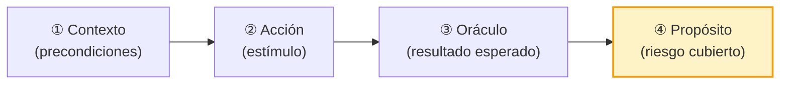
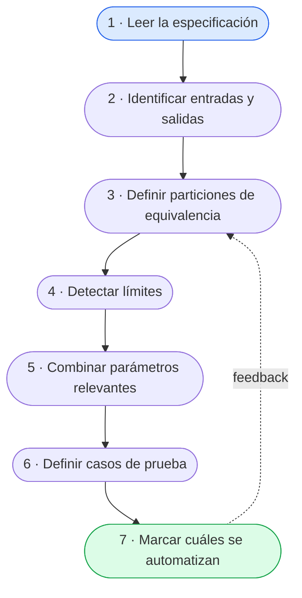
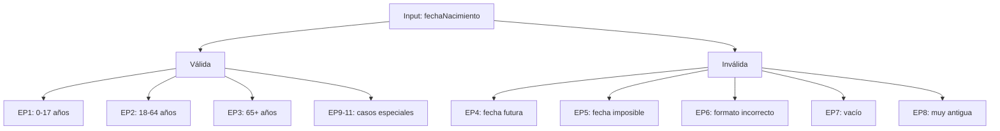
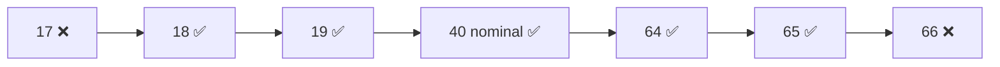
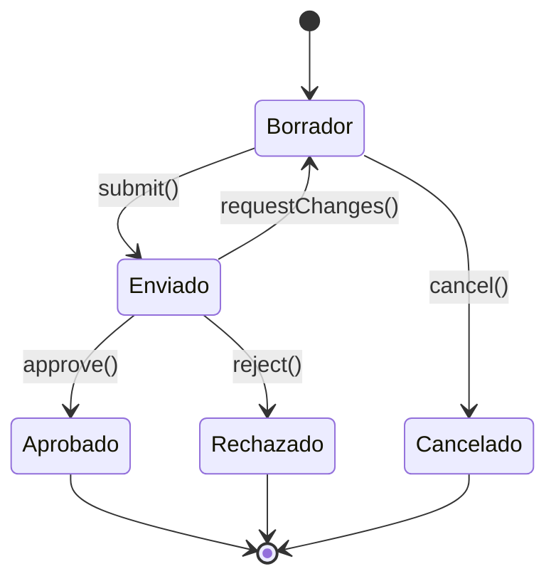
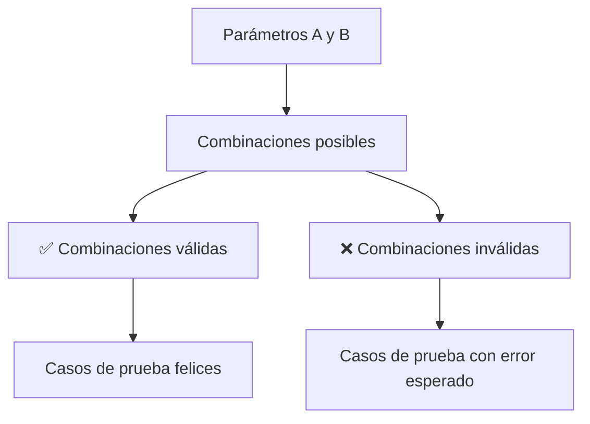

# Capítulo 2 · Diseño de tests: de la intuición al método

> _«Testing shows the presence, not the absence, of bugs.»_
> — **Edsger W. Dijkstra**, _Notes on Structured Programming_ (1972)

---

## Lo que vas a aprender en este capítulo

Al terminar este capítulo vas a poder:

- [x] Distinguir cuándo un caso de prueba está **diseñado** y cuándo está **improvisado**.
- [x] Aplicar un **pipeline mental de 7 pasos** para derivar tests desde una especificación.
- [x] Construir **particiones de equivalencia** y **análisis de valores límite (BVA)** con criterios formales (Myers, Jorgensen).
- [x] Modelar reglas de negocio con **tablas de decisión** y ciclos de vida con **state transition testing**.
- [x] Usar **pairwise / all-pairs** para domar la explosión combinatoria sin perder cobertura.
- [x] Reconocer y mitigar el **Oracle Problem** combinando oráculos especificados, derivados, implícitos, parciales y metamórficos.

> **Nivel:** intermedio · **Tiempo de lectura:** ~45 min · **Pre-requisito:** Capítulo 1 (Propósito del testing).

---

## Mapa de ruta del capítulo


```mermaid
flowchart LR
    A[2.1 Probar 'como venga'] --> B[2.2 Qué es diseñar un test]
    B --> C[2.3 Pipeline mental]
    C --> D[2.4 Leer la especificación]
    D --> E[2.5 Particiones de equivalencia]
    E --> F[2.6 Boundary Value Analysis]
    F --> G[2.7 Tablas de decisión]
    G --> H[2.8 State Transition]
    H --> I[2.9 Pairwise / All-Pairs]
    I --> J[Resumen + Ejercicios]
```

> **Nota del autor**
> En este capítulo te voy a hablar como le hablo a mis alumnas que ya trabajaron en QA pero nunca vieron fundamentos. No voy a asumir que ya sabés qué es una partición de equivalencia, pero tampoco te voy a tratar como si fuera tu primer día en tecnología. La idea es **ordenar lo que ya hacés** para que deje de ser intuitivo y pase a ser **repetible, comunicable y auditable**.

---

## 2.1 El problema de probar "como venga"

Algo que vi en todos los equipos donde trabajé —Estados Unidos, España, Argentina, Reino Unido, Alemania, Francia— se repite con asombrosa consistencia: la mayoría de los testers **no tienen un método de diseño de pruebas**. Lo que tienen es una mezcla de **experiencia + costumbre + lo que hacía el equipo anterior**.

Esa receta funciona… hasta que:

| Disparador | Síntoma típico |
| --- | --- |
| El sistema **crece** | "Cada release rompe algo distinto que ya estaba probado." |
| Cambian las **reglas de negocio** | "No sabemos qué tests hay que actualizar." |
| Hay que **automatizar** | "El test pasa, pero no sé qué está validando." |
| Auditoría / postmortem | "No podemos justificar por qué eso no se probó." |

Ahí se nota la diferencia entre testing hecho **con buena voluntad** y testing hecho **con diseño**.

> **Observación de campo**
> El autor de _Effective Software Testing_ (Aniche, 2022) dice exactamente esto: el problema no es que la gente no pruebe, es que **no prueba de forma sistemática**. Por eso dos testers distintos diseñan dos suites distintas para el mismo código. La meta es que **cualquier persona razonable llegue a un conjunto de tests parecido** para el mismo problema. A eso le llamamos **reproducibilidad metodológica**.

> **⚠️ Antipatrón: "Testing por intuición pura"**
> Cuando el único criterio para decidir qué probar es _"se me ocurrió"_, el resultado es una suite que cubre lo que el tester ya conoce y deja descubierto lo que ignora. **El sesgo de confirmación** se vuelve la principal estrategia de selección.

---

## 2.2 Qué significa "diseñar" un test

> **Definición — Test diseñado**
> Un test diseñado es **un escenario mínimo, reproducible y auditable** que demuestra un comportamiento relevante del sistema bajo prueba (SUT) y cuyo propósito —el riesgo que cubre— está explícito.

Diseñar un test **no es** "escribir un caso en TestRail". Es construir cuatro piezas que, juntas, justifican la existencia del caso:

### La anatomía de un buen test


```mermaid
flowchart LR
    A["① Contexto<br/>(precondiciones)"] --> B["② Acción<br/>(estímulo)"]
    B --> C["③ Oráculo<br/>(resultado esperado)"]
    C --> D["④ Propósito<br/>(riesgo cubierto)"]
    style D fill:#fef3c7,stroke:#f59e0b,stroke-width:2px
```

| # | Pieza | Pregunta que responde | Ejemplo |
| --- | ------- | ---------------------- | --------- |
| ① | **Contexto** | ¿Qué tenía que cumplirse antes? | "Usuario autenticado con saldo > 0." |
| ② | **Acción** | ¿Qué hace el usuario o el sistema? | "Solicita una transferencia de $100." |
| ③ | **Oráculo** | ¿Cómo sé si pasó o falló? | "El saldo final disminuye en $100 exactos." |
| ④ | **Propósito** | ¿Qué riesgo cubre este caso? | "Evitar pérdida monetaria por redondeo." |

> **💡 Idea clave**
> Si falta el **propósito**, el caso existe "porque sí". Es exactamente el caso que nadie quiere automatizar después… y el primero que se borra cuando hay que limpiar la suite.

> **En la práctica — Diseño antes que automatización**
> Cuando pienses en automatizar con Playwright, Postman/Newman o Jest: **la automatización no arregla un test mal diseñado**. El orden correcto es: ① diseñar → ② ejecutar manualmente para validar el oráculo → ③ automatizar. Aniche (2022) lo dice claro: primero derivamos los casos, después los pasamos a JUnit (o al framework que toque).

---

### 2.2.1 El Problema del Oráculo (Oracle Problem)

Uno de los desafíos fundamentales del testing fue identificado por **Elaine Weyuker** en 1982:

> _"Para algunos programas, es imposible o impracticable determinar si el output es correcto sin ejecutar manualmente todo el proceso que el programa debería automatizar."_
> — Weyuker, _On Testing Non-Testable Programs_ (1982)

> **Definición — Oracle Problem**
> El problema de decidir, para una entrada dada, **cuál es el resultado correcto que debería producir el sistema**. Sin oráculo no hay test: hay solo un experimento sin hipótesis.

#### Tipos de oráculo (Barr et al., 2015)

| # | Tipo | En qué se basa | Ventaja | Limitación |
| --- | ------ | ---------------- | --------- | ------------ |
| 1 | **Specified Oracle** | Especificación formal | Precisión total | Requiere especificación completa |
| 2 | **Derived Oracle** | Versión previa o sistema similar | Fácil de implementar | Propaga bugs heredados |
| 3 | **Implicit Oracle** | Propiedades universales (no crash, no leak) | Siempre aplicable | Solo detecta fallos catastróficos |
| 4 | **Partial Oracle** | Verifica solo aspectos clave | Bajo costo | Pierde defectos sutiles |
| 5 | **Pseudo Oracle** | Aproximación heurística (IA, sistemas no-deterministas) | Permite testear lo "no testeable" | No es 100% confiable |

**Tabla 2.1** — Taxonomía de oráculos según Barr, Harman, McMinn, Shahbaz & Yoo (2015).

#### Ejemplo aplicado: ¿cómo testeo un compresor?

> **Caso de estudio**
> No tengo cómo predecir el buffer binario exacto que produce `gzip` para una entrada dada. ¿Significa que no puedo testearlo? No: significa que necesito **combinar varios oráculos**.

**Listing 2.1** — Cinco enfoques de oráculo aplicados a una función de compresión.

```typescript
// Función bajo prueba
function compress(data: string): Buffer {
  const zlib = require('zlib');
  return zlib.gzipSync(Buffer.from(data));
}

// ❌ ANTIPATRÓN — Specified oracle exacto sobre output binario (frágil)
test('Compressed output matches expected binary', () => {
  const result = compress("Hello World");
  expect(result).toEqual(Buffer.from([0x1f, 0x8b, /_ ... _/]));
});

// ✅ Derived Oracle — reversibilidad: f⁻¹(f(x)) === x
test('Decompression of compressed data returns original', () => {
  const zlib = require('zlib');
  const original = "Hello World";
  const compressed = compress(original);
  const decompressed = zlib.gunzipSync(compressed).toString();
  expect(decompressed).toBe(original);
});

// ✅ Partial Oracle — propiedad observable (no validamos el contenido exacto)
test('Compressed data is smaller than original for repetitive input', () => {
  const original = "A".repeat(1000);
  const compressed = compress(original);
  expect(compressed.length).toBeLessThan(original.length);
});

// ✅ Implicit Oracle — el sistema no debe colapsar
test('Compress does not crash with large input', () => {
  const largeData = "X".repeat(1_000_000);
  expect(() => compress(largeData)).not.toThrow();
});
```

#### Estrategias para resolver el Oracle Problem

| Estrategia | Cómo funciona | Cuándo usarla |
| ----------- | --------------- | --------------- |
| **Propiedades matemáticas** | $\sqrt{x}^2 \approx x$, `reverse(reverse(a)) === a` | Funciones puras y algoritmos |
| **Implementación alternativa** | Comparar dos implementaciones independientes | Refactors críticos, migraciones |
| **Test fixtures conocidos** | Snapshot de casos verificados a mano | Reglas de negocio estables |
| **Metamorphic Testing** | Relación entre inputs: $f(x_1) \le f(x_2)$ si $x_1 \subseteq x_2$ | Sistemas no-determinísticos, ML, búsqueda |

**Listing 2.2** — Metamorphic testing aplicado a un sistema de búsqueda.

```typescript
test('Búsqueda con término más específico retorna un subset', () => {
  const results1 = buscar("test");
  const results2 = buscar("testing");

  // Relación metamórfica: input más específico ⇒ resultados ⊆
  expect(results2.length).toBeLessThanOrEqual(results1.length);

  results2.forEach(item => {
    expect(results1).toContainEqual(item);
  });
});
```

> **Resumen rápido — Oracle Problem**
> En la práctica casi nunca tenemos un oráculo perfecto. La estrategia profesional es **componer** múltiples oráculos parciales (reversibilidad + propiedades + invariantes implícitas) hasta obtener una confianza acumulada alta.

---

## 2.3 El pipeline mental para diseñar pruebas

Diseñar tests no es magia: es un **flujo iterativo de 7 pasos** que cualquier QA puede ejecutar con disciplina.

**Figura 2.1** — Pipeline de derivación de casos de prueba.


```mermaid
flowchart TD
    A([1 · Leer la especificación]) --> B([2 · Identificar entradas y salidas])
    B --> C([3 · Definir particiones de equivalencia])
    C --> D([4 · Detectar límites])
    D --> E([5 · Combinar parámetros relevantes])
    E --> F([6 · Definir casos de prueba])
    F --> G([7 · Marcar cuáles se automatizan])
    G -.feedback.-> C
    style A fill:#dbeafe,stroke:#2563eb
    style G fill:#dcfce7,stroke:#16a34a
```

Esto se alinea casi 1:1 con la metodología de **Specification-based testing** descrita por Aniche (2022): primero parámetros, después valores válidos e inválidos, después relaciones entre parámetros, y recién entonces los casos.

> **Iterativo, no lineal**
> El propio Aniche aclara que en la práctica **volvés atrás** cuando descubrís una partición que te faltó. La flecha de feedback en la figura no es decorativa: es la regla, no la excepción.

---

## 2.4 Paso 1 · Leer la especificación… de verdad

Acá es donde la mayoría falla: leen el ticket como si fuera un requisito perfecto. En la vida real el requisito:

- está **incompleto**,
- está pensado solo para el **caso feliz**, o
- **no dice qué pasa con datos raros** (¿qué hago si el campo viene en `null`?).

> **Técnica — Desarmar el requisito en variables**
> Cuando hago QA con equipos en USA o Alemania, lo primero que hago al recibir un ticket es traducirlo a una **lista de variables de entrada y salida**. Si no puedo nombrarlas, el requisito no está listo para diseñar tests.

#### Ejemplo guiado

> **Requisito:** _"El sistema debe calcular el costo de estacionamiento por día."_

Variables que un QA entrenado detecta:

| Variable | Tipo | Notas |
| ---------- | ------ | ------- |
| Tipo de vehículo | enum | auto, moto, camión |
| Fecha/hora de entrada | datetime | ¿zona horaria? |
| Fecha/hora de salida | datetime | ¿puede ser anterior a la entrada? |
| Día (laborable / fin de semana / feriado) | enum derivado | ¿calendario regional? |
| Descuentos | bool / código | ¿stackeable? |
| Límite máximo de días | int | ¿qué pasa si excede? |

> **💡 Idea clave**
> Si no podés enumerar las **variables**, no podés diseñar tests buenos. Y si la especificación no las cubre, **tu lista se vuelve la primera lista de preguntas para el PO**.

> **Tip pro — Los tests también descubren requisitos**
> Si el requisito está incompleto, el test no es menos importante: al revés, **se vuelve la herramienta para descubrir lo que falta**. Por eso los buenos QA hacen preguntas en el refinamiento, no después del bug en producción.

---

## 2.5 Paso 2 · Particiones de equivalencia

> **Definición — Partición de equivalencia (EP)**
> Subconjunto del dominio de entrada en el que **se asume que el sistema se comporta de forma idéntica**. Si elegís un representante de la clase y el test pasa, la hipótesis dice que pasa para todos los elementos de la clase.

La idea es brutal de simple: **si dos entradas son tratadas igual por el sistema, no necesito probar las dos**. Una representa a la otra.

### 2.5.1 Fundamento teórico

> _"Una clase de equivalencia representa un conjunto de estados válidos o inválidos para las condiciones de entrada. El testing de particiones se basa en la hipótesis de que el software tratará todos los elementos de una clase de manera idéntica."_
> — **Myers, Sandler & Badgett**, _The Art of Software Testing_ (3.ª ed., 2011)

Esta hipótesis recibe el nombre de **Assumption of Uniform Behavior** (Suposición de Comportamiento Uniforme). Su consecuencia operativa:

> **💡 Consecuencia práctica**
> Si el test pasa para **un** valor de la clase, debería pasar para **todos** los valores de la clase. Por eso 1 test por partición es, en teoría, suficiente. En la práctica, complementás con BVA (sección 2.6) para no creerle del todo a la hipótesis.

### 2.5.2 Caso guiado: `calcularEdad`

> **⚠️ Antipatrón a refactorizar primero**
> El siguiente código no es testeable porque depende de la fecha del sistema. **Antes de diseñar tests, hacé el código testeable.** Esto es _design for testability_.

**Listing 2.3** — Versión inicial: dependencia oculta de `Date.now()`.

```typescript
// ❌ Fecha "ahora" hardcodeada/oculta → imposible de testear deterministamente
function calcularEdad(fechaNacimiento: string): number {
  const hoy = new Date("2025-11-01"); // ← acoplamiento al reloj
  const cumple = new Date(fechaNacimiento);
  let edad = hoy.getFullYear() - cumple.getFullYear();
  const m = hoy.getMonth() - cumple.getMonth();
  if (m < 0 || (m === 0 && hoy.getDate() < cumple.getDate())) {
    edad--;
  }
  return edad;
}
```

**Listing 2.4** — Refactor con **inyección de dependencia** del reloj.

```typescript
interface AgeCalculatorOptions {
  today?: Date;
}

function calcularEdad(
  fechaNacimiento: string,
  options: AgeCalculatorOptions = {}
): number {
  const hoy = options.today ?? new Date();
  const cumple = new Date(fechaNacimiento);

  if (isNaN(cumple.getTime())) {
    throw new Error('Fecha de nacimiento inválida');
  }
  if (cumple > hoy) {
    throw new Error('Fecha de nacimiento no puede ser futura');
  }

  let edad = hoy.getFullYear() - cumple.getFullYear();
  const m = hoy.getMonth() - cumple.getMonth();
  if (m < 0 || (m === 0 && hoy.getDate() < cumple.getDate())) {
    edad--;
  }
  return edad;
}
```

> **✅ Buena práctica — Inyectá el reloj**
> Cada vez que un cálculo dependa de "ahora" (edad, expiración, antigüedad de sesión), inyectá el `Date` como parámetro opcional. **Es la diferencia entre una suite reproducible y un test que se rompe el 29 de febrero.**

### 2.5.3 Catálogo de particiones para `calcularEdad`

#### 🟢 Particiones válidas

| ID | Descripción | Ejemplo de entrada |
| ---- | ------------- | -------------------- |
| EP1 | Menor de edad (0–17) | `"2010-05-15"` |
| EP2 | Adulto (18–64) | `"1990-03-20"` |
| EP3 | Adulto mayor (65+) | `"1950-12-01"` |

#### 🔴 Particiones inválidas

| ID | Descripción | Ejemplo de entrada |
| ---- | ------------- | -------------------- |
| EP4 | Fecha futura | `"2030-01-01"` |
| EP5 | Fecha imposible (no existe en el calendario) | `"2023-02-30"`, `"2023-13-01"` |
| EP6 | Formato inválido | `"abc"`, `"not-a-date"` |
| EP7 | String vacío | `""` |
| EP8 | Fecha extremadamente antigua | `"1500-01-01"` |

#### 🟡 Casos especiales (descubiertos al pensar dominios)

| ID | Descripción |
| ---- | ------------- |
| EP9  | Persona que cumple años **hoy** |
| EP10 | Persona que cumple años **mañana** |
| EP11 | Nacida un **29 de febrero** (año bisiesto) |

**Figura 2.2** — Árbol de particiones identificadas.


```mermaid
graph TD
    A[Input: fechaNacimiento] --> B[Válida]
    A --> C[Inválida]
    B --> D[EP1: 0-17 años]
    B --> E[EP2: 18-64 años]
    B --> F[EP3: 65+ años]
    B --> L[EP9-11: casos especiales]
    C --> G[EP4: fecha futura]
    C --> H[EP5: fecha imposible]
    C --> I[EP6: formato incorrecto]
    C --> J[EP7: vacío]
    C --> K[EP8: muy antigua]
```

### 2.5.4 Suite ejecutable

**Listing 2.5** — Suite Jest organizada por familia de particiones.

```typescript
describe('calcularEdad — Equivalence Partitioning', () => {
  const HOY = new Date('2025-11-03');

  describe('🟢 Particiones válidas', () => {
    test('EP1: menor de edad (17 años)', () => {
      expect(calcularEdad('2008-11-03', { today: HOY })).toBe(17);
    });
    test('EP2: adulto (30 años)', () => {
      expect(calcularEdad('1995-06-15', { today: HOY })).toBe(30);
    });
    test('EP3: adulto mayor (70 años)', () => {
      expect(calcularEdad('1955-01-20', { today: HOY })).toBe(70);
    });
  });

  describe('🔴 Particiones inválidas', () => {
    test('EP4: fecha futura → error', () => {
      expect(() => calcularEdad('2030-01-01', { today: HOY })).toThrow('futura');
    });
    test('EP5: fecha imposible (30 de febrero)', () => {
      expect(() => calcularEdad('2023-02-30', { today: HOY })).toThrow('inválida');
    });
    test('EP6: formato inválido', () => {
      expect(() => calcularEdad('not-a-date', { today: HOY })).toThrow('inválida');
    });
    test('EP7: string vacío', () => {
      expect(() => calcularEdad('', { today: HOY })).toThrow('inválida');
    });
  });

  describe('🟡 Casos especiales', () => {
    test('EP9: cumple años hoy → ya incrementó', () => {
      expect(calcularEdad('2000-11-03', { today: HOY })).toBe(25);
    });
    test('EP10: cumple años mañana → aún no incrementa', () => {
      expect(calcularEdad('2000-11-04', { today: HOY })).toBe(24);
    });
    test('EP11: nacida un 29 de febrero', () => {
      expect(calcularEdad('2000-02-29', { today: HOY })).toBe(25);
    });
  });
});
```

### 2.5.5 Weak vs Strong Equivalence Class Testing

Cuando una función tiene **varios parámetros**, surge la pregunta: ¿pruebo cada parámetro por separado o todas las combinaciones?

| Enfoque | Hipótesis | Estrategia | Tests |
| --------- | ----------- | ------------ | ------- |
| **Weak ECT** | Errores aislados (Single Fault Assumption) | Una variable por vez | $\sum |\text{particiones}_i|$ |
| **Strong ECT** | Errores combinados | Todas las combinaciones | $\prod |\text{particiones}_i|$ |

**Ejemplo numérico** — Sistema con 3 parámetros de tamaños $\{3, 2, 3\}$:

$$
\text{Weak ECT} = 3 + 2 + 3 = 8 \text{ tests}
\qquad
\text{Strong ECT} = 3 \times 2 \times 3 = 18 \text{ tests}
$$

> **Tip pro — Cuándo usar cada uno**
> Usá **Weak ECT** para humo y componentes simples. Usá **Strong ECT** en componentes críticos (pago, autenticación, dosificación). Cuando el producto cartesiano explota, saltá a **Pairwise** (sección 2.9).

> **Contexto histórico**
> En el PDF de _Specification-based testing_ Aniche hace exactamente esto: primero analiza cada parámetro por separado (`null`, vacío, un elemento, varios elementos, ceros a la izquierda) y recién después analiza la **relación entre parámetros**. Es el orden que vamos a seguir nosotros.

---

## 2.6 Paso 3 · Análisis de Valores Límite (BVA)

> **🔥 La regla de oro del BVA**
> _"Bugs lurk in corners and congregate at boundaries."_
> — **Boris Beizer**, _Software Testing Techniques_ (1990)

Los límites son donde el software más se rompe. Esa intuición tiene respaldo empírico:

### 2.6.1 Fundamento empírico

> _"Los errores tienden a ocurrir en los límites del dominio de entrada más que en el centro. Aproximadamente el 16% de todos los bugs reportados están relacionados con condiciones de borde."_
> — **Paul Jorgensen**, _Software Testing: A Craftsman's Approach_ (4.ª ed., 2013)

**Tabla 2.2** — Eficacia comparada del BVA según Kaner, Falk & Nguyen (1999):

| Métrica | Resultado |
| --------- | ----------- |
| Defectos detectados vs. testing aleatorio | **+35–40 %** |
| Eficiencia costo-beneficio vs. testing exhaustivo | **3–5×** |
| Severidad de defectos detectados | **70–80 % son críticos** |

### 2.6.2 Qué cuenta como "límite"

> **Definición — Límite**
> Cualquier valor donde el comportamiento del sistema **cambia de regla**: el mínimo permitido, el máximo permitido, el paso entre dos rangos, o la transición entre dos políticas de negocio.

### 2.6.3 Variantes de BVA

#### 1️⃣ Normal BVA (Basic BVA)

**Enfoque:** Prueba valores justo en y alrededor de los límites. Para un rango `[min, max]` usás 7 puntos:

$$
\{ \text{min} - 1,\ \text{min},\ \text{min} + 1,\ \text{nominal},\ \text{max} - 1,\ \text{max},\ \text{max} + 1 \}
$$

**Ejemplo: edades aceptadas en `[18, 65]`** → puntos clave: `17, 18, 19, 40, 64, 65, 66`.

**Figura 2.3** — Línea de valores límite.


```mermaid
graph LR
    A[17 ❌] --> B[18 ✅]
    B --> C[19 ✅]
    C --> D[40 nominal ✅]
    D --> E[64 ✅]
    E --> F[65 ✅]
    F --> G[66 ❌]
```

**Listing 2.6** — Suite Normal BVA para validación de edad.

```typescript
describe('Normal BVA - Validación de edad [18-65]', () => {
  test('17: justo debajo del mínimo (inválido)', () => {
    expect(isValidAge(17)).toBe(false);
  });

  test('18: límite inferior (válido)', () => {
    expect(isValidAge(18)).toBe(true);
  });

  test('19: justo sobre el mínimo (válido)', () => {
    expect(isValidAge(19)).toBe(true);
  });

  test('40: valor nominal (válido)', () => {
    expect(isValidAge(40)).toBe(true);
  });

  test('64: justo bajo el máximo (válido)', () => {
    expect(isValidAge(64)).toBe(true);
  });

  test('65: límite superior (válido)', () => {
    expect(isValidAge(65)).toBe(true);
  });

  test('66: justo sobre el máximo (inválido)', () => {
    expect(isValidAge(66)).toBe(false);
  });
});
```

#### 2️⃣ Robust BVA

**Enfoque:** Añade valores extremos **fuera** del rango razonable: negativos, ceros, números absurdamente grandes. Sirve para los puntos donde el usuario o un sistema externo podrían enviar basura.

**Listing 2.7** — Robust BVA: probando lo impensable.

```typescript
describe('Robust BVA - Valores extremos', () => {
  test('-5: valor negativo extremo', () => {
    expect(isValidAge(-5)).toBe(false);
  });

  test('0: cero (límite matemático)', () => {
    expect(isValidAge(0)).toBe(false);
  });

  test('150: edad imposible', () => {
    expect(isValidAge(150)).toBe(false);
  });
});
```

#### 3️⃣ Worst-Case BVA

**Enfoque:** Combina límites de **múltiples variables a la vez**. Para cada variable, usás 5 valores: $\{ \text{min},\ \text{min}+1,\ \text{nominal},\ \text{max}-1,\ \text{max} \}$ y hacés el producto cartesiano.

**Ejemplo:** rectángulo con `ancho ∈ [1, 100]` y `alto ∈ [1, 100]` ⇒ $5^2 = 25$ casos.

**Listing 2.8** — Worst-Case BVA aplicado a área de rectángulo.

```typescript
describe('Worst-Case BVA - Área de rectángulo', () => {
  const boundaryValues = [1, 2, 50, 99, 100]; // 5 valores por variable
  
  // 5² = 25 combinaciones
  boundaryValues.forEach(width => {
    boundaryValues.forEach(height => {
      test(`width=${width}, height=${height}`, () => {
        const area = calculateArea({ width, height });
        expect(area).toBe(width * height);
      });
    });
  });
});
```

### 2.6.4 Tabla comparativa de estrategias BVA

**Tabla 2.3** — Costo y cobertura de cada variante (n = número de variables).

| Estrategia              | Valores/var | Tests        | Ejemplo (n=2) | Detecta               |
| ------------------------- | ------------- | -------------- | --------------- | ----------------------- |
| Normal BVA              | 5           | $4n + 1$     | 9             | Errores simples       |
| Robust BVA              | 7           | $6n + 1$     | 13            | Errores + robustez    |
| Worst-Case BVA          | 5           | $5^n$        | 25            | Interacciones         |
| Robust Worst-Case BVA   | 7           | $7^n$        | 49            | Todo lo anterior      |

### 2.6.5 ¿Cuándo usar cada variante?

**Tabla 2.4** — Guía de decisión rápida.

| Situación | Variante recomendada | Razón |
| ----------- | --------------------- | ------- |
| Componente simple, testing rápido | Normal BVA | Mejor balance costo-beneficio |
| Sistema crítico (médico, financiero, defensa) | Robust Worst-Case BVA | Máxima cobertura |
| Variables independientes (3–4) | Normal BVA por variable | Evita explosión combinatoria |
| Interacciones conocidas entre variables | Worst-Case BVA | Detecta bugs de interacción |
| Validación de input de usuario | Robust BVA | Los usuarios envían cualquier cosa |
| 5+ variables | **Pairwise** (§2.9) | Solo opción razonable |

> **Tip pro — Regla mnemotécnica**
> $1$–$2$ variables → Worst-Case BVA. $3$–$4$ variables → Normal BVA + casos clave. $5$+ variables → Pairwise sin dudar.

> **Observación de campo**
> Esto parece básico, pero es **lo que más falta** cuando reviso test suites reales de equipos que automatizaron "a lo bestia": tienen el caso feliz, pero no tienen el 17 ni el 66. Y después dicen "Playwright no encontró nada". Claro: si no le diste escenarios que **rompan reglas**, no va a encontrar nada.

> **Resumen rápido — BVA**
> Los bugs viven en los bordes. Combiná **Normal BVA** (cobertura mínima decente) con **Robust BVA** (defensa contra inputs absurdos) y reservá **Worst-Case** para cuando hay interacción real entre variables.

---

## 2.7 Paso 4 · Tablas de decisión

> **Definición — Tabla de decisión**
> Técnica de testing de **caja negra** que modela lógica de negocio compleja como una matriz de **condiciones × acciones**, donde cada columna es una **regla** de negocio.

Según **Myers et al.** (2011):

> _"Las tablas de decisión son efectivas cuando el comportamiento del sistema depende de combinaciones de condiciones de entrada, especialmente cuando hay reglas de negocio complejas."_

### 2.7.1 ¿Cuándo usarlas?

Usá una tabla de decisión cuando reconocés **alguno** de estos patrones:

- Múltiples condiciones booleanas que disparan distintas acciones.
- Reglas de negocio con combinaciones específicas (descuentos, autorizaciones, políticas).
- Cálculos que dependen de varias _flags_ o estados simultáneos.
- Múltiples criterios de aprobación / rechazo (crédito, KYC, fraude).

### 2.7.2 Estructura visual

```
┌─────────────────┬────────────────────────────────┐
│                 │      Reglas (Combinaciones)    │
│                 ├────┬────┬────┬────┬────┬────┬──┤
│                 │ R1 │ R2 │ R3 │ R4 │ R5 │ R6 │  │
├─────────────────┼────┼────┼────┼────┼────┼────┼──┤
│ Condiciones:    │    │    │    │    │    │    │  │
│ C1: Edad >= 18  │ T  │ T  │ T  │ F  │ F  │ F  │  │
│ C2: Tiene DNI   │ T  │ T  │ F  │ T  │ F  │ -  │  │
│ C3: Sin deudas  │ T  │ F  │ -  │ -  │ -  │ -  │  │
├─────────────────┼────┼────┼────┼────┼────┼────┼──┤
│ Acciones:       │    │    │    │    │    │    │  │
│ A1: Aprobar     │ X  │    │    │    │    │    │  │
│ A2: Revisar     │    │ X  │    │ X  │    │    │  │
│ A3: Rechazar    │    │    │ X  │    │ X  │ X  │  │
└─────────────────┴────┴────┴────┴────┴────┴────┴──┘
```

**Leyenda:** `T` = True · `F` = False · `-` = _Don't Care_ (no importa) · `X` = acción a ejecutar.

### 2.7.3 Caso real: aprobación de préstamos

**Listing 2.9** — Implementación y suite de tests basada en tabla de decisión.

```typescript
interface LoanRequest {
  age: number;
  hasID: boolean;
  hasDebts: boolean;
  creditScore: number;
}

type LoanDecision = 'APPROVED' | 'REVIEW' | 'REJECTED';

class LoanApprovalSystem {
  static decide(request: LoanRequest): LoanDecision {
    const isAdult = request.age >= 18;
    const hasValidID = request.hasID;
    const hasNoDebts = !request.hasDebts;
    const goodCredit = request.creditScore >= 600;

    // Tabla de decisión implementada
    if (isAdult && hasValidID && hasNoDebts && goodCredit) {
      return 'APPROVED';  // R1
    }
    
    if (isAdult && hasValidID && hasDebts && goodCredit) {
      return 'REVIEW';    // R2
    }
    
    if (isAdult && !hasValidID) {
      return 'REJECTED';  // R3
    }
    
    if (!isAdult) {
      return 'REJECTED';  // R4, R5, R6
    }

    return 'REVIEW';      // Default
  }
}

// Test Suite basado en Tabla de Decisión
describe('LoanApprovalSystem - Decision Table Testing', () => {
  test('R1: Adulto + DNI + Sin deudas + Buen crédito = APROBADO', () => {
    expect(LoanApprovalSystem.decide({
      age: 25,
      hasID: true,
      hasDebts: false,
      creditScore: 700
    })).toBe('APPROVED');
  });

  test('R2: Adulto + DNI + Con deudas + Buen crédito = REVISAR', () => {
    expect(LoanApprovalSystem.decide({
      age: 30,
      hasID: true,
      hasDebts: true,
      creditScore: 650
    })).toBe('REVIEW');
  });

  test('R3: Adulto + Sin DNI = RECHAZADO', () => {
    expect(LoanApprovalSystem.decide({
      age: 25,
      hasID: false,
      hasDebts: false,
      creditScore: 700
    })).toBe('REJECTED');
  });

  test('R4-R6: Menor de edad = RECHAZADO', () => {
    expect(LoanApprovalSystem.decide({
      age: 16,
      hasID: true,
      hasDebts: false,
      creditScore: 700
    })).toBe('REJECTED');
  });
});
```

### 2.7.4 Ventajas formales

| Ventaja | Por qué importa |
| --------- | ---------------- |
| **Completitud** | Te obliga a considerar todas las combinaciones |
| **Detección de inconsistencias** | Reglas contradictorias se hacen visibles |
| **Documentación viva** | Sirve como especificación ejecutable de la lógica de negocio |
| **Reducción con _Don't Care_** | Optimiza tests sin perder cobertura semántica |

### 2.7.5 Limited-Entry vs Extended-Entry

- **Limited-Entry:** condiciones binarias (T/F).
- **Extended-Entry:** condiciones con rangos o categorías.

```
Extended-Entry Decision Table:

Condición: Edad     │ <18 │ 18-25 │ 26-65 │ >65 │
Condición: Ingreso  │  -  │ <30K  │ >30K  │  -  │
────────────────────┼─────┼───────┼───────┼─────┤
Acción: Tarjeta Oro │     │   X   │   X   │     │
```

> **Tip pro — Cuándo se vuelven inmanejables**
> Las tablas de decisión brillan con **3–6 condiciones**. Con más de 8 conviene **dividir la lógica en sub-sistemas** y armar una tabla por cada uno. Si fuerzas una sola tabla con 10 condiciones, vas a tener $2^{10} = 1024$ reglas.

---

## 2.8 Paso 5 · State Transition Testing

> **Definición — State Transition Testing**
> Técnica que modela el sistema como una **máquina de estados finitos (FSM)** y diseña casos que cubren transiciones, eventos, guardas y acciones.

### 2.8.1 ¿Cuándo aplicarla?

Es la técnica natural cuando el SUT tiene un **ciclo de vida** observable:

- Pedidos, tickets, suscripciones, usuarios.
- Protocolos de comunicación (HTTP, TCP handshake, OAuth).
- Workflows de negocio con aprobaciones.
- Sesiones (login → activo → idle → expirado → logout).
- Reproductores, máquinas expendedoras, ATMs.

### 2.8.2 Anatomía de un diagrama de estados


```mermaid
stateDiagram-v2
    [*] --> Borrador
    Borrador --> Enviado: submit()
    Borrador --> Cancelado: cancel()
    Enviado --> Aprobado: approve()
    Enviado --> Rechazado: reject()
    Enviado --> Borrador: requestChanges()
    Aprobado --> [*]
    Rechazado --> [*]
    Cancelado --> [*]
```

**Componentes formales:**

| Componente | Qué representa | Ejemplo |
| ------------ | ---------------- | --------- |
| **Estado** | Condición del sistema | `Borrador`, `Aprobado` |
| **Transición** | Cambio entre estados | `Borrador → Enviado` |
| **Evento** | Disparador de la transición | `submit()` |
| **Guarda** | Condición booleana que habilita la transición | `total > 0` |
| **Acción** | Efecto colateral de la transición | `notificarAprobador()` |

### 2.8.3 Caso completo: órdenes de compra

**Listing 2.10** — Implementación de la máquina de estados.

```typescript
type OrderState = 'DRAFT' | 'SUBMITTED' | 'APPROVED' | 'REJECTED' | 'CANCELLED';

interface Order {
  id: string;
  state: OrderState;
  total: number;
}

class OrderStateMachine {
  private order: Order;

  constructor(order: Order) {
    this.order = order;
  }

  submit(): boolean {
    if (this.order.state !== 'DRAFT') {
      throw new Error(`Cannot submit order in state ${this.order.state}`);
    }
    if (this.order.total <= 0) {
      throw new Error('Cannot submit order with total <= 0');
    }
    this.order.state = 'SUBMITTED';
    return true;
  }

  approve(): boolean {
    if (this.order.state !== 'SUBMITTED') {
      throw new Error(`Cannot approve order in state ${this.order.state}`);
    }
    this.order.state = 'APPROVED';
    return true;
  }

  reject(): boolean {
    if (this.order.state !== 'SUBMITTED') {
      throw new Error(`Cannot reject order in state ${this.order.state}`);
    }
    this.order.state = 'REJECTED';
    return true;
  }

  cancel(): boolean {
    if (this.order.state === 'APPROVED' || this.order.state === 'REJECTED') {
      throw new Error(`Cannot cancel order in state ${this.order.state}`);
    }
    this.order.state = 'CANCELLED';
    return true;
  }

  requestChanges(): boolean {
    if (this.order.state !== 'SUBMITTED') {
      throw new Error(`Cannot request changes in state ${this.order.state}`);
    }
    this.order.state = 'DRAFT';
    return true;
  }

  getState(): OrderState {
    return this.order.state;
  }
}

describe('OrderStateMachine - State Transition Testing', () => {
  
  describe('Transiciones válidas', () => {
    test('DRAFT → SUBMITTED: submit()', () => {
      const order = { id: '1', state: 'DRAFT' as OrderState, total: 100 };
      const sm = new OrderStateMachine(order);
      
      sm.submit();
      expect(sm.getState()).toBe('SUBMITTED');
    });

    test('SUBMITTED → APPROVED: approve()', () => {
      const order = { id: '1', state: 'SUBMITTED' as OrderState, total: 100 };
      const sm = new OrderStateMachine(order);
      
      sm.approve();
      expect(sm.getState()).toBe('APPROVED');
    });

    test('SUBMITTED → REJECTED: reject()', () => {
      const order = { id: '1', state: 'SUBMITTED' as OrderState, total: 100 };
      const sm = new OrderStateMachine(order);
      
      sm.reject();
      expect(sm.getState()).toBe('REJECTED');
    });

    test('SUBMITTED → DRAFT: requestChanges()', () => {
      const order = { id: '1', state: 'SUBMITTED' as OrderState, total: 100 };
      const sm = new OrderStateMachine(order);
      
      sm.requestChanges();
      expect(sm.getState()).toBe('DRAFT');
    });

    test('DRAFT → CANCELLED: cancel()', () => {
      const order = { id: '1', state: 'DRAFT' as OrderState, total: 100 };
      const sm = new OrderStateMachine(order);
      
      sm.cancel();
      expect(sm.getState()).toBe('CANCELLED');
    });
  });

  describe('Transiciones inválidas', () => {
    test('SUBMITTED → SUBMITTED: submit() debe fallar', () => {
      const order = { id: '1', state: 'SUBMITTED' as OrderState, total: 100 };
      const sm = new OrderStateMachine(order);
      
      expect(() => sm.submit()).toThrow('Cannot submit');
    });

    test('APPROVED → CANCELLED: cancel() debe fallar', () => {
      const order = { id: '1', state: 'APPROVED' as OrderState, total: 100 };
      const sm = new OrderStateMachine(order);
      
      expect(() => sm.cancel()).toThrow('Cannot cancel');
    });

    test('DRAFT → APPROVED: approve() debe fallar', () => {
      const order = { id: '1', state: 'DRAFT' as OrderState, total: 100 };
      const sm = new OrderStateMachine(order);
      
      expect(() => sm.approve()).toThrow('Cannot approve');
    });
  });

  describe('Guardas (condiciones)', () => {
    test('Submit con total <= 0 debe fallar', () => {
      const order = { id: '1', state: 'DRAFT' as OrderState, total: 0 };
      const sm = new OrderStateMachine(order);
      
      expect(() => sm.submit()).toThrow('total <= 0');
    });
  });

  describe('Secuencias de transición', () => {
    test('Secuencia válida: DRAFT → SUBMITTED → APPROVED', () => {
      const order = { id: '1', state: 'DRAFT' as OrderState, total: 100 };
      const sm = new OrderStateMachine(order);
      
      sm.submit();
      expect(sm.getState()).toBe('SUBMITTED');
      
      sm.approve();
      expect(sm.getState()).toBe('APPROVED');
    });

    test('Secuencia con cambios: DRAFT → SUBMITTED → DRAFT → SUBMITTED → APPROVED', () => {
      const order = { id: '1', state: 'DRAFT' as OrderState, total: 100 };
      const sm = new OrderStateMachine(order);
      
      sm.submit();
      sm.requestChanges();
      expect(sm.getState()).toBe('DRAFT');
      
      sm.submit();
      sm.approve();
      expect(sm.getState()).toBe('APPROVED');
    });
  });
});
```

### 2.8.4 Niveles de cobertura

**Tabla 2.5** — Niveles clásicos de cobertura para FSM.

| Nivel | Qué cubre | Tests mínimos | Cuándo |
| ------- | ----------- | --------------- | -------- |
| **0-switch (State Coverage)** | Cada estado al menos una vez | $n$ estados | Smoke testing |
| **1-switch (Transition Coverage)** | Cada transición válida (y recomendado: las inválidas) | $t$ transiciones | Default profesional |
| **N-switch** | Secuencias de N transiciones consecutivas | Crece exponencialmente | Sistemas críticos |

**Para nuestro ejemplo de `Order`:**

- 5 estados · 6 transiciones válidas · ~15–20 transiciones inválidas que vale la pena probar.

### 2.8.5 Tabla de transiciones (matriz de estados)

**Tabla 2.6** — Matriz estado × evento del sistema de órdenes.

| Estado actual | Evento           | Estado siguiente | ¿Válido?  |
| --------------- | ------------------ | ------------------ | ----------- |
| DRAFT         | submit()         | SUBMITTED        | ✅        |
| DRAFT         | approve()        | —                | ❌ Error  |
| DRAFT         | reject()         | —                | ❌ Error  |
| DRAFT         | cancel()         | CANCELLED        | ✅        |
| SUBMITTED     | submit()         | —                | ❌ Error  |
| SUBMITTED     | approve()        | APPROVED         | ✅        |
| SUBMITTED     | reject()         | REJECTED         | ✅        |
| SUBMITTED     | requestChanges() | DRAFT            | ✅        |
| SUBMITTED     | cancel()         | CANCELLED        | ✅        |
| APPROVED      | cancel()         | —                | ❌ Error  |

> **Observación de campo — Los caminos negros**
> En sistemas reales, **siempre** probá las transiciones inválidas. Son las que más bugs encuentran porque nadie las considera en el desarrollo inicial. Si la matriz tiene 30 celdas, probá las 30 —no solo las 6 verdes—.

---

## 2.9 Paso 6 · Combinatorial Testing: Pairwise (All-Pairs)

Ya vimos en el Capítulo 1 que un formulario con 10 campos y 5 valores cada uno tiene $5^{10} = 9{,}765{,}625$ combinaciones posibles. Eso es **físicamente imposible** de probar exhaustivamente.

**Pairwise Testing** —también llamado **All-Pairs** u **Orthogonal Array Testing**— reduce drásticamente el número de tests **manteniendo alta efectividad** de detección.

### 2.9.1 El insight empírico (NIST)

> _"El 70% de los defectos son causados por interacciones de 1 o 2 parámetros. El 90% por interacciones de hasta 3 parámetros."_
> — **Kuhn, Wallace & Gallo**, NIST (2004)

> **💡 Idea clave**
> No necesitás probar **todas** las combinaciones: alcanza con asegurar que **cada par de valores** aparezca junto al menos una vez. Esa simple regla cubre la mayoría de los bugs reales.

### 2.9.2 Caso: configuración de navegador

**Parámetros (3ⁿ con n=4 ⇒ 81 combinaciones exhaustivas):**

| Parámetro | Valores |
| ----------- | --------- |
| Browser | Chrome, Firefox, Safari |
| OS | Windows, Mac, Linux |
| Language | ES, EN, FR |
| Resolution | 1080p, 1440p, 4K |

$$
\text{Exhaustivo} = 3^4 = 81 \quad\Longrightarrow\quad \text{Pairwise} \approx 9 \quad (\text{reducción del } \mathbf{\sim 89\%})
$$

**Listing 2.11** — Suite Pairwise (set generado con PICT).

```typescript
interface TestConfig {
  browser: 'Chrome' | 'Firefox' | 'Safari';
  os: 'Windows' | 'Mac' | 'Linux';
  language: 'ES' | 'EN' | 'FR';
  resolution: '1080p' | '1440p' | '4K';
}

// Conjunto Pairwise generado (con herramienta PICT o AllPairs)
const pairwiseTests: TestConfig[] = [
  { browser: 'Chrome', os: 'Windows', language: 'ES', resolution: '1080p' },
  { browser: 'Chrome', os: 'Mac', language: 'EN', resolution: '1440p' },
  { browser: 'Chrome', os: 'Linux', language: 'FR', resolution: '4K' },
  { browser: 'Firefox', os: 'Windows', language: 'EN', resolution: '4K' },
  { browser: 'Firefox', os: 'Mac', language: 'FR', resolution: '1080p' },
  { browser: 'Firefox', os: 'Linux', language: 'ES', resolution: '1440p' },
  { browser: 'Safari', os: 'Windows', language: 'FR', resolution: '1440p' },
  { browser: 'Safari', os: 'Mac', language: 'ES', resolution: '4K' },
  { browser: 'Safari', os: 'Linux', language: 'EN', resolution: '1080p' },
];

describe('Pairwise Testing - Browser Compatibility', () => {
  pairwiseTests.forEach((config, index) => {
    test(`Config ${index + 1}: ${config.browser}/${config.os}/${config.language}/${config.resolution}`, async () => {
      // Playwright setup
      const browser = await chromium.launch(); // Simplificado
      
      // Verificar que la página funciona con esta configuración
      expect(true).toBe(true); // Placeholder
      
      await browser.close();
    });
  });
});
```

### 2.9.3 Comparación: exhaustivo vs pairwise vs aleatorio

**Tabla 2.7** — Trade-off entre cobertura y costo.

| Estrategia  | Casos | Detección de defectos | Costo de ejecución |
| ------------- | ------- | ---------------------- | -------------------- |
| Exhaustivo  | 81    | 100 %                | 100 %              |
| **Pairwise** | **9** | **~90 %**           | **~11 %**          |
| Aleatorio   | 9     | ~50–60 %             | ~11 %              |

### 2.9.4 Herramientas para generar casos pairwise

#### PICT (Microsoft) — recomendado

```bash
# Archivo config.txt
Browser: Chrome, Firefox, Safari
OS: Windows, Mac, Linux  
Language: ES, EN, FR
Resolution: 1080p, 1440p, 4K

# Generar combinaciones
pict config.txt > test-cases.txt
```

#### 🐍 AllPairs (Python)

```python
from allpairspy import AllPairs

parameters = [
    ["Chrome", "Firefox", "Safari"],
    ["Windows", "Mac", "Linux"],
    ["ES", "EN", "FR"],
    ["1080p", "1440p", "4K"]
]

for i, combo in enumerate(AllPairs(parameters)):
    print(f"Test {i+1}: {combo}")
```

#### jenny (CLI tool)

```bash
jenny browser=3 os=3 language=3 resolution=3
```

> **Tip pro — Valores prohibidos**
> En PICT podés declarar **constraints** (`IF [Browser] = "Safari" THEN [OS] = "Mac";`) para evitar combinaciones imposibles. Así no malgastás casos en escenarios que no existen en producción.

> **Resumen rápido — Pairwise**
> Cuando $n \geq 5$ parámetros, pairwise no es una optimización: es **la única opción racional**. Combinálo con BVA dentro de cada parámetro para obtener cobertura de bordes + cobertura de interacciones.

### 2.9.5 Pairwise con restricciones

A veces ciertas combinaciones son **imposibles** o **no soportadas** y no tiene sentido generarlas:

```text
# Restricciones declaradas en PICT
IF [Browser] = "Safari" THEN [OS] <> "Linux";
IF [OS] = "Linux" THEN [Resolution] <> "4K";
```

### 2.9.6 N-way Combinatorial Testing

Pairwise es el caso $N=2$. Podés subir el grado para más cobertura, pagando más casos:

**Tabla 2.8** — Cobertura empírica según grado de combinación (Kuhn et al., 2004, NIST).

| Grado | Garantía | Defectos detectados |
| --- | --- | --- |
| 1-way | Cada valor aparece al menos una vez | Trivial |
| **2-way (Pairwise)** | Cada **par** de valores aparece junto | **~70 %** |
| 3-way | Cada **trío** de valores aparece junto | ~90 % |
| 4-way | Cada **cuarteto** de valores aparece junto | ~95 % |
| 5-way | Idem, 5 | ~97 % |
| 6-way | Idem, 6 | ~99 % |

> **Recomendación práctica**
> Sistemas críticos (médico, aeroespacial, financiero core) → 3-way o 4-way. Resto del mundo → 2-way. Testing exploratorio → 1-way + casos aleatorios dirigidos.

> **Insight de campo**
> Si tenés un formulario con 8 campos y 3 valores cada uno, el espacio exhaustivo es $3^8 = 6{,}561$ combinaciones. Pairwise lo reduce a **~15–20 casos** y vas a encontrar los mismos 7 de cada 10 bugs. Ese 30 % restante se persigue con BVA + exploratorio + observabilidad en producción.

---

## 2.10 Paso 7 · Analizar relaciones entre parámetros

Hasta acá probaste cada parámetro **por separado**. Ahora el paso final del pipeline: ver **cómo se combinan** entre sí.

En sistemas de negocio esto pasa todo el tiempo. Ejemplos que vi trabajando con equipos en UK y Alemania:

| Combinación | Por qué importa |
| --- | --- |
| País + moneda | Ciertos países restringen ciertas monedas. |
| Tipo de documento + país | Un DNI argentino no es válido en España. |
| Tipo de envío + peso | Express puede tener tope de kilos. |
| Rol del usuario + estado del pedido | Un invitado no aprueba pedidos pendientes. |

**Figura 2.4** — Análisis de combinaciones entre parámetros.


```mermaid
graph TD
    A[Parámetros A y B] --> B[Combinaciones posibles]
    B --> C[✅ Combinaciones válidas]
    B --> D[❌ Combinaciones inválidas]
    C --> E[Casos de prueba felices]
    D --> F[Casos de prueba con error esperado]
```

**Tabla 2.9** — Ejemplo: matriz rol × estado para "puede aprobar".

| Rol      | Estado del pedido | ¿Puede aprobar? |
| -------- | ----------------- | ---------------- |
| admin    | pendiente         | ✅               |
| admin    | aprobado          | ❌               |
| operador | pendiente         | ✅               |
| operador | aprobado          | ❌               |
| invitado | pendiente         | ❌               |

> **💡 Idea clave**
> Acá es donde una QA que **solo ejecuta** se queda sin herramientas. La que **diseña** puede ir a producto y decir: _"tu lógica tiene huecos en la celda invitado × aprobado"_.

---

## 2.11 Matriz de selección de técnicas

Una de las preguntas más frecuentes en mentorías es: **¿cuándo uso cada técnica?**

**Tabla 2.10** — Guía de decisión por escenario.

| Situación | Técnica recomendada | Razón |
| --- | --- | --- |
| Función con 1–2 parámetros simples | EP + Normal BVA | Rápido y suficiente |
| Validación de input de usuario | Robust BVA + EP inválidas | El usuario manda cualquier cosa |
| Lógica de negocio con múltiples condiciones | Tablas de decisión | Visualiza todas las reglas claramente |
| Workflow con estados (pedidos, tickets) | State Transition Testing | Cubre el ciclo de vida completo |
| Formulario con 5+ campos | Pairwise | Reduce explosión combinatoria |
| Sistema crítico (médico, financiero core) | Robust Worst-Case BVA + Strong ECT | Máxima cobertura |
| API con muchos parámetros opcionales | Pairwise + EP | Balance cobertura/cantidad |
| Regresión rápida en CI | Weak ECT + Normal BVA | Costo-beneficio óptimo |
| Sistema legacy sin documentación | Exploratorio + EP observadas | Descubrir comportamiento real |

### 2.11.1 Combinando técnicas: caso real

> **Caso de estudio — API de registro de usuario**

```typescript
interface RegistrationRequest {
  email: string;       // EP: válido / formato inválido / vacío
  password: string;    // BVA: longitud [8, 128] + caracteres especiales
  age: number;         // BVA: [18, 150] + EP: menor / mayor válido
  country: string;     // EP: soportados / no soportados
  newsletter: boolean; // booleano
}
```

**Estrategia compuesta:**

1. **Particiones de equivalencia** para `email` y `country`.
2. **Robust BVA** para `password` (longitud) y `age` (límites).
3. **Pairwise** combinando `email × country × newsletter`.
4. **Casos especiales:** Unicode en email, países con restricciones legales (KYC, GDPR).

**Cálculo del ahorro:**

$$
\underbrace{5 \times 7 \times 6 \times 3 \times 2}_{= 1260\ \text{casos exhaustivos}}
\quad\Longrightarrow\quad
\underbrace{\sim 25\text{–}30}_{\text{casos diseñados}}
$$

> **✅ Buena práctica**
> En la práctica casi **nunca** usás una sola técnica. La firma de un QA senior es saber **componer**: EP para clases, BVA para bordes, pairwise para configuraciones, decision table para lógica, state transition para ciclos.

---

## 2.12 Anatomía de un caso de prueba bien escrito

Una vez que tenés particiones, límites y combinaciones relevantes, **recién ahí** escribís los casos.

**Listing 2.12** — Plantilla recomendada (compatible con TestRail, Xray, Zephyr).

```text
ID: CT-REGISTRO-001
Título: Registrar usuario con datos válidos
Propósito: Validar que el sistema acepta datos mínimos y crea el usuario
Precondiciones:
  - No existe un usuario con ese correo
Pasos:
  1. Abrir pantalla de registro
  2. Completar nombre, correo y password válido
  3. Enviar formulario
Resultado esperado:
  - El sistema crea el usuario
  - Se muestra mensaje de éxito
Riesgo cubierto: flujo feliz de onboarding
Automatizable: sí (Playwright + API setup)
```

> **Aclaración**
> Aniche (2022) insiste en separar **diseño** de **ejecución** y de **automatización**. El test nace en el diseño. La automatización es solo cómo ejecutarlo muchas veces. Si saltás directo a Playwright sin este paso, tu suite va a crecer desordenada y frágil.

---

## 2.13 Ejemplo integrador con TypeScript

Vamos a juntar **todo** el pipeline en un caso completo: un servicio que calcula el precio de un envío.

**Listing 2.13** — Sistema bajo prueba.

```typescript
type ShippingType = "standard" | "express" | "international";

interface ShippingRequest {
  weightKg: number;
  country: string;
  type: ShippingType;
  discountCode?: string;
}

export function calculateShipping(req: ShippingRequest): number {
  if (req.weightKg <= 0) {
    throw new Error("Invalid weight");
  }

  let base = 10;

  if (req.type === "express")          base += 15;
  else if (req.type === "international") base += 25;

  if (req.weightKg > 20)               base += 20;   // recargo por peso
  if (req.country !== "AR")            base += 5;    // recargo por país
  if (req.discountCode === "AIKO10")   base = base * 0.9;

  return base;
}
```

### 2.13.1 Variables y particiones

| Variable | Particiones |
| --- | --- |
| `weightKg` | inválido (≤ 0), liviano (1–20), pesado (> 20) |
| `country` | local (`AR`), no local (`!= AR`) |
| `type` | `standard`, `express`, `international` |
| `discountCode` | ausente, `AIKO10`, código no reconocido |

### 2.13.2 Casos derivados

**Tabla 2.11** — Cobertura mínima razonable (combina EP + BVA + relaciones).

| # | Caso | Riesgo cubierto | Resultado esperado |
| --- | --- | --- | --- |
| 1 | `weight = 0` | EP inválida (peso) | `Error("Invalid weight")` |
| 2 | `weight = 10`, `standard`, `AR`, sin código | Caso feliz local | `10` |
| 3 | `weight = 10`, `express`, `AR`, sin código | Recargo express | `25` |
| 4 | `weight = 10`, `international`, `AR`, sin código | Recargo internacional | `35` |
| 5 | `weight = 25`, `standard`, `AR`, sin código | Recargo por peso | `30` |
| 6 | `weight = 25`, `international`, no `AR`, sin código | Combinación de recargos | `60` |
| 7 | `weight = 10`, `express`, no `AR`, `AIKO10` | Descuento aplicado a recargos | `27` |

> **💡 Idea clave**
> Cada caso tiene una **razón explícita**. Ningún _"probar con 5 kg porque sí"_. Esa es la diferencia entre una suite hecha a mano y una suite **diseñada**.

---

## 2.14 Cómo documentar las "notas del tester"

Tu cuaderno mental tiene tanto valor como los casos formales. Markdown te permite documentarlo así:

> **Observación del tester**
> En mobile con red lenta, la pantalla de pago tarda demasiado y no hay loader. **No es un bug funcional**, pero es una condición de prueba que deberíamos repetir y elevar como riesgo de UX.

> **Nota técnica**
> Este endpoint devuelve `200 OK` aun cuando el dato no existe. Hablar con backend para evaluar `404 Not Found` o `204 No Content`.

> **⚠️ Riesgo detectado**
> Si agregamos un nuevo tipo de envío, todos los tests que dependen del enum `ShippingType` van a romper. Conviene **centralizar fixtures** y crear factories.

---

## 2.15 Relación con automatización (avance)

> **Verdad incómoda**
> La **automatización solo tiene valor a partir de la segunda corrida**. La primera vez el valor lo puso el humano que diseñó el test. Si tu diseño es pobre, tu automatización va a ser pobre. Esto lo vi repetirse en empresas Fortune 500 y en startups de Argentina por igual: el problema **nunca era Selenium o Playwright**, era el diseño.

En la **Parte III** de este libro (Automatización inteligente) vamos a tomar exactamente los casos que diseñaste con este pipeline y los vamos a llevar a Playwright, Postman/Newman y Jest sin perder rastreabilidad.

---

# Cierre del capítulo

## Resumen ejecutivo


En este capítulo pasamos de **probar por intuición** a **diseñar con método**. Los siete movimientos clave que tu cerebro debería hacer automáticamente al recibir un requisito:

1. **Leé** la especificación y traducíla a **variables de entrada / salida**.
2. **Particioná** el dominio en clases de equivalencia (válidas, inválidas, especiales).
3. **Detectá los bordes** de cada partición y aplicale BVA.
4. **Combiná** parámetros con tablas de decisión (lógica) o pairwise (configuraciones).
5. **Modelá** el ciclo de vida con state transition cuando haya estados observables.
6. **Componé oráculos** parciales cuando no haya un oracle perfecto.
7. **Marcá cuáles automatizás** según riesgo × frecuencia, no por moda.

> **Idea fuerza**
> Diseñar tests es **reducir un espacio infinito de pruebas a un conjunto finito y justificable**. La calidad de esa reducción es la métrica que distingue al QA empírico del QA Engineer.

---

## ✅ Checklist del QA: ¿mi caso está bien diseñado?

Antes de declararlo "listo" pasá esta checklist mental:

- [ ] ¿Puedo nombrar las **4 piezas** (contexto, acción, oráculo, propósito)?
- [ ] ¿El **propósito** del caso está escrito y dice qué **riesgo** cubre?
- [ ] ¿Identifiqué todas las **variables** del requisito, incluso las implícitas?
- [ ] ¿Tengo al menos un caso por cada **partición** (válidas + inválidas)?
- [ ] ¿Apliqué BVA a los **bordes** de cada rango numérico o temporal?
- [ ] ¿Modelé las **transiciones inválidas** (no solo las felices)?
- [ ] Si hay 5+ parámetros: ¿usé **pairwise** en lugar de combinatorio total?
- [ ] ¿El test es **determinista** (no depende del reloj, red ni orden de ejecución)?
- [ ] ¿Otro QA podría **reproducirlo** leyendo solo el caso?

---

## Ejercicios prácticos

> **Ejercicio 2.1 — Particiones**
> Escribí las particiones de equivalencia para `validarPassword(p: string)` cuya regla es: 8–64 caracteres, al menos 1 mayúscula, 1 minúscula, 1 dígito y 1 símbolo. Identificá al menos 8 particiones, marcando válidas e inválidas.

> **Ejercicio 2.2 — BVA**
> Para la misma `validarPassword`, listá los **valores límite** que probás. ¿Cuántos casos te dan? Justificá si elegirías Normal, Robust o Worst-Case BVA.

> **Ejercicio 2.3 — Tabla de decisión**
> Modelá la política de descuentos de un e-commerce: `cliente premium`, `monto > $1000`, `cupón válido`, `primera compra`. Acciones: `10 %`, `15 %`, `20 %`, `sin descuento`. Construí la tabla y derivá los casos.

> **Ejercicio 2.4 — State transition**
> Dibujá la máquina de estados de un **pedido de Uber Eats** (creado, asignado, en preparación, en camino, entregado, cancelado). Identificá las transiciones inválidas y diseñá al menos 3 tests para ellas.

> **Ejercicio 2.5 — Pairwise**
> Pensá una app móvil con 5 parámetros de configuración (3 valores cada uno). Calculá el costo del test exhaustivo y, usando PICT u otra herramienta, generá el set pairwise. Compará costo vs cobertura esperada.

---

## Conexión con el resto del libro

| Si te interesó… | Saltá a |
| --- | --- |
| Profundizar en oráculos derivados | Cap. 5 — Property-based testing |
| Entender qué cubrió _realmente_ tu suite | Cap. 4 — Cobertura estructural |
| Llevar todo esto a Playwright / Postman | Parte III — Automatización inteligente |
| Discutir riesgo y prioridad con el equipo | Parte IV — Estrategia y cultura |

> **Antes de pasar al capítulo siguiente**
> Revisá una suite de tests **real** del proyecto en el que trabajás y mapeala contra el pipeline de 7 pasos. ¿Qué pasos faltan? ¿Qué técnica resolvería los huecos? Esa auditoría —honesta— es probablemente el ejercicio más valioso del capítulo.

---

## Referencias bibliográficas

### Libros fundamentales

1. **Myers, Glenford J., Sandler, Corey & Badgett, Tom** (2011). _The Art of Software Testing, 3rd Edition_. Wiley. ISBN: 978-1118031964.

2. **Jorgensen, Paul C.** (2013). _Software Testing: A Craftsman's Approach, 4th Edition_. CRC Press. ISBN: 978-1466560680.

3. **Copeland, Lee** (2003). _A Practitioner's Guide to Software Test Design_. Artech House. ISBN: 978-1580537919.

4. **Binder, Robert V.** (1999). _Testing Object-Oriented Systems: Models, Patterns, and Tools_. Addison-Wesley. ISBN: 978-0201809381.

5. **Kaner, Cem, Falk, Jack & Nguyen, Hung Q.** (1999). _Testing Computer Software, 2nd Edition_. Wiley. ISBN: 978-0471358466.

6. **Aniche, Maurício** (2022). _Effective Software Testing: A Developer's Guide_. Manning Publications. ISBN: 978-1633439931.

### Papers y estudios científicos

7. **Weyuker, Elaine J.** (1982). "On Testing Non-Testable Programs". _The Computer Journal_, 25(4), 465-470. doi:10.1093/comjnl/25.4.465

8. **Barr, Earl T., Harman, Mark, McMinn, Phil, Shahbaz, Muzammil & Yoo, Shin** (2015). "The Oracle Problem in Software Testing: A Survey". _IEEE Transactions on Software Engineering_, 41(5), 507-525. doi:10.1109/TSE.2014.2372785

9. **Kuhn, D. Richard, Wallace, Dolores R. & Gallo, Albert M.** (2004). "Software Fault Interactions and Implications for Software Testing". _IEEE Transactions on Software Engineering_, 30(6), 418-421. doi:10.1109/TSE.2004.24

10. **Cohen, David M., Dalal, Siddhartha R., Fredman, Michael L. & Patton, Gardner C.** (1997). "The AETG System: An Approach to Testing Based on Combinatorial Design". _IEEE Transactions on Software Engineering_, 23(7), 437-444. doi:10.1109/32.605761

11. **Grindal, Mats, Offutt, Jeff & Andler, Sten F.** (2005). "Combination Testing Strategies: A Survey". _Software Testing, Verification and Reliability_, 15(3), 167-199. doi:10.1002/stvr.319

### Estándares y especificaciones

12. **IEEE** (2008). _IEEE 829-2008 - Standard for Software and System Test Documentation_. Institute of Electrical and Electronics Engineers.

13. **ISO/IEC/IEEE** (2013). _ISO/IEC/IEEE 29119 - Software Testing Standard_. International Organization for Standardization.

14. **ISTQB** (2018). _ISTQB Foundation Level Syllabus - Test Design Techniques_. International Software Testing Qualifications Board.

### Recursos técnicos

15. **NIST** (National Institute of Standards and Technology). "Combinatorial Testing". https://csrc.nist.gov/projects/automated-combinatorial-testing-for-software

16. **Microsoft PICT** (Pairwise Independent Combinatorial Testing tool). https://github.com/microsoft/pict

17. **AllPairs** (Python library for pairwise testing). https://pypi.org/project/allpairspy/

---

> **Nota final — Próximo capítulo**
> Este capítulo cubrió las técnicas fundamentales del **diseño de tests basado en especificaciones** (caja negra). En el [Capítulo 3](../parte2-tecnicas-clave/03-testing-basado-en-especificaciones.md) profundizamos en specification-based testing y en el [Capítulo 4](../parte2-tecnicas-clave/04-testing-estructural-y-cobertura.md) cruzamos la línea hacia **testing estructural** (caja blanca), donde el código fuente guía el diseño de pruebas.
>
> Nos vemos del otro lado del cristal. 
