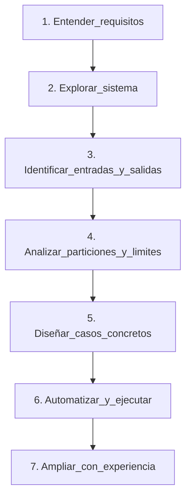
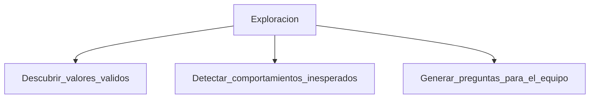
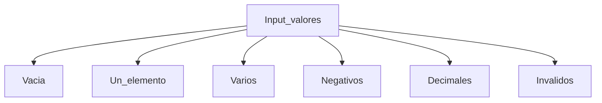
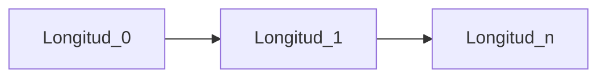
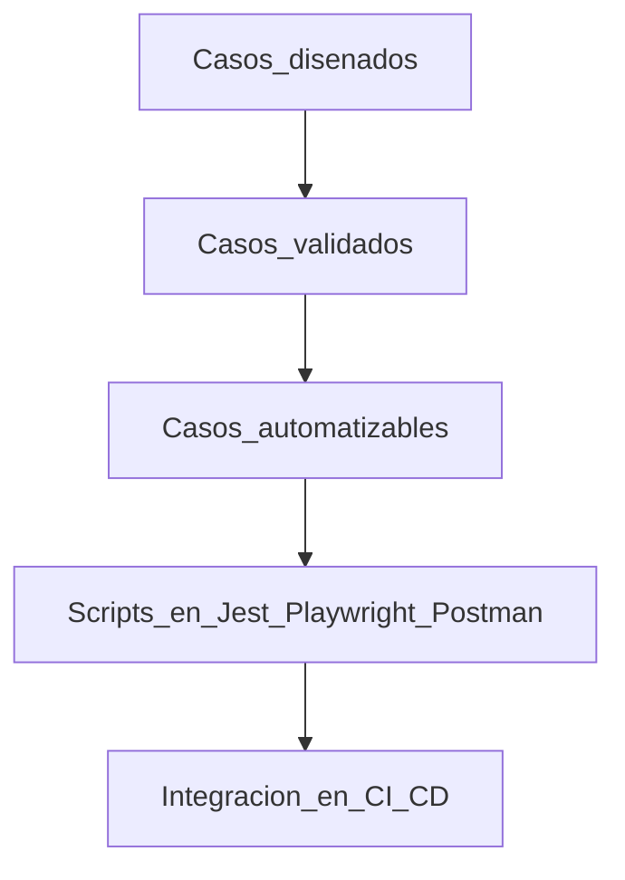
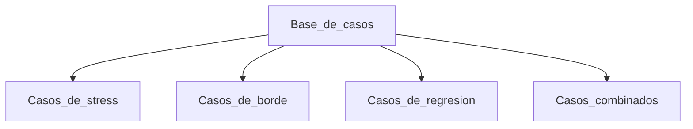
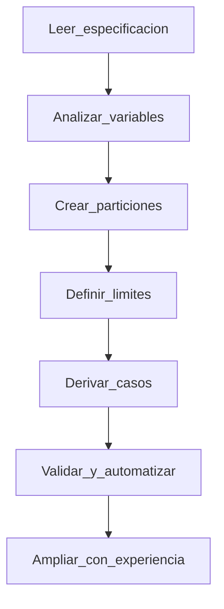

# Capítulo 3. Testing basado en especificaciones

> Nota  
> En este capítulo entramos en una de las habilidades más potentes del QA profesional: **transformar una especificación en una suite de pruebas sistemática**.  
> No se trata solo de leer un documento o un ticket de Jira, sino de **pensar con criterio técnico**.  
> De construir una mirada que va más allá de “probar el flujo feliz” y se adentra en el análisis de los límites, las excepciones y las ambigüedades.

---

## 3.1 Qué significa “especificación”

Una especificación es una **declaración de comportamiento esperado**.  
Puede estar en un documento, un correo, un test unitario, un esquema JSON o incluso en una conversación de Slack.

Lo importante no es el formato, sino su intención: **describir cómo debería comportarse el sistema**.

> Observación  
> En equipos grandes, he visto que los testers se frustran porque las especificaciones “no están claras”.  
> En realidad, esa ambigüedad **es parte del trabajo**: el QA Engineer tiene que detectar las lagunas, no quejarse de ellas.  
> Preguntar lo correcto a tiempo evita bugs costosos.

---

### 3.1.1 Tipos de especificaciones comunes

| Tipo      | Fuente                                          | Ejemplo                                     | Riesgo de interpretación                                         |
| --------- | ----------------------------------------------- | ------------------------------------------- | ---------------------------------------------------------------- |
| Funcional | Documentación, ticket o historia de usuario     | “El usuario puede filtrar por fecha”        | Ambigüedad: qué formato de fecha, qué pasa con rangos invertidos |
| Técnica   | API contract, esquema JSON, interfaz TypeScript | `{ "price": number }`                       | Riesgo de tipo o validación no implementada                      |
| Negocio   | Reglas declaradas por un stakeholder            | “Los clientes VIP tienen descuento del 10%” | Falta de precisión en los límites o excepciones                  |
| Implícita | Suposiciones o comportamientos heredados        | “Siempre funcionó así”                      | Riesgo de rotura invisible tras un refactor                      |

> Detalle  
> En mis proyectos con equipos de Estados Unidos y Alemania, las historias de usuario solían estar muy bien escritas pero carecían de detalle técnico.  
> En cambio, en proyectos de Argentina o España, a veces la documentación técnica estaba, pero el negocio cambiaba sobre la marcha.  
> En ambos casos, **la única defensa del QA es el razonamiento sistemático**.

---

## 3.2 El flujo del testing basado en especificaciones

El método que seguimos viene del libro _Effective Software Testing_ (Maurício Aniche).  
Propone **siete pasos** que estructuran todo el proceso de diseño de pruebas.



---

## 3.3 Paso 1: entender los requisitos

Este paso parece obvio, pero casi nadie lo hace en profundidad.  
Entender un requisito implica **identificar variables**, **suposiciones** y **restricciones**.

Tomemos un ejemplo simple:

> “La función debe devolver el promedio de un conjunto de números enteros positivos.”

Variables que identifico:

- Conjunto de números → puede estar vacío o tener elementos negativos.
- Números enteros → ¿qué pasa si llegan decimales?
- Promedio → ¿redondeado o no?
- Positivos → ¿cómo se maneja el cero?

Cada una de esas preguntas **es un caso de prueba en potencia**.

Quisiera citar las palabras que alguna vez me dijo un jefe español que llegué a admirar mucho:

> "Es mejor ponerse rojo un momento que estar morado toda la vida"

Con esto quiero decir que **no hay que tener miedo de preguntar**. Si algo no está claro en la especificación, **preguntalo antes de diseñar los tests**.

---

## 3.4 Paso 2: explorar el sistema

Antes de diseñar, hay que **jugar un poco**.  
Explorar significa **observar cómo reacciona el sistema** ante distintos inputs, incluso sin leer el código.  
En proyectos reales, esta fase me ha salvado de perder semanas.

Ejemplo: probando una API que devolvía métricas, descubrí que si el parámetro `startDate` y `endDate` eran iguales, el endpoint fallaba con 500.  
No estaba en ninguna especificación.  
Eso solo lo encontrás explorando.



> Aclaración  
> La exploración **no reemplaza el diseño formal**, pero lo nutre.  
> Cuanto más explores, más completas serán tus particiones después.

---

## 3.5 Paso 3: identificar entradas y salidas

Un sistema es una caja negra: tiene **entradas**, **procesamiento**, y **salidas**.  
Nuestro trabajo es identificar esos tres elementos para definir el espacio de prueba.

Ejemplo:

```typescript
function promedio(valores: number[]): number {
  if (valores.length === 0) throw new Error("Lista vacia");
  const suma = valores.reduce((a, b) => a + b, 0);
  return suma / valores.length;
}
```

Entradas:

- `valores`: un array de números.

Salida:

- un número (promedio) o una excepción.

> Nota  
> Aunque sea código simple, el análisis de entradas y salidas te obliga a ver **dónde puede romperse el contrato del sistema**.

---

## 3.6 Paso 4: analizar particiones y límites

### 3.6.1 Particiones

Dividimos los posibles inputs en grupos equivalentes:

| Partición                   | Ejemplo      | Resultado esperado |
| --------------------------- | ------------ | ------------------ |
| Lista vacía                 | `[]`         | Error              |
| Lista con un valor          | `[5]`        | 5                  |
| Lista con varios valores    | `[1,2,3]`    | 2                  |
| Lista con negativos         | `[2, -2]`    | 0                  |
| Lista con decimales         | `[1.5, 2.5]` | 2                  |
| Lista con valores inválidos | `["a", 3]`   | Error              |



### 3.6.2 Límites

Los límites son los bordes de cada partición:

- ¿Qué pasa si hay **exactamente 1 elemento**?
- ¿Y si hay **0**?
- ¿Y si hay **valores grandes o muy chicos**?



---

## 3.7 Paso 5: diseñar casos concretos

Después de las particiones, elegimos ejemplos representativos.

| ID   | Descripción    | Input       | Esperado |
| ---- | -------------- | ----------- | -------- |
| TC01 | Lista vacía    | `[]`        | Error    |
| TC02 | Un valor       | `[5]`       | `5`      |
| TC03 | Varios valores | `[2,4,6]`   | `4`      |
| TC04 | Negativos      | `[2,-2]`    | `0`      |
| TC05 | Decimales      | `[1.5,2.5]` | `2`      |

Y podemos traducirlo a Jest o Vitest:

```typescript
describe("promedio", () => {
  it("deberia lanzar error si la lista esta vacia", () => {
    expect(() => promedio([])).toThrow("Lista vacia");
  });

  it("deberia calcular el promedio de un solo numero", () => {
    expect(promedio([5])).toBe(5);
  });

  it("deberia calcular el promedio de varios numeros", () => {
    expect(promedio([2, 4, 6])).toBe(4);
  });

  it("deberia calcular correctamente con numeros negativos", () => {
    expect(promedio([2, -2])).toBe(0);
  });
});
```

> Observación  
> En un proyecto real de Alemania, este mismo patrón de análisis (particiones + límites + ejemplo) lo usamos para validar una API de cálculo de tasas de cambio.  
> La especificación decía “calcular promedio de tasas diarias”.  
> El bug vino porque el servicio fallaba si la lista venía vacía.  
> El caso “lista vacía” nunca se había documentado.

---

## 3.8 Paso 6: automatizar y ejecutar

Una vez validados los casos manuales, pasamos a la automatización.  
No se trata de “automatizar todo”, sino de **automatizar lo que tiene valor repetitivo**.



Ejemplo real:

```typescript
import { test, expect } from "@playwright/test";

test("Validar calculo de promedio", async ({ page }) => {
  await page.goto("https://aikodev.app/promedio");
  await page.fill("#input", "2,4,6");
  await page.click("#calcular");
  const result = await page.textContent("#resultado");
  expect(result).toBe("4");
});
```

> Detalle  
> En mis equipos en Reino Unido, Playwright se convirtió en la herramienta estándar para QA porque nos permitió integrar tests de UI, API y lógica de negocio en un solo pipeline CI/CD.  
> Pero el secreto fue **el diseño previo**: los casos venían ya pensados, no improvisados.

---

## 3.9 Paso 7: ampliar con creatividad y experiencia

Este paso es el que separa al **QA ejecutor** del **QA ingeniero**.  
Cuando ya tenés tus casos basados en especificaciones, podés **expandirlos** con:

- Casos de estrés: probar inputs muy grandes.
- Casos de borde: inputs vacíos, nulos, negativos, etc.
- Casos de regresión: repetir escenarios viejos para asegurar compatibilidad.
- Casos combinados: mezclar dos reglas aparentemente independientes.



> Nota  
> En Francia trabajé con un equipo financiero que hacía este paso como _Test Review_.  
> Cada QA proponía al menos 3 casos “fuera del guion” antes del cierre de sprint.  
> En dos meses, detectamos 8 bugs que las pruebas automatizadas jamás habrían encontrado.  
> Eso es _pensar como un ingeniero de calidad_, no como un operario.

---

## 3.10 Beneficios del testing basado en especificaciones

| Beneficio                  | Descripción                                                                                   |
| -------------------------- | --------------------------------------------------------------------------------------------- |
| Reducción del riesgo       | Las pruebas están alineadas con lo que el sistema debe hacer, no con lo que creemos que hace. |
| Mayor cobertura lógica     | Se prueban las clases de comportamiento, no solo los valores al azar.                         |
| Facilita la automatización | Los casos están diseñados de forma estable y predecible.                                      |
| Comunicación clara         | Los casos pueden explicarse fácilmente a negocio y desarrollo.                                |
| Prevención de defectos     | Se detectan ambigüedades en los requisitos antes del código.                                  |

> Aclaración  
> Este enfoque es **la base del TDD y del BDD**, aunque muchos lo olvidan.  
> Tanto Gherkin como los tests de unidad en TDD nacen del mismo principio: escribir primero una especificación ejecutable.

---

## 3.11 Resumen visual



---

## 3.12 Conclusión

Testing basado en especificaciones **no es una técnica avanzada**, es **la base de todo testing profesional**.  
Es lo que permite que, si mañana te mudás de proyecto o país, puedas diseñar una estrategia de QA **sin depender del azar ni de la intuición**.

> Reflexión final  
> En mis años trabajando con equipos de distintos países, vi una constante: los testers que saben diseñar pruebas basadas en especificaciones **se vuelven indispensables**.  
> Porque no solo ejecutan: **piensan, cuestionan y previenen**.

---

**Próximo capítulo:** _Testing estructural y cobertura de código_  
Veremos cómo pasar de la especificación a la observación interna del sistema: flujos, ramas, caminos y cobertura lógica.
