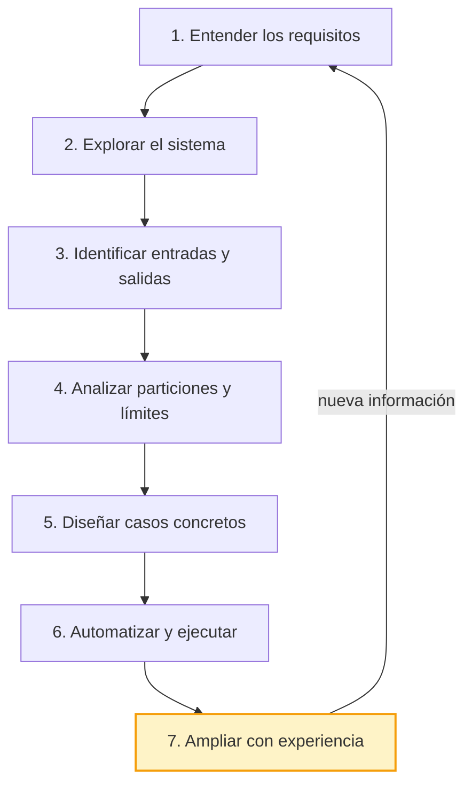
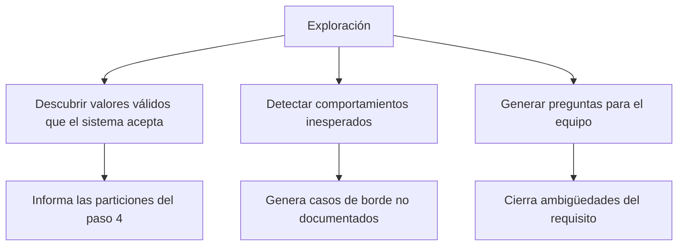
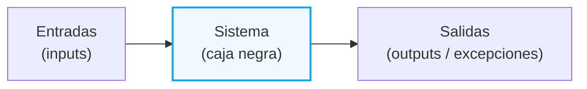
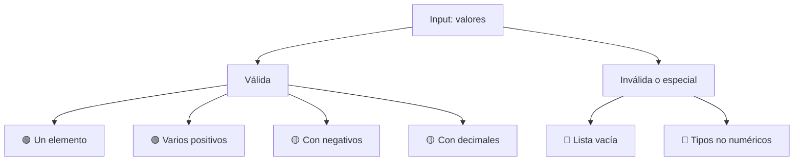
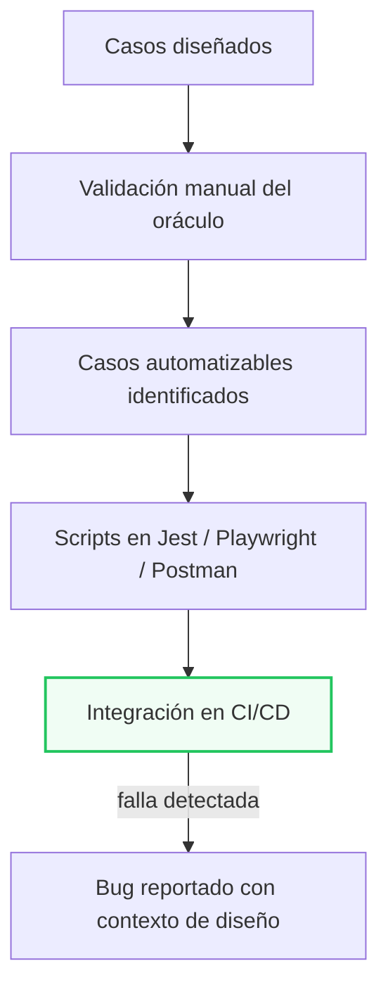

# Capítulo 3 · Testing basado en especificaciones

> _«Beware of bugs in the above code; I have only proved it correct, not tried it.»_
> — **Donald E. Knuth**, carta a Peter van Emde Boas (1977)

---

## Lo que vas a aprender en este capítulo

Al terminar este capítulo vas a poder:

- [x] Distinguir los distintos **tipos de especificación** (funcional, técnica, de negocio, implícita) y evaluar su nivel de ambigüedad.
- [x] Aplicar el **flujo de 7 pasos** de Aniche para transformar cualquier especificación en una suite de pruebas sistemática.
- [x] Descomponer un requisito en **variables de entrada y salida** y construir el espacio de prueba.
- [x] Usar **particiones de equivalencia** y **BVA** dentro del pipeline de especificaciones.
- [x] Ampliar una suite base con **casos de estrés, borde, regresión y combinados**.
- [x] Automatizar casos diseñados con **Jest / Playwright / Postman** sin perder rastreabilidad.

> **Nivel:** intermedio · **Tiempo de lectura:** ~40 min · **Pre-requisito:** Capítulo 2 (Diseño de tests).

---

## Mapa de ruta del capítulo


```mermaid
flowchart LR
    A[3.1 Qué es una especificación] --> B[3.2 El flujo de 7 pasos]
    B --> C[3.3 Paso 1: entender requisitos]
    C --> D[3.4 Paso 2: explorar el sistema]
    D --> E[3.5 Paso 3: entradas y salidas]
    E --> F[3.6 Paso 4: particiones y límites]
    F --> G[3.7 Paso 5: diseñar casos]
    G --> H[3.8 Paso 6: automatizar]
    H --> I[3.9 Paso 7: ampliar con experiencia]
    I --> J[Resumen + Ejercicios]
```

> **Nota del autor**
> En el capítulo anterior sistematizamos el _cómo_ diseñar un test individual. En este capítulo subimos un nivel: vamos a ver cómo **transformar una especificación completa en una suite sistemática**. La fuente principal es el método de Maurício Aniche, pero yo lo voy a anclar en situaciones que vi trabajar —y fallar— en proyectos reales.

---

## 3.1 Qué significa "especificación"

Una especificación es una **declaración de comportamiento esperado**. Puede estar en un documento de requisitos, un ticket de Jira, un test unitario, un esquema JSON o incluso en una conversación de Slack.

Lo importante no es el formato: es su intención. **Describir cómo debería comportarse el sistema.**

> **Definición — Especificación**
> Artefacto —formal o informal— que declara el **contrato observable** de un sistema: qué debe hacer dado cierto contexto. Toda prueba basada en especificaciones es, en esencia, **verificar ese contrato**.

### 3.1.1 Tipos de especificaciones comunes

**Tabla 3.1** — Taxonomía de especificaciones y sus riesgos de interpretación.

| Tipo | Fuente | Ejemplo | Riesgo principal |
| ---- | ------ | ------- | ---------------- |
| **Funcional** | Documento, ticket o historia de usuario | _"El usuario puede filtrar por fecha"_ | Ambigüedad: formato de fecha, rangos invertidos, zonas horarias |
| **Técnica** | API contract, esquema JSON, interfaz TypeScript | `{ "price": number }` | Validación de tipo no implementada; `NaN`, `Infinity` no considerados |
| **Negocio** | Reglas declaradas por un stakeholder | _"Los clientes VIP tienen descuento del 10 %"_ | Falta de precisión en límites o excepciones |
| **Implícita** | Suposiciones o comportamientos heredados | _"Siempre funcionó así"_ | Rotura invisible tras refactor o actualización de dependencia |

> **⚠️ Antipatrón: asumir que la especificación está completa**
> En mis proyectos con equipos de Estados Unidos y Alemania, las historias de usuario solían estar muy bien escritas pero carecían de detalle técnico. En Argentina o España, la documentación técnica existía, pero el negocio cambiaba sobre la marcha. En ambos casos, **la única defensa del QA es el razonamiento sistemático**: no esperar a que la especificación sea perfecta, sino extraer lo que falta con preguntas precisas.

---

## 3.2 El flujo de testing basado en especificaciones

El método que seguimos proviene de _Effective Software Testing_ (Aniche, 2022). Propone **siete pasos** que estructuran el proceso de diseño de pruebas desde la lectura del requisito hasta la ampliación con experiencia.

**Figura 3.1** — Pipeline completo de testing basado en especificaciones.


```mermaid
flowchart TD
    A[1. Entender los requisitos] --> B[2. Explorar el sistema]
    B --> C[3. Identificar entradas y salidas]
    C --> D[4. Analizar particiones y límites]
    D --> E[5. Diseñar casos concretos]
    E --> F[6. Automatizar y ejecutar]
    F --> G[7. Ampliar con experiencia]
    G -->|nueva información| A
    style G fill:#fef3c7,stroke:#f59e0b,stroke-width:2px
```

> **💡 Idea clave**
> El pipeline tiene una **flecha de feedback**: la experiencia acumulada en los pasos 6 y 7 retroalimenta el paso 1. Diseñar pruebas no es lineal —es iterativo, igual que el pipeline del capítulo anterior.

---

## 3.3 Paso 1 · Entender los requisitos

Este paso parece obvio, pero casi nadie lo hace en profundidad. Entender un requisito implica identificar tres cosas:

1. **Variables** — ¿Qué puede variar en la entrada?
2. **Suposiciones** — ¿Qué da por sentado el requisito que nunca va a llegar?
3. **Restricciones** — ¿Cuáles son los límites del comportamiento esperado?

### 3.3.1 Ejemplo guiado: descomponer un requisito

Tomemos un requisito simple:

> **Requisito:** _"La función debe devolver el promedio de un conjunto de números enteros positivos."_

Una lectura superficial dice: _"llega una lista, calculo el promedio"_. Una lectura de QA dice:

| Variable | Preguntas que dispara |
| -------- | --------------------- |
| **Conjunto de números** | ¿Puede estar vacío? ¿Puede tener un solo elemento? ¿Pueden repetirse valores? |
| **Números enteros** | ¿Qué pasa si llegan decimales? ¿Si llega un string numérico? |
| **Positivos** | ¿Cómo se maneja el cero? ¿Se aceptan negativos o se rechazan? |
| **Promedio** | ¿Se redondea o se trunca? ¿A cuántos decimales? |

Cada pregunta sin respuesta en la especificación es un **caso de prueba en potencia** —y posiblemente un bug esperando ser escrito.

> **💡 Idea clave**
> Quisiera citar algo que me dijo un jefe español que llegué a admirar mucho: _"Es mejor ponerse rojo un momento que estar morado toda la vida."_ No hay que tener miedo de preguntar. Si algo no está claro en la especificación, preguntalo antes de diseñar los tests. El costo de una pregunta es cero. El costo de un requisito mal interpretado puede ser una semana de trabajo.

### 3.3.2 Checklist de lectura de requisitos

> **✅ Buena práctica — Checklist de lectura**
> Antes de pasar al paso 2, respondé mentalmente:
>
> - [ ] ¿Puedo nombrar todas las variables de entrada?
> - [ ] ¿Sé cuáles son los valores válidos e inválidos de cada una?
> - [ ] ¿Conozco el comportamiento esperado en el caso feliz?
> - [ ] ¿Sé qué debe pasar cuando la entrada es inválida o extrema?
> - [ ] ¿Hay condiciones de borde no documentadas que puedo inferir?

---

## 3.4 Paso 2 · Explorar el sistema

Antes de diseñar formalmente, hay que **jugar un poco**. Explorar significa observar cómo reacciona el sistema ante distintos inputs, sin leer el código y sin un plan rígido.

> **Definición — Testing exploratorio**
> Modalidad de testing donde el diseño, la ejecución y el aprendizaje ocurren **en simultáneo**. No es aleatoria: es guiada por la curiosidad y el modelo mental del tester.

### 3.4.1 Por qué explorar antes de diseñar

En proyectos reales, la exploración previa tiene un ROI brutal. Un ejemplo personal: probando una API que calculaba métricas financieras, descubrí que si `startDate` y `endDate` eran iguales, el endpoint fallaba con `500 Internal Server Error`. No estaba en ninguna especificación. Solo lo encontré explorando.

**Figura 3.2** — Qué genera la fase de exploración.


```mermaid
flowchart TD
    A[Exploración] --> B[Descubrir valores válidos que el sistema acepta]
    A --> C[Detectar comportamientos inesperados]
    A --> D[Generar preguntas para el equipo]
    B --> E[Informa las particiones del paso 4]
    C --> F[Genera casos de borde no documentados]
    D --> G[Cierra ambigüedades del requisito]
```

> **⚠️ Antipatrón: explorar sin documentar**
> La exploración sin notas es testing de un solo uso. Cuando encontrás un comportamiento interesante, documentalo inmediatamente —aunque sea una nota en tu editor—. Los bugs descubiertos explorando que no se documentan **vuelven a aparecer en producción tres meses después**.

---

## 3.5 Paso 3 · Identificar entradas y salidas

Un sistema es una caja negra: tiene **entradas**, **procesamiento** y **salidas**. Nuestro trabajo es mapear esos tres elementos para definir el espacio de prueba.

**Figura 3.3** — Modelo de caja negra para diseño de pruebas.


```mermaid
flowchart LR
    I["Entradas\n(inputs)"] --> S["Sistema\n(caja negra)"]
    S --> O["Salidas\n(outputs / excepciones)"]
    style S fill:#f0f9ff,stroke:#0ea5e9,stroke-width:2px
```

### 3.5.1 Caso guiado: función `promedio`

**Listing 3.1** — Función bajo prueba: cálculo de promedio.

```typescript
function promedio(valores: number[]): number {
  if (valores.length === 0) {
    throw new Error("Lista vacía: no es posible calcular el promedio.");
  }
  const suma = valores.reduce((acc, v) => acc + v, 0);
  return suma / valores.length;
}
```

**Tabla 3.2** — Mapa de entradas, procesamiento y salidas.

| Elemento | Descripción | Valores posibles |
| --------- | ------------ | ---------------- |
| **Entrada** | `valores: number[]` | Array de números de cualquier longitud y valor |
| **Procesamiento** | Suma dividida por cantidad | Aritmética flotante IEEE 754 |
| **Salida nominal** | `number` (promedio) | Cualquier real; puede ser flotante |
| **Salida de error** | `Error` (lista vacía) | Lanzado cuando `length === 0` |

> **💡 Idea clave**
> Aunque sea código simple, el análisis de entradas y salidas te obliga a ver **dónde puede romperse el contrato del sistema**. Aquí ya se intuyen las particiones del paso siguiente: lista vacía, lista con un elemento, lista con varios, con negativos, con decimales.

---

## 3.6 Paso 4 · Analizar particiones y límites

Este paso conecta directamente con las técnicas del Capítulo 2. Aquí las aplicamos dentro del pipeline.

### 3.6.1 Particiones de equivalencia para `promedio`

**Tabla 3.3** — Particiones identificadas para el parámetro `valores`.

| Partición | Hipótesis | Ejemplo | Resultado esperado |
| --------- | --------- | ------- | ------------------ |
| 🔴 Lista vacía | `length === 0` | `[]` | `Error("Lista vacía…")` |
| 🟢 Un valor | `length === 1` | `[5]` | `5` |
| 🟢 Varios valores positivos | `length > 1`, todos > 0 | `[1, 2, 3]` | `2` |
| 🟡 Con negativos | `length > 1`, mix signos | `[2, -2]` | `0` |
| 🟡 Con decimales | `length > 1`, no enteros | `[1.5, 2.5]` | `2` |
| 🔴 Valores inválidos | Tipos no numéricos en runtime | `["a", 3]` | `NaN` o `Error` |

**Figura 3.4** — Árbol de particiones del parámetro `valores`.


```mermaid
graph TD
    A[Input: valores] --> B[Válida]
    A --> C[Inválida o especial]
    B --> D[🟢 Un elemento]
    B --> E[🟢 Varios positivos]
    B --> F[🟡 Con negativos]
    B --> G[🟡 Con decimales]
    C --> H[🔴 Lista vacía]
    C --> I[🔴 Tipos no numéricos]
```

### 3.6.2 Límites (BVA) aplicados

Los bordes del parámetro `valores` son estructurales (longitud del array):

| Límite | Valor | Por qué importa |
| ------ | ----- | --------------- |
| Vacío | `length = 0` | Límite de la excepción |
| Mínimo válido | `length = 1` | Justo sobre el límite de error |
| Crecimiento | `length = 2` | Primera suma real |

Y de **valores** dentro del array: cero, enteros negativos extremos, flotantes con precisión limitada (ej. `0.1 + 0.2`).

> **⚠️ Caso de borde silencioso — Aritmética flotante**
> En JavaScript/TypeScript, `(0.1 + 0.2) / 2 !== 0.15` exactamente. Si la especificación no dice nada sobre redondeo, tenés una ambigüedad. Un QA que no lo detecta antes del desarrollo genera un bug financiero en producción.

---

## 3.7 Paso 5 · Diseñar casos concretos

Con particiones y límites identificados, seleccionamos un representante por cada clase y lo expresamos como caso formal.

**Tabla 3.4** — Suite de casos derivados por EP + BVA.

| ID   | Descripción | Input | Resultado esperado | Técnica |
| ---- | ----------- | ----- | ------------------ | ------- |
| TC01 | Lista vacía | `[]` | `Error("Lista vacía…")` | EP inválida |
| TC02 | Un solo valor | `[5]` | `5` | Límite mínimo válido |
| TC03 | Varios positivos | `[2, 4, 6]` | `4` | EP válida |
| TC04 | Con negativos | `[2, -2]` | `0` | EP especial |
| TC05 | Con decimales | `[1.5, 2.5]` | `2` | EP especial |
| TC06 | Todos iguales | `[3, 3, 3]` | `3` | Propiedad metamórfica |
| TC07 | Flotantes en borde | `[0.1, 0.2]` | `≈ 0.15` | BVA flotante |

**Listing 3.2** — Suite Jest basada en la tabla de casos derivados.

```typescript
describe('promedio — Specification-Based Testing', () => {

  describe('🔴 Particiones inválidas', () => {
    test('TC01: lista vacía lanza error', () => {
      expect(() => promedio([])).toThrow('Lista vacía');
    });
  });

  describe('🟢 Particiones válidas', () => {
    test('TC02: un solo elemento devuelve ese elemento', () => {
      expect(promedio([5])).toBe(5);
    });

    test('TC03: varios positivos — promedio correcto', () => {
      expect(promedio([2, 4, 6])).toBe(4);
    });
  });

  describe('🟡 Casos especiales', () => {
    test('TC04: con negativos — promedio puede ser cero', () => {
      expect(promedio([2, -2])).toBe(0);
    });

    test('TC05: con decimales — promedio flotante', () => {
      expect(promedio([1.5, 2.5])).toBe(2);
    });

    test('TC06: todos iguales — promedio es el mismo valor', () => {
      expect(promedio([3, 3, 3])).toBe(3);
    });

    test('TC07: flotantes con precisión limitada', () => {
      expect(promedio([0.1, 0.2])).toBeCloseTo(0.15);
    });
  });
});
```

> **Observación de campo**
> En un proyecto real en Alemania, este mismo patrón —particiones + límites + casos concretos— lo usamos para validar una API de cálculo de tasas de cambio. La especificación decía _"calcular promedio de tasas diarias"_. El bug vino porque el servicio fallaba si la lista llegaba vacía —algo que ocurría cada vez que un mercado cerraba por feriado—. El caso TC01 habría encontrado ese bug en development, no en producción.

---

## 3.8 Paso 6 · Automatizar y ejecutar

Una vez validados los casos manualmente, pasamos a la automatización. El criterio no es _"automatizar todo"_, sino **automatizar lo que tiene valor repetitivo**: los casos que queremos que fallen si el sistema regresa.

**Figura 3.5** — Pipeline de automatización a partir de casos diseñados.


```mermaid
flowchart TD
    A[Casos diseñados] --> B[Validación manual del oráculo]
    B --> C[Casos automatizables identificados]
    C --> D[Scripts en Jest / Playwright / Postman]
    D --> E[Integración en CI/CD]
    E -->|falla detectada| F[Bug reportado con contexto de diseño]
    style E fill:#f0fdf4,stroke:#22c55e,stroke-width:2px
```

### 3.8.1 Ejemplo: test de UI con Playwright

**Listing 3.3** — Tests Playwright alineados con casos TC01 y TC03.

```typescript
import { test, expect } from '@playwright/test';

// TC03: varios positivos — resultado correcto
test('TC03: promedio de [2, 4, 6] debe ser 4', async ({ page }) => {
  await page.goto('https://aikodev.app/promedio');
  await page.fill('#input', '2,4,6');
  await page.click('#calcular');

  const result = await page.textContent('#resultado');
  expect(result).toBe('4');
});

// TC01: lista vacía — mensaje de error visible
test('TC01: lista vacía muestra mensaje de error', async ({ page }) => {
  await page.goto('https://aikodev.app/promedio');
  await page.click('#calcular');  // sin input

  const error = await page.textContent('#error-message');
  expect(error).toContain('Lista vacía');
});
```

> **💡 Idea clave**
> Notás que el ID del test (`TC03`, `TC01`) coincide con el de la Tabla 3.4. Eso no es cosmético: es **rastreabilidad**. Cuando el CI falla, sabés exactamente qué partición se rompió y por qué ese caso existía. En mis equipos en Reino Unido, Playwright se convirtió en herramienta estándar precisamente porque el **diseño previo** hacía que los tests fallaran con contexto, no solo con un stack trace.

### 3.8.2 Criterios para decidir qué automatizar

**Tabla 3.5** — Matriz de priorización de automatización.

| Criterio | Automatizá | No automatices todavía |
| --------- | ---------- | ---------------------- |
| Frecuencia de ejecución | Cada PR / cada deploy | Una vez por sprint |
| Estabilidad del requisito | Comportamiento consolidado | Feature en exploración |
| Costo de ejecución manual | Alto (UI, integraciones) | Bajo (lógica trivial) |
| Riesgo de regresión | Alto (pago, auth, datos) | Bajo (copy, estética) |

---

## 3.9 Paso 7 · Ampliar con creatividad y experiencia

Este paso es el que separa al **QA ejecutor** del **QA ingeniero**. Cuando ya tenés una suite base derivada de la especificación, podés **expandirla** con cuatro vectores:

**Tabla 3.6** — Vectores de ampliación de la suite.

| Vector | Qué agrega | Ejemplo para `promedio` |
| ------- | ---------- | ----------------------- |
| **Estrés** | Inputs muy grandes o voluminosos | Array de 1 000 000 elementos |
| **Borde extremo** | Nulos, `undefined`, tipos incorrectos en runtime | `promedio(null)`, `promedio(undefined)` |
| **Regresión** | Escenarios viejos para asegurar compatibilidad | Volver a correr TC01–TC07 tras cada refactor |
| **Combinados** | Mezcla de dos reglas aparentemente independientes | Decimales negativos: `[-0.5, -1.5]` |

**Listing 3.4** — Casos de ampliación.

```typescript
describe('promedio — Casos de ampliación', () => {

  test('Estrés: array de un millón de elementos', () => {
    const bigArray = Array.from({ length: 1_000_000 }, (_, i) => i + 1);
    expect(promedio(bigArray)).toBeCloseTo(500_000.5);
  });

  test('Borde extremo: array con un solo cero', () => {
    expect(promedio([0])).toBe(0);
  });

  test('Combinado: decimales negativos', () => {
    expect(promedio([-0.5, -1.5])).toBeCloseTo(-1);
  });

  test('Regresión: TC03 sigue funcionando tras refactor', () => {
    expect(promedio([2, 4, 6])).toBe(4);
  });
});
```

> **Observación de campo**
> En Francia trabajé con un equipo financiero que formalizaba este paso como _Test Review_. Cada QA proponía al menos 3 casos _"fuera del guion"_ antes del cierre de sprint. En dos meses, detectamos 8 bugs que las pruebas automatizadas jamás habrían encontrado —todos en la intersección de reglas que nadie había combinado—. Eso es pensar como un ingeniero de calidad, no como un operario.

---

## 3.10 Beneficios del testing basado en especificaciones

**Tabla 3.7** — Impacto medible del enfoque sistemático.

| Beneficio | Descripción | Cuándo se nota |
| --------- | ----------- | -------------- |
| **Reducción de riesgo** | Las pruebas están alineadas con lo que el sistema _debe_ hacer | En cada release |
| **Mayor cobertura lógica** | Se prueban clases de comportamiento, no valores al azar | Cuando se encuentra un bug de partición |
| **Facilita la automatización** | Los casos están diseñados de forma estable y predecible | Cuando los tests no se rompen por cambios de UI |
| **Comunicación clara** | Los casos pueden explicarse a negocio y desarrollo sin ambigüedad | En reuniones de postmortem |
| **Prevención de defectos** | Se detectan ambigüedades en los requisitos antes del código | En reuniones de refinamiento |

> **💡 Idea clave**
> Este enfoque es **la base del TDD y del BDD**, aunque muchos lo olvidan. Tanto Gherkin como los tests de unidad en TDD nacen del mismo principio: escribir primero una especificación ejecutable y verificar que el sistema la cumple.

---

## 3.11 Ejemplo integrador: API de cálculo de descuentos

Aplicamos el pipeline completo de los 7 pasos a un caso realista.

**Requisito:** _"La API debe calcular el precio final de un producto aplicando el descuento del usuario. Los clientes VIP tienen 20 % de descuento. Los clientes estándar tienen 10 % si el monto supera $100, o 0 % si es igual o menor."_

### Paso 1 — Variables identificadas

| Variable | Valores posibles |
| -------- | ---------------- |
| `precioBase` | Cualquier número; puede ser 0, negativo, muy grande |
| `tipoCliente` | `'VIP'`, `'STANDARD'`, ¿otros? |
| Umbral | $100 — límite entre con y sin descuento para STANDARD |

**Preguntas al equipo antes de continuar:**
- ¿Qué pasa si `precioBase` es negativo o cero?
- ¿Hay más tipos de cliente además de `VIP` y `STANDARD`?
- ¿El descuento VIP se aplica siempre, sin importar el monto?

### Paso 3 — Función bajo prueba

**Listing 3.5** — Implementación a testear.

```typescript
type CustomerType = 'VIP' | 'STANDARD';

interface PriceRequest {
  precioBase: number;
  tipoCliente: CustomerType;
}

function calcularPrecioFinal(req: PriceRequest): number {
  if (req.precioBase <= 0) {
    throw new Error('El precio base debe ser mayor a cero.');
  }

  if (req.tipoCliente === 'VIP') {
    return req.precioBase * 0.8;   // 20 % de descuento
  }

  if (req.tipoCliente === 'STANDARD' && req.precioBase > 100) {
    return req.precioBase * 0.9;   // 10 % de descuento
  }

  return req.precioBase;           // sin descuento
}
```

### Paso 4 — Particiones y límites

**Tabla 3.8** — Particiones para `precioBase` y `tipoCliente`.

| Variable | Partición | Ejemplo | Categoría |
| -------- | --------- | ------- | --------- |
| `precioBase` | Inválido (≤ 0) | `0`, `-10` | 🔴 |
| `precioBase` | Válido ≤ $100 | `50`, `100` | 🟢 |
| `precioBase` | Válido > $100 | `101`, `200` | 🟢 |
| `tipoCliente` | `'VIP'` | — | 🟢 |
| `tipoCliente` | `'STANDARD'` | — | 🟢 |

**Límites críticos para `precioBase`:** `0`, `1`, `100`, `101`.

### Paso 5 — Casos concretos

**Tabla 3.9** — Suite derivada por EP + BVA + relaciones.

| ID   | Caso | `precioBase` | `tipoCliente` | Resultado esperado | Técnica |
| ---- | ---- | ------------ | ------------- | ------------------ | ------- |
| TC01 | Precio inválido (cero) | `0` | `STANDARD` | `Error("precio base…")` | EP inválida + BVA |
| TC02 | Precio negativo | `-10` | `VIP` | `Error("precio base…")` | EP inválida |
| TC03 | VIP precio bajo | `50` | `VIP` | `40` | EP válida VIP |
| TC04 | VIP precio alto | `200` | `VIP` | `160` | EP válida VIP |
| TC05 | STANDARD en límite exacto | `100` | `STANDARD` | `100` | BVA límite |
| TC06 | STANDARD justo sobre el límite | `101` | `STANDARD` | `90.9` | BVA límite + 1 |
| TC07 | STANDARD precio alto | `500` | `STANDARD` | `450` | EP válida STANDARD |

**Listing 3.6** — Suite Jest del ejemplo integrador.

```typescript
describe('calcularPrecioFinal — Specification-Based Testing', () => {

  describe('🔴 Particiones inválidas', () => {
    test('TC01: precio cero lanza error', () => {
      expect(() =>
        calcularPrecioFinal({ precioBase: 0, tipoCliente: 'STANDARD' })
      ).toThrow('precio base');
    });

    test('TC02: precio negativo lanza error', () => {
      expect(() =>
        calcularPrecioFinal({ precioBase: -10, tipoCliente: 'VIP' })
      ).toThrow('precio base');
    });
  });

  describe('🟢 Cliente VIP — siempre 20 % de descuento', () => {
    test('TC03: VIP precio bajo ($50 → $40)', () => {
      expect(calcularPrecioFinal({ precioBase: 50, tipoCliente: 'VIP' })).toBe(40);
    });

    test('TC04: VIP precio alto ($200 → $160)', () => {
      expect(calcularPrecioFinal({ precioBase: 200, tipoCliente: 'VIP' })).toBe(160);
    });
  });

  describe('🟢 Cliente STANDARD — descuento condicional', () => {
    test('TC05: en límite exacto ($100 → $100, sin descuento)', () => {
      expect(calcularPrecioFinal({ precioBase: 100, tipoCliente: 'STANDARD' })).toBe(100);
    });

    test('TC06: justo sobre el límite ($101 → $90.9)', () => {
      expect(
        calcularPrecioFinal({ precioBase: 101, tipoCliente: 'STANDARD' })
      ).toBeCloseTo(90.9);
    });

    test('TC07: precio alto ($500 → $450)', () => {
      expect(calcularPrecioFinal({ precioBase: 500, tipoCliente: 'STANDARD' })).toBe(450);
    });
  });
});
```

> **⚠️ El límite en $100 es el punto caliente**
> TC05 y TC06 prueban exactamente el valor `100` y el valor `101`. Es donde la regla cambia. En la revisión de código del equipo alemán, el bug estaba en el operador: el developer había escrito `>= 100` en lugar de `> 100`. Un test que no cubre ese límite **no puede encontrar ese bug**.

---

# Cierre del capítulo

## Resumen ejecutivo

El testing basado en especificaciones no es una técnica avanzada: es **la base de todo testing profesional**. Los siete pasos de Aniche son un marco que, aplicado sistemáticamente, garantiza que ningún comportamiento declarado en la especificación quede sin un caso que lo respalde.

Los movimientos fundamentales del capítulo:

1. **Descomponer el requisito** en variables, suposiciones y restricciones antes de escribir cualquier test.
2. **Explorar el sistema** para descubrir comportamientos no documentados.
3. **Mapear entradas y salidas** para definir el espacio de prueba.
4. **Aplicar EP y BVA** dentro del pipeline —no como técnicas aisladas.
5. **Derivar casos concretos** con IDs rastreables a las particiones que cubren.
6. **Automatizar con rastreabilidad**: los tests mencionan la partición que cubren.
7. **Ampliar con experiencia**: estrés, bordes, regresión y combinados.

## ✅ Checklist del QA: ¿mi suite está basada en especificaciones?

- [ ] ¿Identifiqué todas las variables de entrada del sistema?
- [ ] ¿Pregunté sobre los casos no documentados antes de diseñar?
- [ ] ¿Exploré el SUT antes de escribir el primer test?
- [ ] ¿Tengo al menos una partición válida, una inválida y un límite por variable?
- [ ] ¿Cada caso tiene un ID rastreable a una partición o límite?
- [ ] ¿Automaticé los casos con criterio de ROI, no por completitud ciega?
- [ ] ¿Agregué al menos un caso de ampliación (estrés, borde o combinado)?

## Ejercicios prácticos

> **Ejercicio 3.1 — Descomponer un requisito**
> Tomá este requisito: _"El sistema debe calcular el interés simple de un préstamo dado un capital, una tasa anual y una cantidad de meses."_ Identificá todas las variables, los valores válidos e inválidos de cada una, y al menos 3 preguntas que harías al equipo.

> **Ejercicio 3.2 — Particiones y BVA**
> Para la función `promedio` del capítulo, agregá dos particiones que no estén en la Tabla 3.3. Justificá por qué representan comportamiento distinto.

> **Ejercicio 3.3 — Rastreabilidad**
> Tomá la suite TC01–TC07 de la Tabla 3.4 y reescribí los títulos de cada test para que incluyan la técnica usada (EP / BVA / combinado) y la partición que cubre.

> **Ejercicio 3.4 — Ampliar la suite**
> Para `calcularPrecioFinal`, agregá un caso de ampliación de cada vector: estrés, borde extremo y combinado. Justificá qué riesgo cubre cada uno.

> **Ejercicio 3.5 — De especificación a Playwright**
> Tomá los casos TC05 y TC06 de la Tabla 3.9 y escribí los tests Playwright correspondientes asumiendo que la función está expuesta en una UI web. ¿Qué precondiciones necesitás preparar?

## Conexión con el resto del libro

| Si te interesó… | Profundizá en |
| --------------- | ------------- |
| Las técnicas EP y BVA usadas en el paso 4 | Capítulo 2 · Secciones 2.5 y 2.6 |
| Testing estructural para complementar el blackbox | Capítulo 4 · Cobertura de código |
| Property-based testing como alternativa a EP manual | Capítulo 5 · Testing basado en propiedades |
| Automatizar la suite con Playwright end-to-end | Parte III · Automatización inteligente |
| Medir la cobertura de la especificación | Parte IV · Estrategia y cultura QA |

---

## Referencias bibliográficas

### Libros fundamentales

1. **Aniche, M.** (2022). _Effective Software Testing: A Developer's Guide_. Manning Publications. — Fuente principal del pipeline de 7 pasos de este capítulo.
2. **Myers, G. J., Sandler, C., & Badgett, T.** (2011). _The Art of Software Testing_ (3.ª ed.). John Wiley & Sons.
3. **Jorgensen, P. C.** (2013). _Software Testing: A Craftsman's Approach_ (4.ª ed.). CRC Press.
4. **Kaner, C., Bach, J., & Pettichord, B.** (2001). _Lessons Learned in Software Testing_. Wiley.
5. **Beizer, B.** (1990). _Software Testing Techniques_ (2.ª ed.). Van Nostrand Reinhold.

### Estándares y especificaciones

6. **ISO/IEC/IEEE 29119-4:2021** — _Software Testing: Test Techniques_.
7. **ISTQB Syllabus v4.0** (2023). _Certified Tester Foundation Level_. International Software Testing Qualifications Board.

### Recursos técnicos

8. **Playwright Documentation** (2024). _Test isolation, fixtures and page objects_. Microsoft. https://playwright.dev/docs
9. **Jest Documentation** (2024). _Using Matchers_. Meta Open Source. https://jestjs.io/docs/using-matchers

---

> **Nota final — Próximo capítulo**
> En este capítulo trabajamos desde **afuera hacia adentro**: la especificación nos dijo qué probar. En el [Capítulo 4](04-testing-estructural-y-cobertura.md) cruzamos la línea hacia el **testing estructural** (caja blanca): el código fuente se convierte en nuestra guía. Aprenderemos cobertura de sentencias, ramas, caminos y condiciones —y cuándo cada métrica tiene sentido real.
>
> Nos vemos del otro lado del cristal.