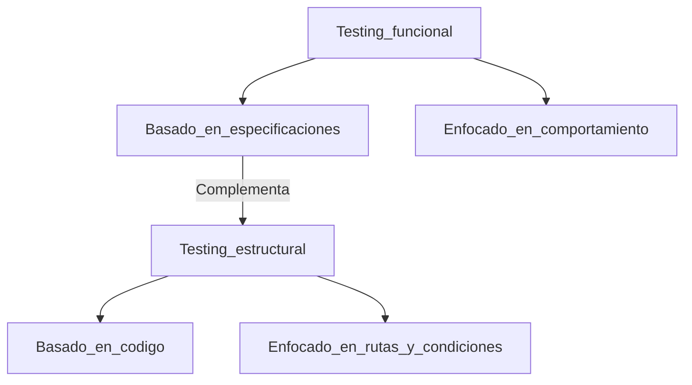
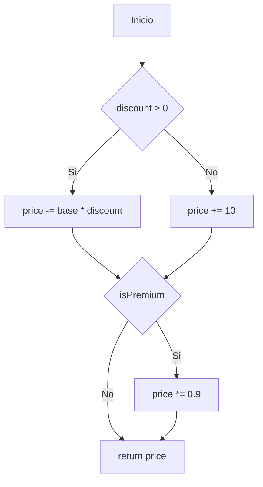
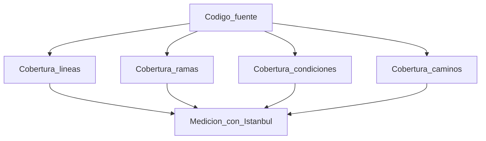
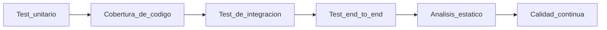
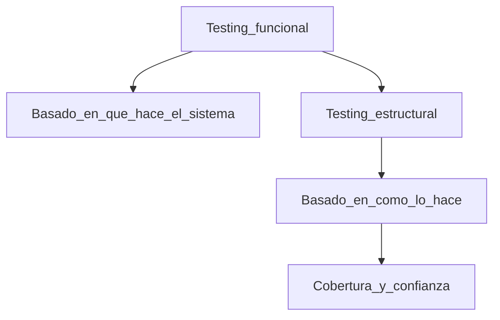

# Capítulo 4. Testing estructural y cobertura de código

> Nota  
> En este capítulo entramos en el terreno del **testing estructural**, una disciplina que no depende de la especificación funcional, sino de **la estructura interna del código**.  
> Este enfoque busca garantizar que todas las rutas, condiciones y decisiones dentro del programa sean verificadas.  
> Mientras el testing basado en especificaciones se pregunta *“¿El sistema hace lo que debería?”*, el testing estructural pregunta *“¿Ya ejecutamos todas las partes del código que podrían fallar?”*.

---

## 4.1 Qué es el testing estructural

Testing estructural significa **probar el código desde adentro**.  
Ya no analizamos los requisitos, sino la **lógica, los flujos y las decisiones**.  
El objetivo es **maximizar la cobertura**: cuántas líneas, ramas o condiciones fueron realmente ejecutadas durante las pruebas.

> Observación  
> En mis años trabajando con equipos de QA y desarrollo en distintos países, noté una brecha cultural:  
>
> - En Estados Unidos y Alemania se mide la calidad por cobertura.  
> - En Latinoamérica todavía se asocia el testing solo con ejecución manual.  
>   Sin embargo, los mejores equipos combinan ambos enfoques: funcional y estructural.



---

## 4.2 Qué mide la cobertura

La cobertura no es un porcentaje vacío. Es una **medida de confianza**.  
Indica qué tanto del código fue recorrido por los tests, pero **no garantiza ausencia de errores**.

### Tipos comunes de cobertura

| Tipo                     | Qué mide                                | Ejemplo                         | Herramienta      |
| ------------------------ | --------------------------------------- | ------------------------------- | ---------------- |
| Cobertura de líneas      | Líneas ejecutadas al menos una vez      | 85% de las líneas se ejecutaron | Jest, Istanbul   |
| Cobertura de sentencias  | Instrucciones ejecutadas                | `if`, `for`, `return`           | NYC, Vitest      |
| Cobertura de ramas       | Caminos del código dentro de decisiones | `if/else`, `switch`             | Istanbul, Clover |
| Cobertura de condiciones | Combinaciones de booleanos              | `A && B`, `A || B`              | Jest, Playwright |
| Cobertura de rutas       | Secuencias completas de ejecución       | Todas las rutas del flujo       | Cypress, JaCoCo  |

> Aclaración  
> Tener 100% de cobertura de líneas no significa tener 100% de confianza.  
> Podés ejecutar una línea sin validar su salida o sin comprobar que hace lo correcto.  
> Por eso el testing estructural **no reemplaza** al testing funcional, sino que lo **fortalece**.

---

## 4.3 Cómo entender el flujo del código

En testing estructural analizamos los **caminos de ejecución**.  
Cada rama del código (una decisión `if`, un `switch`, un bucle) crea nuevas rutas que deben ser probadas.

### Ejemplo en TypeScript

```typescript
function calculatePrice(base: number, discount: number, isPremium: boolean): number {
  let price = base;
  if (discount > 0) {
    price -= base * discount;
  } else {
    price += 10;
  }

  if (isPremium) {
    price *= 0.9;
  }

  return price;
}
```

Ramas posibles:

1. `discount > 0 && isPremium === true`
2. `discount > 0 && isPremium === false`
3. `discount <= 0 && isPremium === true`
4. `discount <= 0 && isPremium === false`



> Nota  
> Un test por cada ruta no es lo mismo que un test por cada caso funcional.  
> Aquí buscamos **que el código sea recorrido completamente**, no solo que las salidas coincidan.

---

## 4.4 Estrategias de testing estructural

El testing estructural abarca diferentes técnicas según el nivel de detalle.

### 1. Cobertura de líneas

Asegura que todas las líneas sean ejecutadas al menos una vez.

### 2. Cobertura de ramas

Verifica que cada camino posible en una decisión (`if`, `else`, `switch`) haya sido probado.

### 3. Cobertura de condiciones

Evalúa cada expresión booleana de forma independiente.

### 4. Cobertura de decisiones múltiples

Comprueba todas las combinaciones posibles de condiciones en una expresión compleja.

### 5. Cobertura de caminos

Analiza secuencias completas de decisiones, ideal para lógica crítica (autenticación, facturación, validaciones de seguridad).



> Observación  
> En mis equipos de Europa, usábamos **reportes de cobertura por módulo**, no solo globales.  
> Esto ayudaba a detectar qué partes del sistema estaban más expuestas a errores.  
> Una cobertura del 80% global puede ocultar un módulo crítico con solo 30%.

---

## 4.5 Cómo medir cobertura en TypeScript

Con herramientas como **Jest** o **Vitest**, la cobertura se obtiene fácilmente con un flag:

```bash
npx jest --coverage
```

El reporte muestra métricas como estas:

```
File                | % Stmts | % Branch | % Funcs | % Lines | Uncovered Line #
--------------------|---------|-----------|----------|----------|----------------
src/utils.ts        | 95.00   | 90.00     | 100.00   | 95.00   | 45
src/calc.ts         | 80.00   | 66.67     | 75.00    | 80.00   | 10,15,20
All files           | 87.50   | 83.33     | 90.00    | 87.50   |
```

```typescript
describe("calculatePrice", () => {
  it("aplica descuento y premium", () => {
    expect(calculatePrice(100, 0.1, true)).toBe(81);
  });

  it("aplica descuento sin premium", () => {
    expect(calculatePrice(100, 0.1, false)).toBe(90);
  });

  it("sin descuento con premium", () => {
    expect(calculatePrice(100, 0, true)).toBe(99);
  });

  it("sin descuento ni premium", () => {
    expect(calculatePrice(100, 0, false)).toBe(110);
  });
});
```

> Detalle  
> Cada test activa una ruta distinta. Con estas cuatro pruebas, alcanzamos **100% de cobertura de ramas**.

---

## 4.6 Testing estructural en la práctica profesional

En el mundo real, el testing estructural se aplica de diferentes formas:

| Nivel       | Qué se prueba                        | Herramienta típica    | Objetivo                             |
| ----------- | ------------------------------------ | --------------------- | ------------------------------------ |
| Unitario    | Lógica interna de funciones o clases | Jest, Vitest          | Cobertura de ramas                   |
| Integración | Módulos y dependencias               | Playwright, Supertest | Flujos entre componentes             |
| End-to-end  | Sistema completo                     | Cypress               | Validar rutas de usuario             |
| Estático    | Código sin ejecutar                  | ESLint, SonarQube     | Detectar código muerto o no testeado |



> Aclaración  
> El testing estructural no es exclusivo del QA: **es una práctica compartida con los desarrolladores**.  
> Cuanto más temprano se ejecuta, más barato es corregir.

---

## 4.7 Equilibrio entre cobertura y valor

Buscar 100% de cobertura puede ser una trampa.  
A veces, el costo de escribir ciertos tests supera el beneficio real.  
Lo importante es la **cobertura significativa**, aquella que reduce riesgo de fallas en producción.

### Ejemplo real

En un sistema de pagos en Alemania, teníamos 98% de cobertura en el módulo de validación de tarjetas, pero solo 40% en los reportes de auditoría.  
El riesgo real estaba en los pagos, no en los reportes.  
Por eso concentramos el esfuerzo donde más valía.

> Nota  
> Una cobertura del 70% bien distribuida puede ser más valiosa que un 95% lleno de tests triviales.

---

## 4.8 Pruebas estructurales automatizadas

El testing estructural se apoya en **instrumentación de código**: agregar marcadores para saber qué líneas fueron ejecutadas.

Herramientas comunes:

- **Istanbul / NYC** para JavaScript y TypeScript.  
- **JaCoCo** para Java y Kotlin.  
- **Coverage.py** para Python.  
- **dotCover** para .NET.

Ejemplo básico de instrumentación con NYC:

```bash
npx nyc --reporter=text --reporter=html npm test
```

Esto genera un informe visual en `/coverage/index.html` donde podés ver qué líneas se ejecutaron o no.

> Observación  
> Enseño siempre a mis alumnos a **interpretar el reporte, no solo leerlo**.  
> Si una línea no cubierta no representa riesgo, no vale la pena forzar un test artificial.

---

## 4.9 Limitaciones del testing estructural

1. **No garantiza la corrección funcional**: puede cubrir todas las líneas, pero con valores incorrectos.  
2. **Puede incentivar tests triviales**: algunos equipos escriben tests vacíos solo para subir el porcentaje.  
3. **No reemplaza revisiones de código ni validaciones de negocio**.  
4. **Depende fuertemente del entorno de ejecución**.

> Detalle  
> El autor de *Effective Software Testing* lo resume así: “El testing estructural mejora la confianza, no la verdad”.  
> Es una métrica útil, no una meta en sí misma.

---

## 4.10 Síntesis del capítulo

| Concepto            | Descripción                                         |
| ------------------- | --------------------------------------------------- |
| Testing estructural | Evalúa la lógica interna del código                 |
| Cobertura           | Porcentaje del código ejecutado en pruebas          |
| Tipos               | Líneas, ramas, condiciones, caminos                 |
| Herramientas        | Jest, Vitest, NYC, Istanbul, SonarQube              |
| Valor real          | Aumentar la confianza en la estabilidad del sistema |



---

## 4.11 Conclusión

El testing estructural es el espejo técnico del testing funcional.  
Si el primero asegura que el código **hace lo correcto**, el segundo garantiza que **lo hace de la forma correcta**.

> Reflexión final  
> Cuando enseño esto en clase, siempre digo lo mismo: *la cobertura no es una obsesión, es una brújula*.  
> Te muestra hacia dónde mirar, no dónde está el error.  
> Saber leerla es lo que convierte a un QA en ingeniero.

---

**Próximo capítulo:** *Diseñando contratos y test doubles*.  
Aprenderemos cómo aislar dependencias y diseñar componentes más testeables a través de principios de diseño y dobles de prueba.