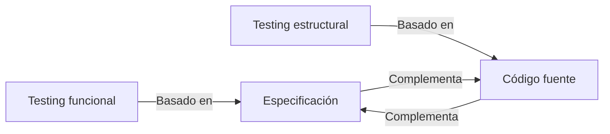
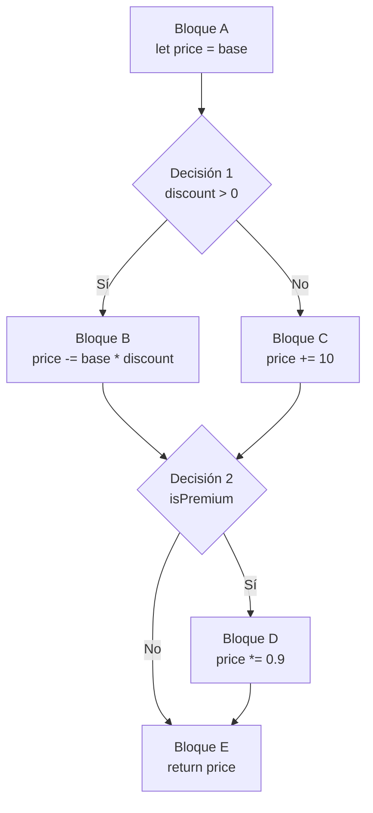
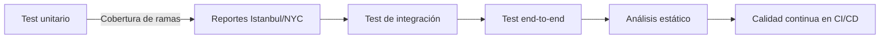

# Capítulo 4 · Testing estructural y cobertura de código

> _«The art of debugging is figuring out what you really told your program to do rather than what you thought you told it to do.»_
> — **Andrew Singer**, _The Practice of Programming_ (1999)

---

## Lo que vas a aprender en este capítulo

Al terminar este capítulo vas a poder:

- [x] Distinguir el **testing estructural** del testing basado en especificaciones y entender cuándo aplicar cada uno.
- [x] Interpretar los **cuatro niveles de cobertura** —líneas, ramas, condiciones y caminos— y conocer las limitaciones de cada métrica.
- [x] Modelar el **grafo de flujo de control** de una función y derivar casos que maximicen cobertura de ramas.
- [x] Configurar **Jest / Istanbul / NYC** para generar reportes de cobertura en proyectos TypeScript.
- [x] Aplicar cobertura de **condiciones múltiples (MC/DC)** en lógica crítica.
- [x] Tomar decisiones de **ROI sobre cobertura**: cuándo perseguirla y cuándo no.

> **Nivel:** intermedio · **Tiempo de lectura:** ~40 min · **Pre-requisito:** Capítulo 3 (Testing basado en especificaciones).

---

## Mapa de ruta del capítulo


```mermaid
flowchart LR
    A[4.1 Qué es el testing estructural] --> B[4.2 Qué mide la cobertura]
    B --> C[4.3 Grafos de flujo de control]
    C --> D[4.4 Cobertura de líneas y sentencias]
    D --> E[4.5 Cobertura de ramas]
    E --> F[4.6 Cobertura de condiciones y MC/DC]
    F --> G[4.7 Cobertura de caminos]
    G --> H[4.8 Medir cobertura en TypeScript]
    H --> I[4.9 Equilibrio y ROI]
    I --> J[Resumen + Ejercicios]
```

> **Nota del autor**
> En el capítulo anterior trabajamos desde **afuera hacia adentro**: la especificación nos dijo qué probar. En este capítulo cruzamos la línea y miramos **adentro del código**: el propio código fuente se convierte en nuestra guía. Esta perspectiva no reemplaza a la anterior —la complementa. Los equipos que solo aplican una de las dos siempre tienen puntos ciegos.

---

## 4.1 Qué es el testing estructural

Testing estructural significa **probar el código desde adentro**. En lugar de razonar sobre lo que el sistema _debería_ hacer según una especificación, analizamos lo que el código _puede_ hacer según su estructura: sus ramas, condiciones, bucles y caminos de ejecución.

El objetivo central es la **cobertura**: una medida de qué porción del código fue realmente ejecutada durante las pruebas.

> **Definición — Testing estructural (caja blanca)**
> Técnica de diseño de tests en la que los casos se derivan a partir de la **estructura interna del programa** —su flujo de control, sus condiciones lógicas y sus caminos de ejecución— en lugar de su especificación funcional. También se denomina _white-box testing_ o _glass-box testing_.

### 4.1.1 Funcional vs. estructural: dos perspectivas, un objetivo

**Tabla 4.1** — Comparación entre testing funcional y testing estructural.

| Dimensión | Testing funcional (cap. 2–3) | Testing estructural (este capítulo) |
| --------- | ---------------------------- | ----------------------------------- |
| **Pregunta central** | ¿El sistema hace lo que debería? | ¿Ya ejecutamos todas las rutas que podrían fallar? |
| **Fuente de los casos** | Especificación, requisitos, reglas de negocio | Código fuente, grafo de flujo de control |
| **Visibilidad del código** | No necesaria (caja negra) | Necesaria (caja blanca) |
| **Garantía principal** | Comportamiento correcto | Ausencia de rutas no probadas |
| **Limitación principal** | Puede ignorar código muerto o condicionales no documentados | Puede cubrir todas las líneas con oráculos débiles |
| **Complemento natural** | Testing estructural | Testing basado en especificaciones |

> **💡 Idea clave**
> Ninguno de los dos enfoques es superior. Un sistema puede tener 100 % de cobertura estructural con tests que no validan nada relevante —y puede tener una suite funcional sólida que nunca ejercita ciertas ramas críticas del código. **La combinación intencional de ambos es lo que define una estrategia de testing madura.**

> **Observación de campo**
> En mis años trabajando con equipos en Estados Unidos, Alemania, Argentina y España, noté una brecha cultural consistente: los equipos norteamericanos y alemanes medían la calidad por cobertura estructural de forma rutinaria; los equipos latinoamericanos tendían a priorizar la ejecución funcional manual. Ninguno tenía razón completa. Los mejores equipos que vi —en todos los países— **usaban ambas métricas deliberadamente**, no por costumbre.


```mermaid
graph LR
    A[Testing funcional] -->|Basado en| B[Especificación]
    C[Testing estructural] -->|Basado en| D[Código fuente]
    B -->|Complementa| D
    D -->|Complementa| B
```

---

## 4.2 Qué mide la cobertura

La cobertura no es un porcentaje vacío. Es una **medida de confianza**: indica qué tanto del código fue recorrido por los tests. Pero —y esto es fundamental— **no garantiza ausencia de errores**.

> **⚠️ Antipatrón: confundir cobertura con corrección**
> Podés ejecutar todas las líneas de un módulo y aun así no detectar un bug porque el oráculo del test es incorrecto. _"El test pasa"_ y _"el código es correcto"_ no son equivalentes. La cobertura mide **qué se ejecutó**, no **si lo que se ejecutó era correcto**.

### 4.2.1 Los cuatro niveles de cobertura

**Tabla 4.2** — Niveles de cobertura, qué miden y cuándo usarlos.

| Nivel | Qué mide | Herramienta típica | Cuándo priorizarlo |
| ----- | -------- | ------------------ | ------------------ |
| **Cobertura de líneas** | Líneas ejecutadas al menos una vez | Istanbul, NYC, Vitest | Baseline rápida en código legacy |
| **Cobertura de sentencias** | Instrucciones individuales ejecutadas (`if`, `for`, `return`) | NYC, Jest | Auditoría inicial de módulos nuevos |
| **Cobertura de ramas** | Cada camino en una decisión (`if/else`, `switch`) | Istanbul, Clover | Lógica condicional de negocio |
| **Cobertura de condiciones** | Cada expresión booleana individualmente | Jest, JaCoCo | Reglas compuestas (`A && B`, `A \|\| B`) |
| **Cobertura de caminos** | Secuencias completas de decisiones | PathCrawler, manual | Código crítico: auth, pagos, validaciones |
| **MC/DC** | Cada condición afecta independientemente el resultado | Herramientas formales | Sistemas de seguridad, aviación, médico |

> **💡 Idea clave**
> Tener 100 % de cobertura de líneas **no implica** 100 % de cobertura de ramas, y 100 % de cobertura de ramas **no implica** 100 % de cobertura de condiciones. Cada nivel es estrictamente más fuerte que el anterior. Elegir el nivel correcto es una decisión de riesgo, no de perfeccionismo.

---

## 4.3 Grafos de flujo de control

Para razonar sobre cobertura estructural, necesitamos un modelo del código. La herramienta formal es el **grafo de flujo de control (CFG)**: una representación donde cada nodo es un bloque de código y cada arista es una transición entre bloques.

> **Definición — Grafo de flujo de control (CFG)**
> Representación dirigida de la **estructura de ejecución** de un programa. Los nodos son bloques de código sin saltos internos; las aristas son las transiciones posibles entre bloques (condición verdadera, condición falsa, continuación secuencial).

### 4.3.1 Ejemplo guiado: `calculatePrice`

Tomemos la siguiente función como objeto de estudio en este capítulo:

**Listing 4.1** — Función `calculatePrice` bajo análisis estructural.

```typescript
function calculatePrice(
  base: number,
  discount: number,
  isPremium: boolean
): number {
  let price = base;               // Bloque A

  if (discount > 0) {             // Decisión 1
    price -= base * discount;     // Bloque B
  } else {
    price += 10;                  // Bloque C
  }

  if (isPremium) {                // Decisión 2
    price *= 0.9;                 // Bloque D
  }

  return price;                   // Bloque E
}
```

**Figura 4.1** — CFG de `calculatePrice`.


```mermaid
graph TD
    A["Bloque A<br/>let price = base"] --> D1{"Decisión 1<br/>discount > 0"}
    D1 -->|"Sí"| B["Bloque B<br/>price -= base * discount"]
    D1 -->|"No"| C["Bloque C<br/>price += 10"]
    B --> D2{"Decisión 2<br/>isPremium"}
    C --> D2
    D2 -->|"Sí"| D["Bloque D<br/>price *= 0.9"]
    D2 -->|"No"| E["Bloque E<br/>return price"]
    D --> E
```

Las cuatro rutas de ejecución posibles son:

| Ruta | Condiciones | Descripción |
| ---- | ----------- | ----------- |
| **R1** | `discount > 0` && `isPremium` | Descuento aplicado, precio premium |
| **R2** | `discount > 0` && `!isPremium` | Descuento aplicado, precio estándar |
| **R3** | `discount <= 0` && `isPremium` | Sin descuento, precio premium |
| **R4** | `discount <= 0` && `!isPremium` | Sin descuento, precio estándar |

> **💡 Idea clave**
> El número de rutas crece exponencialmente con las decisiones: dos decisiones independientes producen 4 rutas; tres producen hasta 8; diez producen hasta 1 024. Por eso la **cobertura de caminos completa** es práctica solo en funciones pequeñas o de altísimo riesgo.

---

## 4.4 Cobertura de líneas y sentencias

La **cobertura de líneas** es el nivel más básico: verifica que cada línea de código sea ejecutada al menos una vez. Es la métrica que reportan por defecto la mayoría de las herramientas y la que se suele mostrar en los dashboards de CI/CD.

La **cobertura de sentencias** es ligeramente más precisa: cuenta instrucciones individuales, no líneas físicas. Una línea puede contener varias sentencias; una sentencia puede ocupar varias líneas.

### 4.4.1 Limitación fundamental

Para cubrir el 100 % de las _líneas_ de `calculatePrice`, basta con **un solo test** que active cualquier ruta —por ejemplo, R1. Todas las líneas se ejecutan excepto `price += 10`.

Pero esa línea corresponde al camino `discount <= 0`: un bug en esa rama quedaría invisible.

> **⚠️ Antipatrón: reportar solo cobertura de líneas**
> En muchas organizaciones, el dashboard muestra un número global de cobertura de líneas y se toma decisiones de release sobre ese número. Un módulo crítico con 90 % de cobertura de líneas puede tener el 50 % de sus ramas sin probar. **El número correcto a reportar por defecto es cobertura de ramas.**

---

## 4.5 Cobertura de ramas

La **cobertura de ramas** garantiza que cada camino en cada decisión del código sea ejecutado al menos una vez. Para una estructura `if/else`, esto significa al menos dos tests: uno que tome el `if` y otro que tome el `else`.

### 4.5.1 Aplicación a `calculatePrice`

Para alcanzar 100 % de cobertura de ramas en `calculatePrice` necesitamos cubrir las cuatro aristas del CFG:

| Test | `discount` | `isPremium` | Rama cubierta |
| ---- | ---------- | ----------- | ------------- |
| TC01 | `0.1` | `true` | D1→B, D2→D |
| TC02 | `0.1` | `false` | D1→B, D2→E |
| TC03 | `0` | `true` | D1→C, D2→D |
| TC04 | `0` | `false` | D1→C, D2→E |

Con estos cuatro casos, **cada arista del CFG es recorrida al menos una vez**. Esto es cobertura de ramas completa.

**Listing 4.2** — Suite Jest con 100 % de cobertura de ramas.

```typescript
describe('calculatePrice — Branch Coverage', () => {

  describe('🟢 Con descuento', () => {
    test('TC01: descuento + premium → $81', () => {
      expect(calculatePrice(100, 0.1, true)).toBeCloseTo(81);
    });

    test('TC02: descuento sin premium → $90', () => {
      expect(calculatePrice(100, 0.1, false)).toBe(90);
    });
  });

  describe('🔴 Sin descuento', () => {
    test('TC03: sin descuento + premium → $99', () => {
      expect(calculatePrice(100, 0, true)).toBeCloseTo(99);
    });

    test('TC04: sin descuento ni premium → $110', () => {
      expect(calculatePrice(100, 0, false)).toBe(110);
    });
  });
});
```

> **✅ Buena práctica — Cobertura de ramas como mínimo razonable**
> Para código de negocio —validaciones, cálculos, reglas condicionales— la cobertura de ramas es el **piso razonable**. Debajo de ese piso hay rutas ejecutables que nunca fueron probadas. Arriba de ese piso, la inversión de esfuerzo debe ser justificada por el riesgo del módulo.

---

## 4.6 Cobertura de condiciones y MC/DC

Cuando una decisión tiene **condiciones compuestas** (`A && B`, `A || B`), la cobertura de ramas no es suficiente: puede que la rama _verdadera_ sea ejecutada sin que cada condición haya tomado todos sus valores posibles.

> **Definición — Modified Condition/Decision Coverage (MC/DC)**
> Criterio de cobertura donde cada condición booleana dentro de una decisión compuesta **afecta independientemente** el resultado de la decisión. Es el estándar requerido por DO-178C (aviación civil) y muchos sistemas de seguridad crítica.

### 4.6.1 Ejemplo con condición compuesta

```typescript
function isEligible(age: number, hasLicense: boolean, isPremium: boolean): boolean {
  return age >= 18 && (hasLicense || isPremium);
}
```

Para MC/DC, necesitamos que cada condición (`age >= 18`, `hasLicense`, `isPremium`) muestre que **su valor individual cambia el resultado de la función**, manteniendo las demás constantes.

**Tabla 4.3** — Tests mínimos para MC/DC de `isEligible`.

| TC | `age` | `hasLicense` | `isPremium` | Resultado | Condición que varía |
| -- | ----- | ------------ | ----------- | --------- | ------------------- |
| A  | `20`  | `true`       | `false`     | `true`    | Base |
| B  | `16`  | `true`       | `false`     | `false`   | `age >= 18` → false cambia resultado |
| C  | `20`  | `false`      | `false`     | `false`   | `hasLicense` → false cambia resultado |
| D  | `20`  | `false`      | `true`      | `true`    | `isPremium` → true cambia resultado |

Con solo 4 tests cubrimos MC/DC para esta función de 3 condiciones —frente a las 8 combinaciones del criterio de cobertura exhaustiva.

> **💡 Idea clave**
> MC/DC es el criterio más potente en la práctica sin ser exponencial en costo. Requiere _n + 1_ tests mínimos para una decisión con _n_ condiciones independientes, frente a $2^n$ del criterio exhaustivo.

---

## 4.7 Cobertura de caminos

La **cobertura de caminos completa** requiere ejecutar todas las rutas de ejecución posibles desde la entrada hasta la salida de un módulo. Para `calculatePrice` son 4 rutas. Para una función con 10 decisiones binarias independientes, serían hasta 1 024.

En la práctica, la cobertura de caminos completa se reserva para:

- Módulos de **autenticación y autorización**.
- Módulos de **cálculo financiero o fiscal**.
- Código de **seguridad o cifrado**.
- Funciones con **efectos secundarios críticos** (escritura en base de datos, envío de transacciones).

> **⚠️ Antipatrón: perseguir cobertura de caminos en todo el código**
> Es común en equipos recién formados creer que más cobertura siempre es mejor. Pero un test que ejercita un camino de bajo riesgo con un oráculo débil **no añade valor**: añade mantenimiento. La pregunta correcta no es _"¿cuántas rutas tengo?"_ sino _"¿cuáles rutas representan riesgo real?"_.

---

## 4.8 Medir cobertura en TypeScript

Con **Jest** e **Istanbul** (incluido en `@jest/coverage`), obtener un reporte de cobertura es inmediato:

```bash
npx jest --coverage
```

El reporte muestra cuatro columnas:

```
File                | % Stmts | % Branch | % Funcs | % Lines | Uncovered
--------------------|---------|----------|---------|---------|------------------
src/pricing.ts      |   95.00 |    87.50 |  100.00 |   95.00 | 45
src/eligibility.ts  |   80.00 |    66.67 |   75.00 |   80.00 | 10, 15, 20
All files           |   87.50 |    77.08 |   90.00 |   87.50 |
```

La columna **`% Branch`** (cobertura de ramas) es la más informativa para código con lógica condicional. La columna **Uncovered** indica las líneas no ejecutadas —el primer lugar donde buscar cuando hay un bug post-release.

### 4.8.1 Configurar umbrales de cobertura en `jest.config.ts`

**Listing 4.3** — Configuración de thresholds por módulo.

```typescript
// jest.config.ts
import type { Config } from 'jest';

const config: Config = {
  collectCoverage: true,
  coverageProvider: 'v8',
  coverageReporters: ['text', 'html', 'lcov'],
  coverageThreshold: {
    global: {
      branches: 80,
      functions: 90,
      lines: 85,
      statements: 85,
    },
    './src/payments/': {
      branches: 95,   // módulo crítico: umbral más alto
      lines: 95,
    },
  },
};

export default config;
```

> **💡 Idea clave**
> Los **umbrales por módulo** son más útiles que un umbral global. Un 80 % global puede ocultar un módulo crítico con 30 % de cobertura de ramas. Configura umbrales más altos para los módulos de mayor riesgo y más bajos para código auxiliar o de configuración.

### 4.8.2 Generar reportes HTML con NYC

Para proyectos que no usan Jest, **NYC** (el sucesor de Istanbul) genera reportes visuales navegables:

```bash
npx nyc --reporter=text --reporter=html npm test
```

El reporte HTML en `/coverage/index.html` permite navegar archivo por archivo y ver, línea por línea, qué se ejecutó y qué no. Es la forma más rápida de identificar ramas no cubiertas en un módulo desconocido.

> **Observación de campo**
> En mis equipos de Europa, usábamos **reportes de cobertura por módulo**, no solo globales. En reuniones de sprint review, mostrábamos el porcentaje de ramas para los módulos que iban a release —no el número global. Un módulo con 40 % de branch coverage no podía ir a producción, independientemente del número global. Esa práctica eliminó toda una categoría de bugs de regresión en tres meses.

---

## 4.9 Equilibrio y ROI de la cobertura

Buscar 100 % de cobertura puede ser una trampa. El costo de cubrir ciertos caminos de bajo riesgo puede superar ampliamente el beneficio. La meta no es el número: es **la cobertura significativa**, la que reduce riesgo real de fallas en producción.

### 4.9.1 Marco de decisión

**Tabla 4.4** — Criterio de cobertura recomendado según tipo de módulo.

| Tipo de módulo | Cobertura recomendada | Justificación |
| -------------- | --------------------- | ------------- |
| Lógica de negocio crítica (pagos, auth) | Ramas ≥ 95 %, MC/DC para condiciones compuestas | Alto riesgo de regresión; costo de falla muy alto |
| Servicios de aplicación (validaciones, cálculos) | Ramas ≥ 80 % | Balance entre confianza y costo de mantenimiento |
| Controladores / handlers HTTP | Ramas ≥ 70 % | Lógica simple; cubierta parcialmente por tests de integración |
| Código de configuración o bootstrapping | Líneas ≥ 60 % | Riesgo bajo; difícil de aislar en tests unitarios |
| Código generado automáticamente | No requerida | No es código que el equipo mantiene |

> **💡 Idea clave**
> Una cobertura de ramas del 70 % bien distribuida puede ser más valiosa que un 95 % lleno de tests con oráculos triviales que no verifican comportamiento real. **La cobertura dice cuánto se ejecutó. Los oráculos dicen si lo que se ejecutó era correcto.** Necesitás ambas cosas.

### 4.9.2 Ejemplo real: sistema de pagos

En un sistema de pagos en Alemania, teníamos 98 % de cobertura de líneas en el módulo de validación de tarjetas, pero solo 40 % de cobertura de ramas en los flujos de error de reportes de auditoría. El riesgo real estaba en los pagos, pero los bugs que llegaron a producción durante tres meses consecutivos aparecieron en los reportes —exactamente donde la cobertura era baja. La lección: **la cobertura por módulo, no el número global, es lo que importa**.

> **⚠️ Antipatrón: tests vacíos para subir el porcentaje**
> Cuando un equipo tiene un umbral de cobertura en CI sin cultura de diseño de tests, el resultado predecible es tests que llaman a funciones sin ningún `expect()`. Ejecutan el código —sube la cobertura— pero no verifican nada. Esto es peor que no tener tests: da falsa confianza y consume tiempo de mantenimiento.

---

## 4.10 Testing estructural en la práctica profesional

El testing estructural no vive solo en el nivel unitario. Cada nivel del stack tiene su variante:

**Tabla 4.5** — Testing estructural por nivel de stack.

| Nivel | Qué se analiza | Herramienta típica | Objetivo de cobertura |
| ----- | -------------- | ------------------ | --------------------- |
| **Unitario** | Lógica interna de funciones/clases | Jest, Vitest, Mocha | Cobertura de ramas |
| **Integración** | Flujos entre módulos y dependencias | Supertest, Jest | Cobertura de caminos entre capas |
| **End-to-end** | Rutas de usuario en el sistema completo | Playwright, Cypress | Cobertura de flujos críticos |
| **Estático** | Código sin ejecutar | ESLint, SonarQube, TypeScript | Código muerto, rutas inalcanzables |


```mermaid
graph LR
    A[Test unitario] -->|Cobertura de ramas| B[Reportes Istanbul/NYC]
    B --> C[Test de integración]
    C --> D[Test end-to-end]
    D --> E[Análisis estático]
    E --> F[Calidad continua en CI/CD]
```

> **✅ Buena práctica — Testing estructural como práctica compartida**
> El testing estructural **no es exclusivo del QA**: es una práctica compartida con el equipo de desarrollo. Los desarrolladores son quienes mejor conocen las rutas internas de su código. El QA aporta el enfoque de riesgo. La combinación produce suites más eficientes que las que cualquiera de los dos diseñaría solo.

---

## 4.11 Limitaciones del testing estructural

El testing estructural es una herramienta poderosa, pero tiene límites que un QA profesional debe conocer:

1. **No garantiza corrección funcional.** Puede cubrir todas las ramas con oráculos incorrectos o triviales.
2. **No detecta funcionalidad faltante.** Si una regla de negocio no está implementada, no hay rama que cubrir —y el test estructural no lo notará.
3. **Puede incentivar tests artificiales.** Subir el porcentaje de cobertura sin añadir valor real es un antipatrón frecuente bajo presión.
4. **No reemplaza revisiones de código ni validaciones de negocio.** Es una métrica técnica, no una garantía de comportamiento.
5. **Depende del entorno de ejecución.** Ramas que solo se activan en producción (race conditions, timeouts de red) pueden ser difíciles o imposibles de cubrir en tests.

> **💡 Idea clave**
> Maurício Aniche lo resume con precisión en _Effective Software Testing_: _"El testing estructural mejora la confianza, no la verdad."_ Es una métrica útil para orientar el esfuerzo de testing, no una meta en sí misma.

---

# Cierre del capítulo

## Resumen ejecutivo

El testing estructural es el espejo técnico del testing funcional. Si el segundo asegura que el sistema _hace lo correcto_, el primero garantiza que _no hay rutas en el código que nadie haya recorrido_. Los cinco conceptos fundamentales del capítulo:

1. **CFG como modelo mental**: modelar el flujo de control antes de diseñar tests estructurales es el equivalente a descomponer el requisito en el capítulo anterior.
2. **Cobertura de ramas como mínimo razonable**: para cualquier código con lógica condicional, la cobertura de líneas sola es insuficiente.
3. **MC/DC para condiciones compuestas**: en lógica crítica con `&&` y `||`, cada condición debe ser probada de forma independiente.
4. **Umbrales por módulo, no globales**: un número global puede ocultar zonas de riesgo. Los umbrales diferenciados por tipo de módulo son más informativos.
5. **ROI sobre cobertura**: la meta es cobertura significativa, no cobertura máxima. La pregunta es siempre: _¿qué riesgo cubre este test adicional?_

## ✅ Checklist del QA: ¿mi suite tiene cobertura estructural suficiente?

- [ ] ¿Modelé el CFG de los módulos de mayor riesgo antes de diseñar los tests?
- [ ] ¿La cobertura de ramas de los módulos críticos supera el 80 %?
- [ ] ¿Apliqué MC/DC en funciones con condiciones compuestas (`&&`, `||`)?
- [ ] ¿Cada test tiene al menos un `expect()` con un oráculo no trivial?
- [ ] ¿Revisé la columna `Uncovered` del reporte y evalué el riesgo de cada línea no cubierta?
- [ ] ¿Configuré umbrales de cobertura diferenciados por módulo en el pipeline de CI/CD?
- [ ] ¿Combiné la perspectiva estructural con los casos derivados desde la especificación?

## Ejercicios prácticos

> **Ejercicio 4.1 — Modelar un CFG**
> Tomá la función `isEligible` de la sección 4.6. Dibujá su grafo de flujo de control completo. Identificá cuántas rutas existen y cuáles son los tests mínimos para alcanzar 100 % de cobertura de ramas.

> **Ejercicio 4.2 — MC/DC manual**
> Para la siguiente condición: `return score >= 60 && (attempts < 3 || isPremium)`, construí la tabla de tests mínimos para MC/DC. ¿Cuántos tests necesitás? ¿Por qué?

> **Ejercicio 4.3 — Interpretar un reporte de cobertura**
> Dado el siguiente reporte:
> ```
> src/auth.ts      | 98 | 72 | 100 | 98 | 34, 67
> src/reports.ts   | 65 | 40 |  50 | 65 | 12-25, 88
> ```
> ¿En qué módulo concentrarías esfuerzo de testing primero? ¿Qué información adicional necesitarías para decidir?

> **Ejercicio 4.4 — Configurar umbrales**
> Configurá `jest.config.ts` para un proyecto con tres módulos: `src/payments/` (crítico), `src/notifications/` (bajo riesgo), `src/utils/` (auxiliar). Definí umbrales de `branches` distintos para cada uno y justificá la decisión.

> **Ejercicio 4.5 — Combinar estructural y funcional**
> Tomá los casos TC01–TC04 de la Tabla 3.9 del capítulo anterior (descuentos). Para cada caso, identificá qué rama del código de `calcularPrecioFinal` ejercita. ¿Hay alguna rama que los casos funcionales no cubran? ¿Añadirías un test estructural adicional?

## Conexión con el resto del libro

| Si te interesó… | Profundizá en |
| --------------- | ------------- |
| Las particiones de equivalencia usadas para derivar TC01–TC04 | Capítulo 3 · Secciones 3.6 y 3.7 |
| Property-based testing como alternativa sistemática a MC/DC manual | Capítulo 5 · Testing basado en propiedades |
| Cobertura en pipelines CI/CD con reportes por módulo | Parte III · Automatización inteligente |
| Decidir qué cobertura es suficiente para un release | Parte IV · Estrategia y cultura QA |
| Análisis estático como complemento (SonarQube, ESLint) | Parte IV · Herramientas de calidad continua |

---

## Referencias bibliográficas

### Libros fundamentales

1. **Aniche, M.** (2022). _Effective Software Testing: A Developer's Guide_. Manning Publications. — Fuente principal de los criterios de cobertura y su aplicación práctica.
2. **Myers, G. J., Sandler, C., & Badgett, T.** (2011). _The Art of Software Testing_ (3.ª ed.). John Wiley & Sons.
3. **Jorgensen, P. C.** (2013). _Software Testing: A Craftsman's Approach_ (4.ª ed.). CRC Press. — Referencia clásica para grafos de flujo de control y cobertura de caminos.
4. **Pezze, M., & Young, M.** (2007). _Software Testing and Analysis: Process, Principles and Techniques_. Wiley.
5. **Beizer, B.** (1990). _Software Testing Techniques_ (2.ª ed.). Van Nostrand Reinhold. — Origen formal de los criterios de cobertura estructural.

### Estándares y especificaciones

6. **ISO/IEC/IEEE 29119-4:2021** — _Software Testing: Test Techniques_.
7. **DO-178C / ED-12C** (2011). _Software Considerations in Airborne Systems and Equipment Certification_. — Estándar que define MC/DC como requisito para software crítico de aviación.

### Recursos técnicos

8. **Istanbul / NYC Documentation** (2024). _Code Coverage for JavaScript_. https://istanbul.js.org
9. **Jest Documentation** (2024). _Configuring Jest: coverageThreshold_. Meta Open Source. https://jestjs.io/docs/configuration#coveragethreshold-object

---

> **Nota final — Próximo capítulo**
> En este capítulo miramos el código desde adentro. En el [Capítulo 5](05-testing-basado-en-propiedades.md) damos un salto conceptual: en lugar de diseñar casos específicos, vamos a **describir propiedades que siempre deben cumplirse** y dejar que una herramienta genere miles de inputs para encontrar el contraejemplo. Es el _property-based testing_, y cambia la forma en que pensás sobre los bordes del sistema.
>
> Nos vemos del otro lado de la especificación.