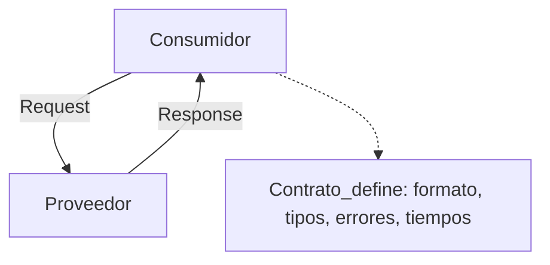
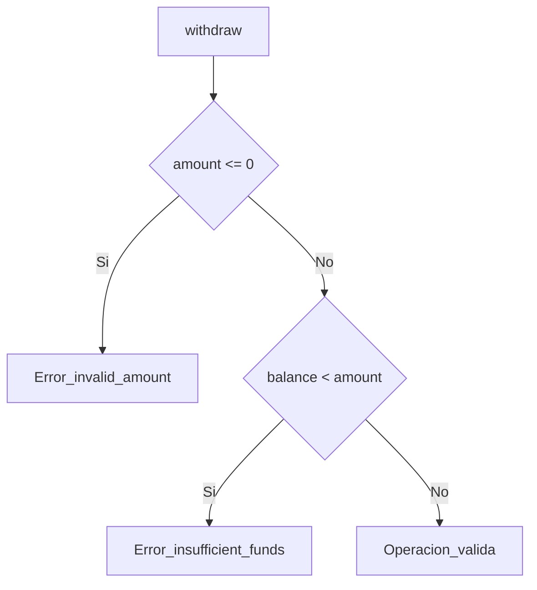
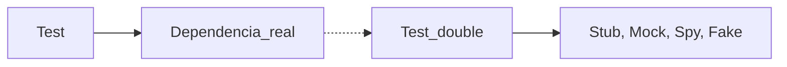
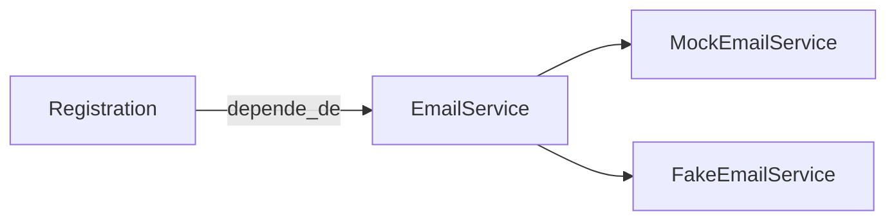
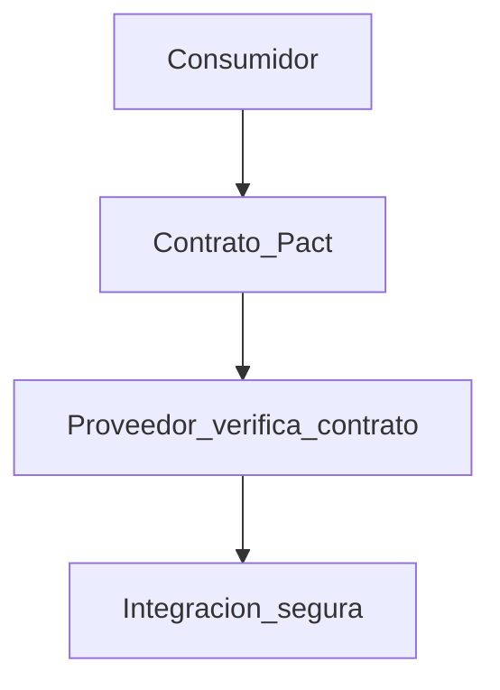
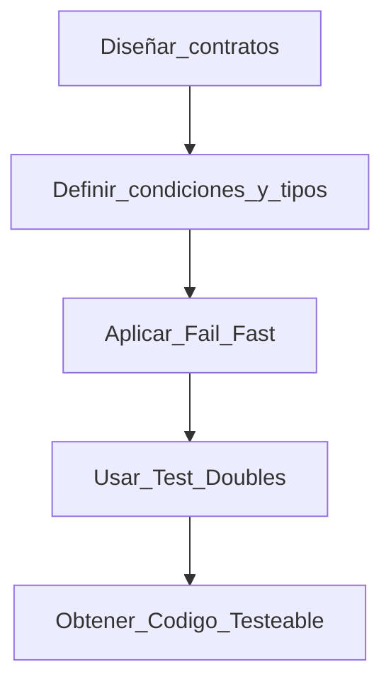

# Capítulo 5. Diseñando contratos y test doubles

> Nota  
> En este capítulo entramos en el corazón de la ingeniería de calidad moderna: **diseñar contratos claros** entre componentes y **usar test doubles para probarlos de forma aislada**.  
> Si el capítulo anterior nos enseñó a recorrer el código, este nos enseña a **controlar sus dependencias**.  
> Aquí es donde un QA o desarrollador pasa de probar el software a **diseñar software testeable**.

---

## 5.1 Qué es un contrato

Un contrato en software es un **acuerdo entre dos partes**:  

- una que provee un servicio (por ejemplo, una API o clase),  
- y otra que la consume.  

El contrato define qué se puede esperar y qué no.  
En otras palabras, **qué entra, qué sale y bajo qué condiciones**.

> Observacion  
> En mis clases siempre digo que los bugs más caros no vienen del código roto, sino del **contrato roto**: cuando un componente asume que el otro hará algo que en realidad no hace.



Ejemplo simple en TypeScript:

```typescript
interface UserServiceContract {
  getUser(id: string): Promise<User>;
}
```

El contrato define la expectativa: `getUser` debe devolver un `User` válido o un error controlado.  
El test estructural valida que el código cumpla el contrato; el test de integración valida que ambas partes **firmen el mismo contrato**.

---

## 5.2 Contratos en sistemas distribuidos

Cuando trabajamos con APIs, microservicios o librerías compartidas, los contratos se vuelven críticos.  
Los cambios no coordinados pueden generar **incompatibilidades silenciosas**.

> Aclaracion  
> Esto lo vi en un proyecto financiero en Alemania: un cambio menor en el formato de fecha (`yyyy-MM-dd` → `dd/MM/yyyy`) rompió 14 microservicios porque nadie verificó el contrato.  
> Desde entonces, el equipo adoptó **testing de contratos automatizado** con Pact.

### Ejemplo: contrato para una API de usuarios

```typescript
interface UserAPI {
  getUser(id: string): Promise<{ id: string; name: string; email: string }>;
}
```

```typescript
test("contrato de API de usuarios", async () => {
  const response = await api.getUser("123");
  expect(response).toHaveProperty("id");
  expect(typeof response.name).toBe("string");
  expect(response.email).toMatch(/@/);
});
```

> Nota  
> Este test no valida la lógica de negocio, sino **la forma del contrato**.  
> Si mañana la API cambia su estructura, el test fallará antes de llegar a producción.

---

## 5.3 Principio de diseño: fail fast

El diseño de contratos se apoya en el principio de **fail fast**:  
si algo no cumple las condiciones, debe fallar de inmediato, no más tarde.

```typescript
function withdraw(balance: number, amount: number): number {
  if (amount <= 0) throw new Error("Invalid amount");
  if (balance < amount) throw new Error("Insufficient funds");
  return balance - amount;
}
```

Cada `throw` es una forma de contrato.  
Le dice al sistema: “No voy a continuar si no se cumplen estas reglas.”



> Detalle  
> Diseñar para fallar rápido es parte de *Designing for Testability*.  
> Un código que no valida sus entradas es **difícil de testear y más difícil de mantener**.

---

## 5.4 Test doubles: la anatomía del aislamiento

Un test doble es un **sustituto controlado** de una dependencia real.  
Se usa cuando probar con la dependencia real es lento, inseguro o impredecible.

| Tipo  | Propósito                           | Ejemplo en TypeScript           |
| ----- | ----------------------------------- | ------------------------------- |
| Dummy | Rellenar una firma, no se usa       | `new User("", "", "")`          |
| Stub  | Devuelve valores predefinidos       | `jest.fn(() => "OK")`           |
| Mock  | Verifica interacciones              | `expect(fn).toHaveBeenCalled()` |
| Spy   | Observa sin modificar               | `jest.spyOn(obj, "method")`     |
| Fake  | Implementa una versión simplificada | Un servidor local en memoria    |



> Nota  
> Los test doubles no existen para engañar al sistema, sino para **aislar causas de error**.  
> Un test de integración puede fallar por mil razones; un test con mocks te dice exactamente cuál.

---

## 5.5 Ejemplo práctico con mocks y stubs

Imaginemos que tenemos un servicio que envía emails:

```typescript
class EmailService {
  send(to: string, message: string): boolean {
    console.log("Sending email to", to);
    return true;
  }
}

class Registration {
  constructor(private email: EmailService) {}

  register(user: string) {
    const ok = this.email.send(user, "Welcome!");
    return ok ? "User registered" : "Error";
  }
}
```

Ahora, en lugar de enviar un email real durante las pruebas, usamos un **mock**:

```typescript
test("registro usa el servicio de email", () => {
  const mockEmail = { send: jest.fn().mockReturnValue(true) };
  const registration = new Registration(mockEmail);
  const result = registration.register("test@aiko.dev");

  expect(mockEmail.send).toHaveBeenCalledWith("test@aiko.dev", "Welcome!");
  expect(result).toBe("User registered");
});
```

> Observacion  
> Este tipo de prueba no mide comportamiento externo, sino **colaboración interna**.  
> Nos interesa saber si el objeto usa sus dependencias como se espera.

---

## 5.6 Fakes: una dependencia controlada pero funcional

Los *fakes* son implementaciones reales, pero simplificadas.  
Sirven para probar flujos completos sin infraestructura externa.

```typescript
class FakeEmailService implements EmailService {
  logs: string[] = [];
  send(to: string, message: string): boolean {
    this.logs.push(`To:${to} | Msg:${message}`);
    return true;
  }
}
```

```typescript
test("registro con fake service", () => {
  const fake = new FakeEmailService();
  const registration = new Registration(fake);
  registration.register("hello@aiko.dev");

  expect(fake.logs.length).toBe(1);
  expect(fake.logs[0]).toContain("hello@aiko.dev");
});
```

> Aclaracion  
> En grandes sistemas, los *fakes* se usan para pruebas locales y CI.  
> Por ejemplo, un *FakePaymentGateway* puede simular la API de Stripe sin gastar un centavo.

---

## 5.7 Diseñar para ser testeable

El testing de contratos y el uso de test doubles solo funcionan si el código está **diseñado para la prueba**.  
Esto significa **invertir las dependencias**: los componentes no deben crear sus servicios internos, sino recibirlos desde afuera.

```typescript
class Registration {
  constructor(private email: EmailService) {}

  register(user: string) {
    this.email.send(user, "Welcome!");
  }
}
```

Esto se llama **inyección de dependencias**.  
Permite reemplazar `EmailService` por un `MockEmailService` o `FakeEmailService` durante los tests.



> Detalle  
> En mis proyectos con equipos de Inglaterra y España, la testabilidad era un criterio de calidad tan importante como el rendimiento.  
> Si una clase no podía testearse fácilmente, se consideraba un *code smell*.

---

## 5.8 Contratos verificables con tipos y tests

TypeScript nos da una ventaja: **los contratos pueden expresarse en el tipo mismo**.

```typescript
interface PaymentGateway {
  process(amount: number): Promise<{ success: boolean }>;
}
```

```typescript
class Checkout {
  constructor(private gateway: PaymentGateway) {}

  async pay(amount: number): Promise<string> {
    const res = await this.gateway.process(amount);
    return res.success ? "Pago exitoso" : "Pago rechazado";
  }
}
```

```typescript
test("verifica contrato del gateway", async () => {
  const mockGateway = { process: jest.fn().mockResolvedValue({ success: true }) };
  const checkout = new Checkout(mockGateway);
  const result = await checkout.pay(100);

  expect(mockGateway.process).toHaveBeenCalledWith(100);
  expect(result).toBe("Pago exitoso");
});
```

> Nota  
> Aquí el contrato se verifica en dos niveles:  
>
> - **Estático:** por el sistema de tipos.  
> - **Dinámico:** por la prueba automatizada.

---

## 5.9 Anti-patrones comunes

| Anti-patrón           | Problema                            | Solución                                |
| --------------------- | ----------------------------------- | --------------------------------------- |
| Dependencias rígidas  | El componente crea sus servicios    | Inyección de dependencias               |
| Tests frágiles        | Mocks que cambian con frecuencia    | Contratos estables o fakes              |
| Over-mocking          | Exceso de mocks sin lógica real     | Mezclar mocks con tests de integración  |
| Contratos ambiguos    | Interfaces sin validación           | Testing de contrato automatizado (Pact) |
| Acoplamiento excesivo | Tests que conocen detalles internos | Diseñar con encapsulamiento             |

> Observacion  
> Los tests deben conocer el **contrato**, no la **implementación**.  
> Si tus tests fallan cada vez que refactorizás, no son de contrato, son de acoplamiento.

---

## 5.10 Testing de contratos automatizado

En entornos distribuidos, el testing de contratos se implementa con herramientas como **Pact** o **Postman Mock Servers**.

```bash
# consumidor
pact-mock-service start
pact verify
```



> Detalle  
> En Aiko Academy usamos Pact para enseñar cómo mantener sincronizados microservicios entre frontend y backend.  
> Los alumnos aprenden que un contrato bien definido **evita pruebas redundantes** y errores de integración.

---

## 5.11 Síntesis del capítulo

| Concepto         | Descripción                                    |
| ---------------- | ---------------------------------------------- |
| Contrato         | Acuerdo formal sobre inputs, outputs y errores |
| Fail Fast        | Fallar rápido cuando el contrato no se cumple  |
| Test Double      | Sustituto de una dependencia real              |
| Mock/Stub/Fake   | Tipos específicos de sustitutos                |
| Diseño testeable | Código que se puede aislar fácilmente          |



---

## 5.12 Conclusión

El diseño de contratos y el uso de test doubles convierten al testing en **una herramienta de ingeniería**, no solo de control.  
Nos permiten aislar dependencias, descubrir errores antes de la integración y construir sistemas que se comportan de manera predecible.

> Reflexion final  
> He visto muchos proyectos donde los tests eran vistos como una carga.  
> Cuando el equipo entiende los contratos, los tests se convierten en **una red de seguridad y documentación viva**.  
> Así, el QA deja de ser el último filtro y se transforma en el **arquitecto de la confianza del software**.

---

**Próximo capítulo:** *Property-based testing y diseño por propiedades*.  
Aprenderemos cómo generar miles de casos automáticamente a partir de las propiedades del sistema.